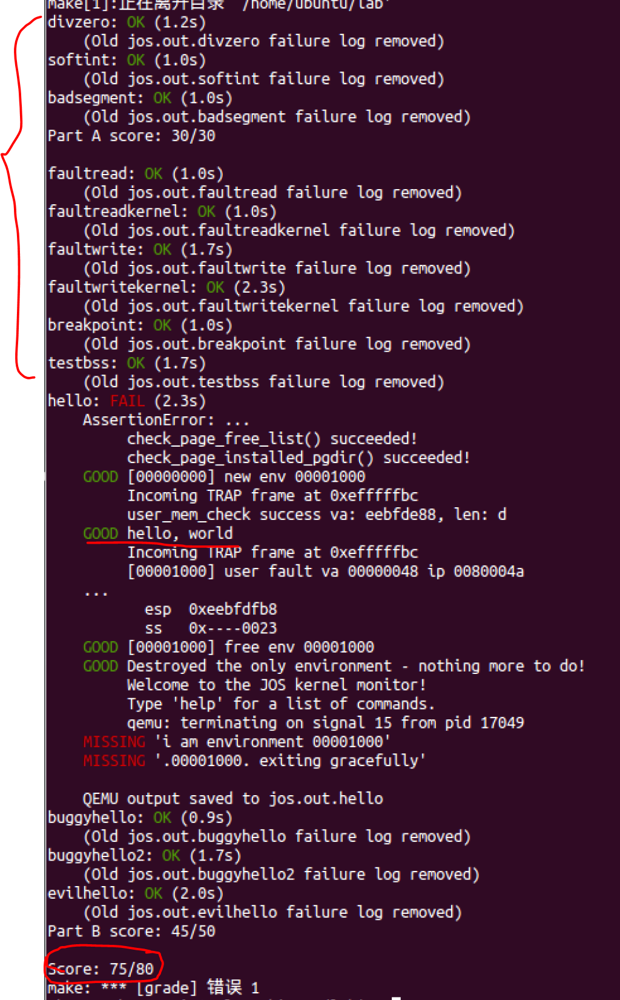
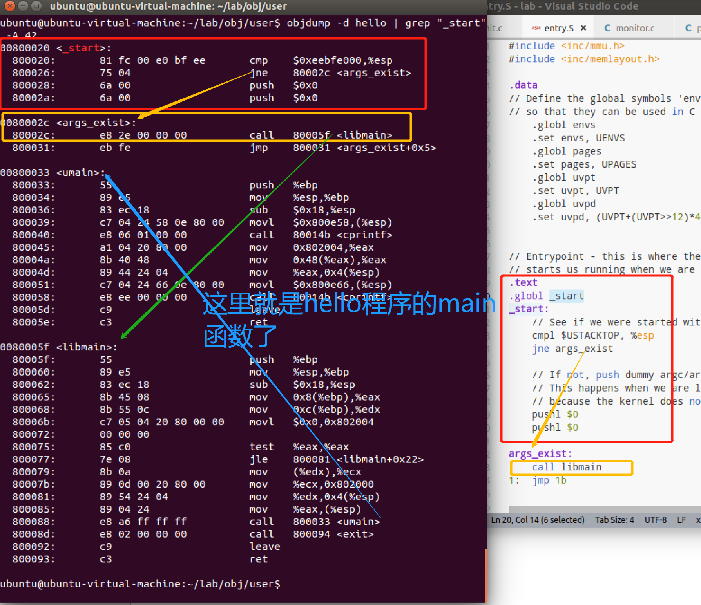
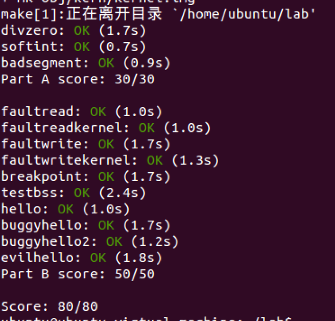
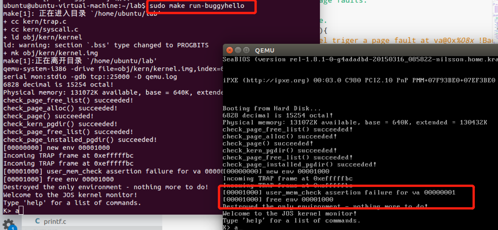
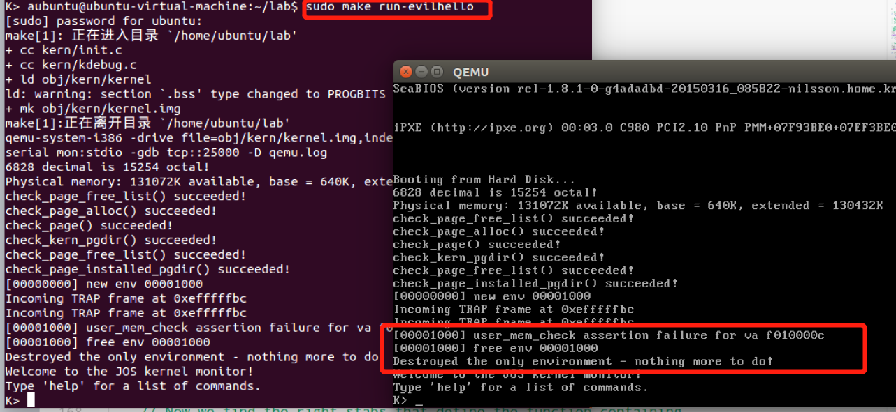
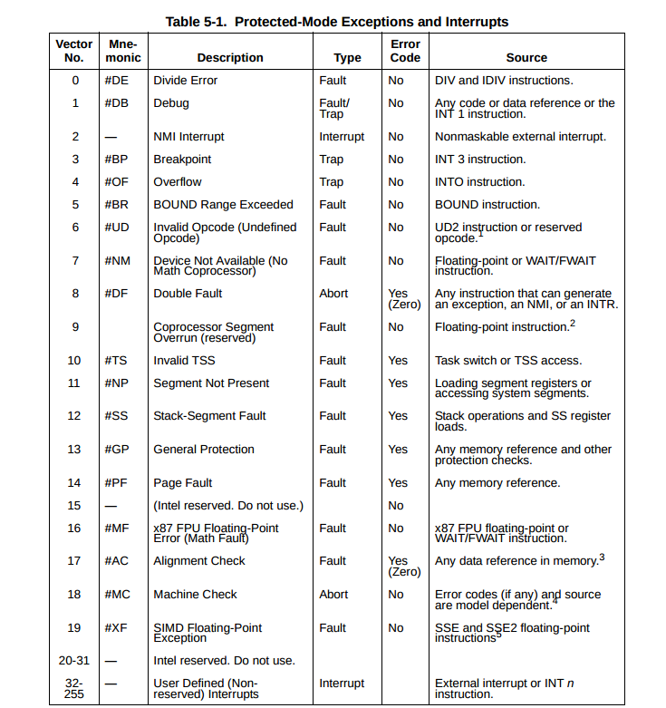
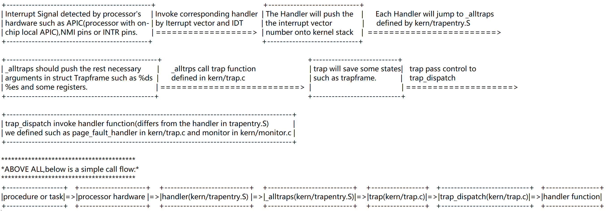

## Lab3 Part B: Page Faults, Breakpoints Exceptions, and System Calls

Lab3还剩下PartB没有完成，Part A完成了异常的基本介绍、异常的初始化和IDT入口设置。

现在JOS内核已经具备了一些基本的异常处理能力了。但还需要继续改善。PartB部分更加细致地处理页错误、断点异常和系统调用。

#### Handling Page Faults

页错误的中断号是14（T_PGFLT），当处理器遇到一个页错误时，会将导致错误的线性地址（即虚拟地址）存储在特殊的CPU控制寄存器`CR2`中。

在trap.c中，通过`page_fault_handler()`来处理页错误。

在lab3 partA部分，我们将所有的异常处理都集中到trap函数中。而trap函数接下来就是调用`trap_dispatch`分发中断【这两个函数都在trap.c中】，所以函数的具体实现还得转到`trap_dispatch`这个函数里面来。

#####  Exercise 5

>Modify `trap_dispatch()` to dispatch page fault exceptions to `page_fault_handler()`. You should now be able to get make grade to succeed on the `faultread`, `faultreadkernel`, `faultwrite`, and `faultwritekernel` tests. If any of them don't work, figure out why and fix them. 

Remember that you can boot JOS into a particular user program using make run-*x* or make run-*x*-nox. For instance, make run-hello-nox runs the *hello* user program.

**注意**目前这里只需要转到`page_fault_handler()`就可以了。并不需要在`page_fault_handler()`里面做任何真正的处理。之后会在实现system call的之后，再完善kernel's page fault handling。

```C
// LAB 3: Your code here.
	if (tf->tf_trapno == T_PGFLT) {
		page_fault_handler(tf);
		return;
	}
```

#### The Breakpoint Exception

断点异常的中断向量为3（`T_BRKPT`），通常用于允许调试器通过用特殊的一字节长度的软件中断指令`int3`临时替换相关的程序指令，从而在程序代码中插入断点。

在JOS中，我们"滥用"这个异常，将其转为原始的伪系统调用，以便任何用户环境都可以使用该异常来调用JOS内核监视器。【我们可以简单地将JOS内核监视器视为debugger】

用户模式执行lib/panic.c中的`panic()`时，将使用`int3`显示panic 消息。

##### Exercise 6. 

>Modify `trap_dispatch()` to make breakpoint exceptions invoke the kernel monitor. You should now be able to get make grade to succeed on the `breakpoint` test.

```c
if (tf->tf_trapno == T_BRKPT){
	monitor(tf); //在trap_dispatch中加入一个breakpiont的case就可以了，调用kernel monitor
	return;
}
```

But this will produce a `General Protection` fault. This is becasuse we set DPL of `T_BRKPT` to 0 and we use `int $3` in `breakpoint`. To let the user to use break point, we need to modify `trap_init`

此外由于加入了这个功能，因此需要允许用户态通过设置断点，来调用monitor，因此允许DPL=3的普通权限下，执行int 3指令：

```c
//trap_init()修改如下：
SETGATE(idt[T_BRKPT], 1, GD_KT, T_BRKPT_handler, 3);	//原来最后一个参数DPL为0
```

##### Challenge

这个Challenge让我们修改monitor从而实现单步调试的功能。

基本的原理可以查阅Intel IA-32 developer’s manual:2.3：

>TF Trap(bit 8)-Set to enable single-step mode for debugging;clear to disable single-step mode.**In single-step mode,the processor generates a debug exception after each instruction**.This allows the execution state of a program to be inspected after each instruction.

这样，就有思路了。触发Breakpoint exception进入monitor之后，需要设置EFLAGS寄存器值的TF位（在实际实现中就是修改trapframe的tf_eflags），随后退出monitor，将控制权交还给被该Breakpoint exception中断的procedure或task，因为将控制权交还给用户程序时，也会把进入中断处理程序时保存的eflags寄存器的值恢复到EFLAGS寄存器之中，而我们在monitor中修改了所保存的eflags寄存器值的TF位，这样后续用户程序再执行一条指令，就会触发**Debug Exception**，因此，我们还需要修改trap_dispatch，使其能够对Debug Exception进行处理，此时只需要让处理程序继续设置一次TF位然后又返回，这样不断往复，就能够实现逐步调试的功能了。

简单来说，就是在触发断点异常的时候，进行异常处理时要设置EFLAGS寄存器值的TF位，从而进入single-step mode，之后异常处理结束回到用户态继续进行程序执行，用户态的EFLAGS寄存器会恢复为设置了TF为EFLAGS寄存器，从而用户程序每执行一条指令，都会触发Debug exception，又进入了内核态的异常处理流程【因此需要修改trap_dispatch，使其能够对Debug Exception进行处理，此时**只需要让处理程序继续设置一次TF位然后又返回**】。因此单步调试的过程就是不断在内核态和用户态之间进行切换，不断使得EFLAGS寄存器置位->清零->置位->清零->置位……。

具体实现参考：https://qinstaunch.github.io/2020/01/16/MIT-6-828-LAB3-User-Environments/#OSELAB3_B

##### Question

1. The break point test case will either generate a break point exception or a general protection fault depending on how you initialized the break point entry in the IDT (i.e., your call to `SETGATE` from `trap_init`). Why? How do you need to set it up in order to get the breakpoint exception to work as specified above and what incorrect setup would cause it to trigger a general protection fault?

   断点测试例子中，产生断点异常还是通用保护错误取决于我们如何初始化断点异常的IDT项。如果设置其DPL为0，则会产生GPF。如果我们想要当前执行的程序能够跳转到这个中断描述符所指向的处理程序继续执行的话，有个要求，就是要求当前运行程序的CPL，RPL的最大值需要小于等于DPL【所以T_BRKPT应该为3，如果为0，则只有内核代码可以触发这种异常】，否则就会出现优先级低的代码试图去访问优先级高的代码的情况，就会触发General Protection Exception。

2. What do you think is the point of these mechanisms, particularly in light of what the `user/softint` test program does？

   DPL的设置可以限制用户态对关键指令的使用。为了安全，避免优先级低的代码段尝试去执行优先级高的代码段，从而进一步限制用户程序对一些内核代码或内存的访问，得以实现隔离用户代码与内核代码。

#### Syscall calls

User processes ask the kernel to do things for them by invoking system calls. 

当用户进程发起一个系统调用，处理器会进入内核模式。之后经过保存用户进程状态->内核执行系统调用代码->恢复用户进程。

The exact details of how the user process gets the kernel's attention and how it specifies which call it wants to execute **vary from system to system.**

对于如何发起系统调用、发起哪个系统调用，根据内核的不同会有不同的处理。

对于JOS内核，使用会导致中断的`int`指令来发起系统调用，具体而言就是`int $0x30`。

We have defined the constant `T_SYSCALL` to 48 (0x30) for you. You will have to set up the interrupt descriptor to allow user processes to cause that interrupt. 【也就是为系统调用设置中断描述符。DPL为3，允许用户进程调用】Note that interrupt 0x30 cannot be generated by hardware, so there is no ambiguity caused by allowing user code to generate it.

由于应用会将系统调用号和系统调用的参数放置在寄存器上，因此kernel无需从用户环境栈或者指令流上获取。

规则： The system call number will go in `%eax`, and the arguments (up to five of them) will go in `%edx`, `%ecx`, `%ebx`, `%edi`, and `%esi`, respectively. The kernel passes the return value back in `%eax`. 

##### Exercise 7

The assembly code to invoke a system call has been written for you, in `syscall()` in `lib/syscall.c`. You should read through it and make sure you understand what is going on.

在Exercise7之前，先阅读触发系统调用的汇编代码【`lib/syscall.c`】

```c
//发起系统调用的汇编。
//在入口参数中给出num和系统调用参数，会为系统调用用到的各个寄存器设置值。
static inline int32_t
syscall(int num, int check, uint32_t a1, uint32_t a2, uint32_t a3, uint32_t a4, uint32_t a5)
{
	int32_t ret;

	// Generic system call: pass system call number in AX,
	// up to five parameters in DX, CX, BX, DI, SI.
	// Interrupt kernel with T_SYSCALL.
	//
	// The "volatile" tells the assembler not to optimize
	// this instruction away just because we don't use the
	// return value.
	//
	// The last clause tells the assembler that this can
	// potentially change the condition codes and arbitrary
	// memory locations.

	asm volatile("int %1\n"
		     : "=a" (ret)	//返回值也放置到%eax中
		     : "i" (T_SYSCALL),	//触发int $0x30。“i”表示符号常量
		       "a" (num),	//系统调用号放到%eax寄存器中
		       "d" (a1),	//系统调用第一个参数放到%edx中
		       "c" (a2),	//……
		       "b" (a3),
		       "D" (a4),
		       "S" (a5)
		     : "cc", "memory");
	//注意最后的list of clobbered registers
    //会造成修改的寄存器或内存等都要加入clobbered list
    //如果我们的指令可以修改条件码寄存器（cc），我们必须将 "cc" 添加进修饰寄存器列表。
    // 如果我们的指令以不可预测的方式修改了内存，那么需要将 "memory" 添加进修饰寄存器列表。
	if(check && ret > 0)
		panic("syscall %d returned %d (> 0)", num, ret);

	return ret;
}
```

还有当前JOS支持的4种合法系统调用号`inc/syscall.h`对应的syscall处理代码在`kern/syscall.c`中

```c
/* system call numbers */
enum {
	SYS_cputs = 0,	//指定enum从0开始
    //对应于static void sys_cputs(const char *s, size_t len)函数
	SYS_cgetc,		//1
	SYS_getenvid,	//2
	SYS_env_destroy,//3
	NSYSCALLS		//4
};
```

>Add a handler in the kernel for interrupt vector `T_SYSCALL`. You will have to edit `kern/trapentry.S` and `kern/trap.c`'s `trap_init()`. 
>
>You also need to change `trap_dispatch()` to handle the system call interrupt by calling `syscall()` (defined in `kern/syscall.c`) with the appropriate arguments, and then arranging for the return value to be passed back to the user process in `%eax`. Finally, you need to implement `syscall()` in `kern/syscall.c`. 
>
>Make sure `syscall()` returns `-E_INVAL` if the system call number is invalid. 
>
>You should read and understand `lib/syscall.c` (especially the inline assembly routine) in order to confirm your understanding of the system call interface. 
>
>Handle all the system calls listed in `inc/syscall.h` by invoking the corresponding kernel function for each call.

我们首先需要设置T_SYSCALL系统调用的handler，分配不同调用号的处理代码。

```c
//实现kern/syscall.c中的syscall()，这个syscall会在trap_dispatch时被调用。
int32_t
syscall(uint32_t syscallno, uint32_t a1, uint32_t a2, uint32_t a3, uint32_t a4, uint32_t a5)
{
	switch (syscallno) {
		case SYS_cputs:
			sys_cputs((char*)a1,(size_t)a2);
			return 0;
        case SYS_cgetc:
            return sys_cgetc();
        case SYS_getenvid:
            assert(curenv);
            return sys_getenvid();
        case SYS_env_destroy:
            return sys_env_destroy((envid_t)a1);
		default:	//不支持的系统调用就返回E_INVAL
			return -E_INVAL;
	}
}
```

在系统调用处理代码中，`sys_cputs`有需要添加的内容，这个函数用于读取内存，输出一个字符。

And we need to **Check that the user has permission to read memory** in `sys_cputs` by call `user_mem_assert`

```c
static void
sys_cputs(const char *s, size_t len)
{
	// Check that the user has permission to read memory [s, s+len).
	// Destroy the environment if not.

	// LAB 3: Your code here.
	if(curenv->env_tf.tf_cs & 3)
		user_mem_assert(curenv, s, len, PTE_P|PTE_U);	//user且页面存在【有效】
	// Print the string supplied by the user.
	cprintf("%.*s", len, s);
}
```

但是检查权限的`user_mem_assert`中的`user_mem_check`【`kern/pmap.c`】并没有实现好，完善如下：

```C
static uintptr_t user_mem_check_addr;

// Check that an environment is allowed to access the range of memory
// [va, va+len) with permissions 'perm | PTE_P'.
// Normally 'perm' will contain PTE_U at least, but this is not required.
// 'va' and 'len' need not be page-aligned; you must test every page that
// contains any of that range.  You will test either 'len/PGSIZE',
// 'len/PGSIZE + 1', or 'len/PGSIZE + 2' pages.
//
// A user program can access a virtual address if (1) the address is below
// ULIM, and (2) the page table gives it permission.  These are exactly
// the tests you should implement here.
//
// If there is an error, set the 'user_mem_check_addr' variable to the first erroneous virtual address.
//
// Returns 0 if the user program can access this range of addresses,
// and -E_FAULT otherwise.
//
int
user_mem_check(struct Env *env, const void *va, size_t len, int perm)
{
	// LAB 3: Your code here.
	cprintf("user_mem_check va: %x, len: %x\n", va, len);
	uint32_t begin = (uint32_t) ROUNDDOWN(va, PGSIZE); 
	uint32_t end = (uint32_t) ROUNDUP(va+len, PGSIZE);
	uint32_t i;
    //遍历涉及到的内存页，因为权限是按页记录的
	for (i = (uint32_t)begin; i < end; i+=PGSIZE) {
		pte_t *pte = pgdir_walk(env->env_pgdir, (void*)i, 0);//页表项pte
		// pprint(pte);
		if ((i>=ULIM) || !pte || !(*pte & PTE_P) || ((*pte & perm) != perm)) {	//ULIM是用户空间的内存上界[不能访问kernel memmory]、pte要存在且有效、pte对应的权限*pte&perm==perm存在
			user_mem_check_addr = (i<(uint32_t)va?(uint32_t)va:i);	//如果有误，就设置第一个有误的虚拟地址user_mem_check_addr
			return -E_FAULT;
		}
	}
    //之前没有return，说明检测成功
	cprintf("user_mem_check success va: %x, len: %x\n", va, len);
	return 0;
}
```

这样用户就可以通过在syscall来触发`lib/syscall.c` 中的内联汇编，进一步的call `int $(T_SYSCALL)`，之后进入中断处理流程。因此我们还需要修改 `trap_dispatch`，加入对中断号`T_SYSCALL`的处理支持【如下】，并且将内联syscall设置的系统调用号和参数值传递到`kern/syscall.c`，进行系统调用处理函数指派，之后再存好返回值到eax。

```c
case T_SYSCALL:
		struct PushRegs *regs = &(tf->tf_regs);
		regs->reg_eax = syscall(regs->reg_eax,regs->reg_edx,regs->reg_ecx,regs->reg_ebx,regs->reg_edi,regs->reg_esi);
		return;
```

**测试：Right now, we can see `hello, world` printed by the user program!**

总结：`lib/syscall.c`W是提供给用户的接口。在用户触发系统调用时，通过`lib/syscall.c:syscall()`内联汇编触发了T_SYSCALL中断之后，又会进入到之前完成的中断处理流程的call flow【见参考-JOS中断调用流程】，最终进入`kern/trap.c:trap_dispatch()`，并且调用`kern/syscall.c:syscall()`分派不同的系统调用号到不同的处理函数中，并且返回返回值。再回到`kern/trap.c:trap_dispatch()`将返回值写入eax寄存器内。

到这里已经可以通过大多数的`make grade`的测试集了，并且可以成功输出“hello，world”了。



#### User-mode startup

回顾在之前设置的用户空间环境的部分中，我们通过env_create创建了user_hello的用户进程空间，通过`load_icode`加载了该ELF到内存中，并实现了`env_run`、`env_poptf`等函数来运行这个程序。但是由于当时中断还没有实现，因此会遇到`Triple fault`【由于无法处理异常，而导致的三重错误，参考[lab3 PartA](https://spidermana.github.io/2020/10/26/MIT-6.828-lab3/#env_run)】。正常来说，我们实际进入用户空间时，`env_pop_tf`是运行的最后一个函数，该函数中`iret`指令会实际将控制流转移到用户空间中。

```c
// Restores the register values in the Trapframe with the 'iret' instruction.
// This exits the kernel and starts executing some environment's code.
//
// This function does not return.
//
void
env_pop_tf(struct Trapframe *tf)
{
	asm volatile(
		"\tmovl %0,%%esp\n"	//将栈顶设置到参数位置【tf参数包含了regs、es、ds……】
		"\tpopal\n"			//加载新的regs
		"\tpopl %%es\n"		//加载%es
		"\tpopl %%ds\n"		//加载%ds
		"\taddl $0x8,%%esp\n" /* skip tf_trapno and tf_errcode */
		"\tiret\n"	//iret指令，控制从内核态转入用户态
		: : "g" (tf) : "memory");
	panic("iret failed");  /* mostly to placate the compiler */
}
```

之后`make qemu-gdb`通过GDB单步执行，应该在用户环境的可执行文件中看到第一条指令——`lib/entry.S`文件中*start*标签处的`cmpl`指令。这应该是编译器编译每个文件时都会加入的一个代码片段。

```c
#include <inc/mmu.h>
#include <inc/memlayout.h>

.data
// Define the global symbols 'envs', 'pages', 'uvpt', and 'uvpd'
// so that they can be used in C as if they were ordinary global arrays.
//可以回顾一下用户栈顶之上的内存空间布局
	.globl envs
	.set envs, UENVS	//.set => Define symbols for values.
    					// envs = UENVS
    					//在mem_init中在UENVS虚拟地址分配了空间存储envs，并设置了用户可读。
	.globl pages
	.set pages, UPAGES
	.globl uvpt
	.set uvpt, UVPT
	.globl uvpd
	.set uvpd, (UVPT+(UVPT>>12)*4)
//以上导出的全局遍历是可以在用户空间中读取的。

// Entrypoint - this is where the kernel (or our parent environment) starts us running when we are initially loaded into a new environment.
.text
.globl _start	//所有ELF文件都是从_start开始的。
_start:
	// See if we were started with arguments on the stack
	cmpl $USTACKTOP, %esp
	jne args_exist
	//判断我们当前是不是在栈的最高地址。以确定是否有参数传入
    //如果没有参数传入，那么说明我们是从kernel刚刚进入到用户态的。
	// If not, push dummy argc/argv arguments.
	// This happens when we are loaded by the kernel,
	// because the kernel does not know about passing arguments.
	pushl $0
	pushl $0

args_exist:
	call libmain	//之后会进入libmain
1:	jmp 1b


```

之后就是真正的执行到ELF文件中【这里是hello程序】，使用`b *0x...`在`int $0x30`处设置断点，可以看到系统调用`sys_cputs()`产生的中断【in `hello` (see `obj/user/hello.asm` for the user-space address)】

**以上是对lab3 partA的回顾**

在实现异常以后，hello文件可以完好的处理完`sys_cputs()`产生的中断了【从make grade中我们也可以看出】。

但在这之前，在执行ELF文件之前，我们还需要做一些用户模式的启动设置User-mode startup。

我们知道`env_pop_tf`的`iret`指令之后，从用户程序开始在 lib/entry.S 的顶部\_start开始运行。我们反编译hello可执行文件，看到_start符号后的代码正是`lib/entry.S`的内容【这应该属于运行库代码】。



经过一些设置之后，该代码在 lib/libmain.c 中调用 libmain()。

You should modify `libmain()` to initialize the global pointer `thisenv` to point at this environment's `struct Env` in the `envs[]` array。

(请注意，lib/entryy.s 已经定义了 envs 来指向您在第 a 部分中设置的 UENVS 映射)

>Hint: look in `inc/env.h` and use `sys_getenvid`.

```c
//lib/libmain.c
// Called from entry.S to get us going.
// entry.S already took care of defining envs, pages, uvpd, and uvpt.
#include <inc/lib.h>

extern void umain(int argc, char **argv);

const volatile struct Env *thisenv;		//全局变量
const char *binaryname = "<unknown>";

void
libmain(int argc, char **argv)
{
	// set thisenv to point at our Env structure in envs[].
	// LAB 3: Your code here.
	thisenv = 0;
    thisenv = &envs[ENVX(sys_getenvid())];
    //envid由三个部分组成参考inc/env.h
    //envs的index获取方法：The environment index ENVX(eid) equals the environment's index in the 'envs[]' array.

	// save the name of the program so that panic() can use it
	if (argc > 0)
		binaryname = argv[0];

	// call user main routine
	umain(argc, argv);	//调用main函数。

	// exit gracefully
	exit();
}
```

libmain ()最后调用 umain。对于 hello 程序，其`umain`位于`user/hello.c`中。注意，在打印“hello，world”之后，它会尝试访问`thisenv-> env_id`，但是之前我们还没有设置thisenv，这就是为什么它之前出现了故障。

现在你已经正确地初始化了这个 env，它应该不会出错了。

```c
// hello.c => hello, world
#include <inc/lib.h>
void
umain(int argc, char **argv)
{
	cprintf("hello, world\n");
	cprintf("i am environment %08x\n", thisenv->env_id);
}
```

>**If it still faults, you probably haven't mapped the `UENVS` area user-readable** (back in Part A in `pmap.c`; this is the first time we've actually used the `UENVS` area).

执行完用户程序后，会回到libmain()并调用exit()->sys_env_destroy(0)，并触发`lib/syscall.c`中的汇编中断`int $0x30`代码，进入kernel系统调用处理函数`kern/syscall.c`中的`sys_env_destroy`【进一步进入env_destroy，并最终调用`monitor`】，销毁env【减少相关pages的ref，解除pages映射，将env归回env_free_list】。

至此，it should report that it has destroyed the only environment and then drop into the kernel monitor. You should be able to get make grade to succeed on the `hello` test。



#### Page faults and memory protection

最后一个部分啦！

内存保护是操作系统的一个关键特性，确保一个程序中的错误不会破坏其他程序或操作系统本身。**操作系统通常依靠硬件支持来实现内存保护。操作系统会让硬件知道哪些虚拟地址是有效的，哪些是无效的。**

When a program tries to access an invalid address or one for which it has no permissions, the processor stops the program at the instruction causing the fault and then traps into the kernel with information about the attempted operation.

如果错误是可修复的，内核可以修复它并让程序继续运行。如果故障不可修复，那么程序就不能继续【since it will never get past the instruction causing the fault】。

这里给出一个page fault可修复的例子——“an automatically extended stack”。大多OS在执行程序前只会给栈分配一个page，如果程序需要的栈空间超过一个page，那么就会出现page fault，从而进入kernel分配新的页面，然后再恢复程序的执行。通过这种方式，kernel只需要分配程序栈需要的那么多页面，而不必预先分配很多，没用到的就浪费了。因此，在这种动态扩展的栈分配机制下，程序“活在“拥有大量栈空间的假象中【一不够。kernel就会再给】。

由于系统调用的存在，给内存保护提出了很多挑战。因系统调用接口允许用户程序将指针传递给内核。这些指针指向要读取或写入的用户缓冲区。然后内核在执行系统调用时将对指针解引用。但是在这种情形下存在两个和内存保护有关的问题：

- kernel page-fault vs user page-fault
  - 内核本身的page-fault可能比用户程序导致的page-fault严重得多。如果内核在操作自己的数据结构时出现page-fault，那么这就是kernel bug，the fault handler should panic the kernel（因此整个系统就down掉了）。
  - 因此kernel解引用用户程序的指针的时候，需要记住如果导致page fault是用户程序造成的。
- reveal private information or destroy the integrity of the kernel
  - 内核通常比用户程序拥有更多的内存权限。用户程序可能会向系统调用传递一个指针，该指针指向内核可以读写但程序不能读写的内存。因此，内核必须小心不要被欺骗解引用了这样的指针，因为这可能导致信息泄露或者破坏内核的完整性。

For both of these reasons the kernel must be extremely careful when handling pointers presented by user programs.

现在，您将使用一种机制来解决这两个问题，**该机制仔细检查从用户空间传递到内核的所有指针。**当程序向内核传递一个指针时，<u>内核将检查地址是否在用户地址空间，并且页表允许该内存操作</u>。

Thus, <u>the kernel will never suffer a page fault due to dereferencing **a user-supplied pointer**.</u> If the **kernel does page fault, it should panic and terminate**.

##### Exercise 9

>Change `kern/trap.c` to panic if a page fault happens in kernel mode.
>
>Hint: to determine whether a fault happened in user mode or in kernel mode, check the low bits of the `tf_cs`.

cs段寄存器的低两位用来标识privileged level，因此在`page_fault_handler`中可以通过检查tf->tf_cs的低两位来判断是kernel mode还是user mode：

```c
void
page_fault_handler(struct Trapframe *tf)
{
	uint32_t fault_va;

	// Read processor's CR2 register to find the faulting address
	fault_va = rcr2();

	// Handle kernel-mode page faults.

	// LAB 3: Your code here.
    //判断kernel mode
	if((tf->tf_cs & 3) == 0){
		panic(":( Your kernel triger a page fault at va@0x%08x !Bad kernel", fault_va);
        //panic kernel
	}

	// We've already handled kernel-mode exceptions, so if we get here,
	// the page fault happened in user mode.
	//到这里说明，page fault是user导致的
	// Destroy the environment that caused the fault.
    //这里先简单的报错给user，而kernel继续运行着。
	cprintf("[%08x] user fault va %08x ip %08x\n",
		curenv->env_id, fault_va, tf->tf_eip);
	print_trapframe(tf);
	env_destroy(curenv);
}
```

>Read `user_mem_assert` in `kern/pmap.c` and implement `user_mem_check` in that same file.
>
>Change `kern/syscall.c` to sanity check arguments to system calls.【这里接收用户指针的只有sys_cputs，因此在sys_cputs中添加】

这个我们之前已经实现过了。也就是判断访问操作是否满足页表项中的权限要求。

如何check呢？

- 启动buggyhello，内核不会崩，只是销毁了该用户进程。



- 启动内核，运行 user/evilhello【恶意程序访问了kernel的内存】，用户进程env应该被终止，内核不应panic。



>Finally, change `debuginfo_eip` in `kern/kdebug.c` to call `user_mem_check` on `usd`, `stabs`, and `stabstr`. 

```c
//debuginfo_eip function
		// Make sure this memory is valid.
		// Return -1 if it is not.  Hint: Call user_mem_check.
		// LAB 3: Your code here.
		if (user_mem_check(curenv,usd,sizeof(struct UserStabData),PTE_U)){
			return -1;
		}

		stabs = usd->stabs;
		stab_end = usd->stab_end;
		stabstr = usd->stabstr;
		stabstr_end = usd->stabstr_end;

		// Make sure the STABS and string table memory is valid.
		// LAB 3: Your code here.
		if(user_mem_check(curenv,stabs,sizeof(struct Stab),PTE_U)){
			return -1;
		}	if(user_mem_check(curenv,stabstr,stabstr_end-stabstr,PTE_U)){
			return -1;
		}
```

最后回答一下它的问题，为什么backtrace用户态的`user/breakpoint`程序会出现缺页错误。这是因为用户态程序的开始是iret跳转的，和普通程序不同，所以`mon_backtrace`中while（ebp ！=0）这个条件永远达不到。最后一次发生错误前，栈指针（ebp）在用户栈顶端下面8字节的位置（因为之前push了两个0），然后在读取args的时候，往上读取，就发生了错误。

```c
K> backtrace
ebp efffff00 eip f01008fd args 00000001 efffff28 f01b4000 0a100188 f0105d53
	     kern/monitor.c:268: runcmd+-267384840
ebp efffff80 eip f0100c03 args 00000002 00000000 efffffb0 f0103821 f01b4000
	     kern/monitor.c:289: monitor+-267383888
ebp efffff90 eip f0103821 args f01b4000 efffffbc 00000000 00000082 00000000
	     kern/trap.c:203: trap+-267372692
ebp efffffb0 eip f0103943 args efffffbc 00000000 00000000 eebfdfd0 efffffdc
	     kern/syscall.c:69: syscall+-267372221
ebp eebfdfd0 eip 800073 args 00000000 00000000 eebfdff0 00800049 00000000
	     lib/libmain.c:26: libmain+8388665
Incoming TRAP frame at 0xeffffe8c
kernel panic at kern/trap.c:271: :( Your kernel triger a page fault at va@0xeebfe008 !Bad kernel

K> showMappings 0xeebfe008 0xeebfe008
va@start: eebfe000 va@end: eebff000
va@page: eebfe000 pa@page: 00000000 @perm:PTE_P 0 PTE_U 0 PTE_W 0;
```

showMappings可以看到0xeebfe008对应的页的起始地址为0xeebfe000，而在memlayout.h中标明了0xeebfe000为USTACKTOP，也就是说backtrace最后触发page fault就是因为其尝试访问高于USTACKTOP的地址了。这是kernel中monitor的代码导致的缺页错误，所以kernel panic了。

至此！全部完成啦。

## 参考

#### asm内联汇编

```c
asm ( assembler template
        : output operands                /* optional */
        : input operands                   /* optional */
        : list of clobbered registers   /* optional */
);
```

一般常见的内联汇编形式如上。

基本要求：

- 每条指令放在一个双引号内，或者将所有的指令都放着一个双引号内。
- 每条指令都要包含一个分隔符。合法的分隔符是换行符(\n)或者分号。用换行符的时候通常后面放一个制表符\t。对此前文已经有所说明。
- 访问C语言中的变量用%0,%1…等等。
- ”asm”内部使用C语言字符串作为操作数。操作数都要放在双引号中。constraint和修饰都放在双引号内。
- 对于输出操作数，还要用“=”修饰。
- 如果有多个操作数，使用逗号隔开。

**接下来给出一些常用的constraint：**

| r    | Register(s)     |
| :--- | :-------------- |
| a    | %eax, %ax, %al  |
| b    | %ebx, %bx, %bl  |
| c    | %ecx, %cx, %cl  |
| d    | %edx, %dx, %adl |
| S    | %esi, %si       |
| D    | %edi, %di       |

当constraints ”r” 被指定时，GCC可能会选择任何一个可用的通用寄存器中保存这个值。

- 内存操作数constraint: m

  **当操作数在内存中时，任何对其操作会直接在内存中进行。**与寄存器constraint不同的是：指定寄存器constraint时，内存操作时先把值存在一个寄存器中，修改后再将该值写回到该内存中去。寄存器constraint通常只用于必要的汇编指令，或者用于能明显加快操作速度的情况，因为内存constraint能提升C语言变量更新效率，完全没必要通过一个寄存器来中转。下面这个例子中，sidt的值会被直接存储到loc所指向的内存:
   `asm (“sidt” %0” : : “m”(loc) );`

- 匹配constraint

  在某些情况下，一个变量可能被用来传递输入也用来保存输出。这种情况下我们需要用到匹配constraint。如：
   `asm (“incl %0” :”=a”(var) : “0”(var) );`

  上面的例子中，%eax被用来传递输入也用来保存输出。**这里的constraint ”0”就是指定使用和第一个输出相同的寄存器，即输入变量指定放在eax中**。这条汇编的意思是输入变量先被读入eax中，incl执行之后，%eax被更新并且保存到变量var中。

- 其他可能用到的constraint有：
  - “m”: 使用一个内存操作数，内存地址可以是机器支持的范围内。
  - “o”: 使用一个内存操作数，但是要求内存地址范围在在同一段内。例如，加上一个小的偏移量来形成一个可用的地址。
  - “V”: 内存操作数，但是不在同一个段内。换句话说,就是使用除了”o” 以外的”m”的所有的情况。
  - **“i”: 使用一个立即整数操作数(值固定)；也包含仅在编译时才能确定其值的符号常量。**
  - “n”: 一个确定值的立即数。很多系统不支持汇编常数操作数小于一个字(word)的长度的情况。这时候使用n就比使用i好。
  - “g”: 除了通用寄存器以外的任何寄存器，内存和立即整数。

#### 中断表



#### JOS中断调用过程

注意最初的异常，是由硬件信号引发的。通过引脚pin，被kernel捕获处理。



