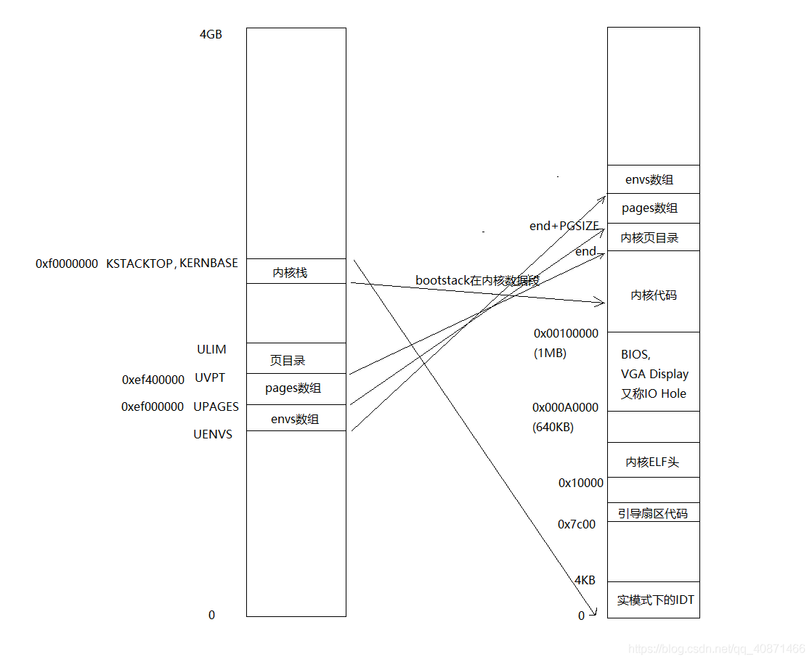
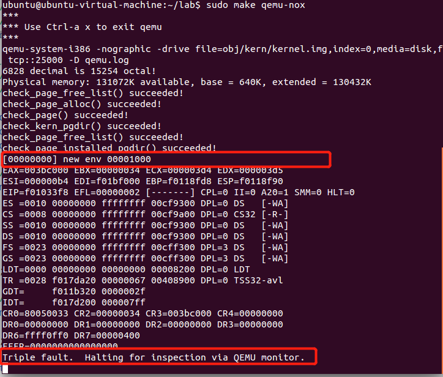
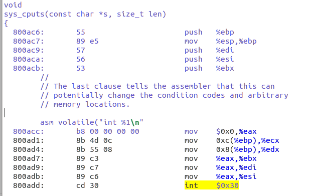
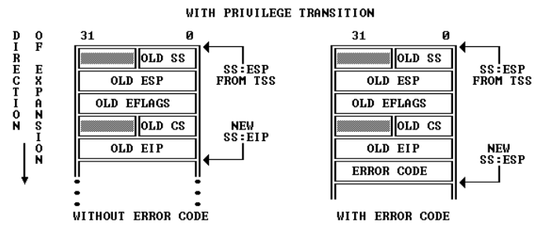
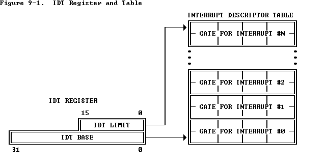
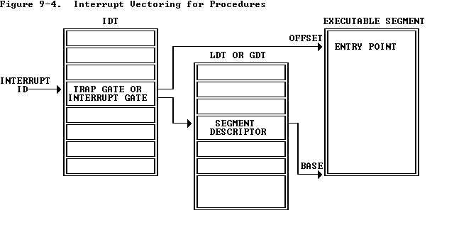
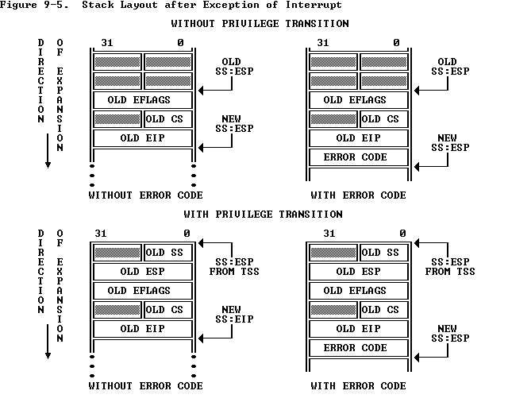

## Lab3

you will implement the basic kernel facilities required to get **a protected user-mode environment (i.e., "process")** running. 

You will enhance the JOS kernel to set up the data structures to keep track of user environments, create a single user environment, load a program image into it, and start it running. 

You will also make the JOS kernel capable of handling any system calls the user environment makes and handling any other exceptions it causes.

综上，需要实现的基本内核功能如下：

- 进程运行
- 追踪用户环境
- 加载程序镜像
- 处理系统调用和异常

要完成lab3需要关注以下源文件：

```
inc/	env.h	Public definitions for user-mode environments
trap.h	Public definitions for trap handling
syscall.h	Public definitions for system calls from user environments to the kernel
lib.h	Public definitions for the user-mode support library

kern/	env.h	Kernel-private definitions for user-mode environments
env.c	Kernel code implementing user-mode environments
trap.h	Kernel-private trap handling definitions
trap.c	Trap handling code
trapentry.S	Assembly-language trap handler entry-points
syscall.h	Kernel-private definitions for system call handling
syscall.c	System call implementation code

lib/	Makefrag	Makefile fragment to build user-mode library, obj/lib/libjos.a
entry.S	Assembly-language entry-point for user environments
libmain.c	User-mode library setup code called from entry.S
syscall.c	User-mode system call stub functions
console.c	User-mode implementations of putchar and getchar, providing console I/O
exit.c	User-mode implementation of exit
panic.c	User-mode implementation of panic

user/	*	Various test programs to check kernel lab 3 code
```

本实验由PartA和PartB两部分组成。

提交当前lab2修改的部分，并切换到lab3.

```shell
cd ~/lab
git commit -am 'changes to lab2 after handin'
Created commit 734fab7: changes to lab2 after handin
 4 files changed, 42 insertions(+), 9 deletions(-)
git pull
Already up-to-date.
git checkout -b lab3 origin/lab3
Branch lab3 set up to track remote branch refs/remotes/origin/lab3.
Switched to a new branch "lab3"
git merge lab2
Merge made by recursive.
 kern/pmap.c |   42 +++++++++++++++++++
 1 files changed, 42 insertions(+), 0 deletions(-)
```

### Part A: User Environments and Exception Handling

文件`inc/env.h`包含了JOS内核对用户环境【类似于用户进程】的基本定义，即内核使用Env数据结构来追踪每个用户环境。

在本实验中，最初只会创建一个环境，但您需要设计JOS内核以支持多个环境; lab4将通过允许用户环境`fork`其他环境来利用此功能。

#### 用户环境变量

主要涉及`inc/env.h`和`kern/env.c`两个文件。前者是用户环境变量的变量定义，后者是有关的kern管理用户环境所需的变量。

```c

// An environment ID 'envid_t' has three parts:
//
// +1+---------------21-----------------+--------10--------+
// |0|          Uniqueifier             |   Environment    |
// | |                                  |      Index       |
// +------------------------------------+------------------+
//                                       \--- ENVX(eid) --/
//
// The environment index ENVX(eid) equals the environment's index in the
// 'envs[]' array.  The uniqueifier distinguishes environments that were
// created at different times, but share the same environment index.
//
// All real environments are greater than 0 (so the sign bit is zero).
// envid_ts less than 0 signify errors.  The envid_t == 0 is special, and
// stands for the current environment.

#define LOG2NENV		10                       
#define NENV			(1 << LOG2NENV) //JOS可同时管理的最大active environments数量
#define ENVX(envid)		((envid) & (NENV - 1))   //获取ENVX字段
```

environment ID标识了某种特定的环境，每个环境都有各自唯一的ID。可知一个environment ID有三个组成部分：

- environment index，即ENVX(eid)，就是`envs[]`数组的下标
- uniqueifier字段用于区别共享相同用户环境的、不同时间创建的环境【比如不同时间创建的父子进程】
- 第一个bit标识了环境的属性：
  - 为0则表示当前环境
  - 为负，非法
  - 为正，表示所有的真实环境。

接下来就是kern管理用户环境所需的变量：

```c
struct Env *envs = NULL;		// All environments
struct Env *curenv = NULL;		// The current env
static struct Env *env_free_list;	// Free environment list
```

Once JOS gets up and running, <u>the `envs` pointer points to an array of `Env` structures representing all the environments in the system.</u> 

the JOS kernel will support **a maximum of `NENV` simultaneously active environments.**

The JOS kernel keeps all of the inactive `Env` structures on the `env_free_list`. 

- 这使得环境的分配和释放很简单，只需要从free list中删除或添加。

The kernel uses **the `curenv` symbol to keep track of the *currently executing* environment at any given time**. 【在启动过程中，在第一个环境被创建之前，这个字段一直保持NULL】

#### Environment State

`Env`结构在`inc/env.h`定义如下（将来的实验中将添加更多字段）：

```c
struct Env {
	struct Trapframe env_tf;	// Saved registers
	struct Env *env_link;		// Next free Env
	envid_t env_id;			// Unique environment identifier
	envid_t env_parent_id;		// env_id of this env's parent
	enum EnvType env_type;		// Indicates special system environments
	unsigned env_status;		// Status of the environment
	uint32_t env_runs;		// Number of times environment has run

	// Address space
	pde_t *env_pgdir;		// Kernel virtual address of page dir
};
```

- **env_tf**：

  - defined in `inc/trap.h`

    存储未运行该环境时的寄存器数据：holds the saved register values for the environment while that environment is *not* running: i.e., when the kernel or a different environment is running.

  - 内核会负责保存从用户模式到内核模式的寄存器数据，以便之后这个环境被重新启动时可以恢复到他被切换前的状态。

- **env_link**:

  -  `env_free_list`中的next指针
  - This is a link to the next `Env` on the `env_free_list`. 
  - `env_free_list` points to the first free environment on the list.

- **env_id**:

  - kernel会创建一个唯一标识某个环境的字段【uniquely identifiers】、
  - 也就是`environment ID `，该结构中有 `envs` 数组的index
  -  After a user environment terminates, the kernel may re-allocate the same `Env` structure to a different environment - **but the new environment will have a different `env_id` from the old one** <u>even though the new environment is re-using the same slot in the `envs` array.</u>
  - 如果某个Env结构体被回收后重用了，这个env_id字段和之前的环境也不会相同，就是使用了相同的 `envs` array slot【应该说的是environment ID的index一样，Uniqueifier也不同】。

- **env_parent_id**:

  - 存储了创建这个环境的父环境env_id
  - In this way the environments can **form a “family tree,”**
  - 这对于制定允许哪些环境对谁执行操作的相关安全决策很有用。

- **env_type**:

  - 用于区别特殊环境

  - For most environments, it will be `ENV_TYPE_USER`. 

  - We'll <u>introduce a few more types for special system service environments in later labs.</u>

  - ```c
    // Special environment types
    enum EnvType {
    	ENV_TYPE_USER = 0,
    };
    ```

- **env_status**:

  This variable holds one of the following values:

  - `ENV_FREE`: 不活跃状态，放置于`env_free_list`

    Indicates that the `Env` structure is inactive, and therefore on the `env_free_list`.

  - `ENV_RUNNABLE`:等待被调度

    Indicates that the `Env` structure represents an environment that is waiting to run on the processor.

  - `ENV_RUNNING`:当前正在运行

    Indicates that the `Env` structure represents the currently running environment.

  - `ENV_NOT_RUNNABLE`:active但没准备好被调度，可能在等待IO、IPC

    Indicates that the `Env` structure represents a currently active environment, but it is not currently ready to run: for example, because it is waiting for an interprocess communication (IPC) from another environment.

  - `ENV_DYING`:zombie环境

    Indicates that the `Env` structure represents a zombie environment. **A zombie environment will be freed the next time it traps to the kernel**. <u>We will not use this flag until Lab 4.</u>

- **env_pgdir**:

  - This variable holds the kernel *virtual address* of this environment's page directory.
  - 存储了kernel管理环境的页目录

Like a Unix process, a JOS environment couples the concepts of "thread" and "address space". 

- The thread is defined primarily by the saved registers (the `env_tf` field), 
- and the address space is defined by the page directory and page tables pointed to by `env_pgdir`. 

JOS environment和Unix的进程概念相似，需要保存页目录【context】以及寄存器值

**To run an environment**, <u>the kernel must set up the CPU with *both* the saved registers and the appropriate address space</u>.

Our `struct Env` is analogous to `struct proc` in xv6. 

- Both structures hold the environment's (i.e., process's) user-mode register state in a `Trapframe` structure. 

- ```c
  struct PushRegs {
  	/* registers as pushed by pusha */
  	uint32_t reg_edi;
  	uint32_t reg_esi;
  	uint32_t reg_ebp;
  	//……
  	uint32_t reg_eax;
  } __attribute__((packed));
  
  struct Trapframe {
  	struct PushRegs tf_regs;
  	uint16_t tf_es;
  	uint16_t tf_padding1;
  	uint16_t tf_ds;
  	//c ……
  } __attribute__((packed));
  //tarp.h中定义
  ```

**In JOS, individual environments do not have their own kernel stacks** as processes do in xv6. There can be **only one JOS environment active in the kernel** at a time, so <u>JOS needs only a *single* kernel stack</u>.

JOS只有一个内核栈，和xv6不同不是一个用户环境对应一个内核栈。

#### Allocating the Environments Array

在实验2中，我们实现了`mem_init()`为`pages[]`数组分配内存，用于记录哪些pages是free、哪些pages是alloc的。

**Exercise1.**现在我们需要修改`mem_init()`：

- 分配`Env`，大小为`NENV`
- 然后需要把`envs`分配到`UENVS` (defined in `inc/memlayout.h`) ，且mapped为可读，使得用户进程可以读取这个数组。

```c
//位于/kern/pmap.c -> mem_init()
// Make 'envs' point to an array of size 'NENV' of 'struct Env'.
// LAB 3: Your code here.
envs = (struct Env*)boot_alloc(sizeof(struct Env)*NENV);
memset(envs,0,sizeof(struct Env)*NENV;
// Map the 'envs' array read-only by the user at linear address UENVS
// (ie. perm = PTE_U | PTE_P).
// Permissions:
//    - the new image at UENVS  -- kernel R, user R
//    - envs itself -- kernel RW, user NONE
// LAB 3: Your code here.
boot_map_region(kern_pgdir,UENVS,ROUNDUP(NENV * sizeof(struct Env),PGSIZE),PADDR(envs),PTE_U);
```

完成这一步以后，内存的情况如下：



#### Creating and Running Environments

接下来，我们要在`/kern/env.c`完成一些代码以便于允许用户环境/用户进程。Because <u>we do not yet have a filesystem</u>, we will set up the kernel to <u>load a static binary image that is embedded within the kernel itself</u>. JOS embeds this binary in the kernel as a ELF executable image.

由于我们现在还没有文件系统，因此作者提前把一些binary静态编译之后嵌入了kernel中。考虑这种情况。比如内核里面需要包含一个独立的程序。但是内核本身就是一个大的程序。那么如何把这个小程序放到内核里面去。

The Lab 3 `GNUmakefile` generates a number of binary images in the `obj/user/` directory. If you look at `kern/Makefrag`, you will notice some magic that "links" these binaries directly into the kernel executable as if they were `.o` files. 

链接器命令行上的-b binary选项使这些文件链接为`raw`，即未解释的二进制文件，而不是作为编译器生成的常规.o文件。（就链接程序而言，这些文件根本不必是ELF，它们可以是任何东西，例如文本文件或图片！）

如果您在构建内核之后查看`obj / kern / kernel.sym`， 您会注意到，链接器“神奇地”产生了许多有趣的符号，它们的名称晦涩难懂，例如\_binary\_obj\_user\_hello\_start，\_binary\_obj\_user\_hello\_end和\_binary\_obj\_user\_hello\_size。 链接器通过处理二进制文件的文件名来生成这些符号名。 这些符号为常规内核代码提供了一种引用嵌入式二进制文件的方式。

```c
void
i386_init(void)
{
	extern char edata[], end[];、
	/*…… */
	mem_init();
	// Lab 3 user environment initialization functions
	env_init();
	trap_init();
	/*…… */
	// We only have one user environment for now, so just run it.
	env_run(&envs[0]);   //在kern/init.c中i386_init()函数运行了嵌入的kernel中的binary中某一个。但是在建立这个binary用户环境的关键函数还没有完全实现，下面需要完成他们。
}
```

**Exercise2.**在文件`env.c`中补足以下函数：

- `env_init()`：初始化`envs`数组中的所有结构体`Env`并把他们都加入`env_free_list`。调用`env_init_percpu`设置段寄存器，内核为特权级别0、用户为特权级别3。
- `env_setup_vm()`：为每个用户环境（environment，即用户进程）设置页目录并初始化新用户环境的地址空间的kernel部分。
- `region_alloc()`：为用户环境分配且映射物理内存。
- `load_icode()`：解析ELF binary image【类似于boot loader的功能】，并且把它加载用户环境的用户地址空间中。
- `env_create()`：使用`env_alloc()`分配用户环境，并且调用`load_icode`加载ELF binary到用户环境中。
- `env_run()`：以用户模式启动允许给定的用户环境。

>Tips：cprintf verb `%e` useful -- it prints a description corresponding to an error code. For example,
>
>```
>	r = -E_NO_MEM;
>	panic("env_alloc: %e", r);
>```
>
>will panic with the message "env_alloc: out of memory".

##### env_init()

这个函数的作用很简单，就是完成如下功能。

```c
// Mark all environments in 'envs' as free, set their env_ids to 0,
// 把env_ids = 0
// and insert them into the env_free_list.
// Make sure the environments are in the free list in the same order
// 注意顺序，链表的是顺序与数组的顺序是完全一致的。
// they are in the envs array (i.e., so that the first call to
// env_alloc() returns envs[0]).
// 比如第一次申请的时候，肯定拿到的是envs[0]
//
void
env_init(void)
{    
    memset(envs, 0, sizeof(envs));
    env_free_list = NULL;
    for (int i = NENV - 1; i >= 0; i--) {
        envs[i].env_link = env_free_list;
        env_free_list = &envs[i];
    }
    assert(env_free_list == envs);
    // Per-CPU part of the initialization
    env_init_percpu();
}
```

这里犯过的一个错误是

```c
for (uint32_t i = NENV - 1; i >= 0; i--) {
}
```

这样操作，实际上是会造成溢出。这个循环也就会一直出问题。

##### env_setup_vm()

这个函数的功能实际上就是给进程分配页目录表。

```c
//
// Initialize the kernel virtual memory layout for environment e.
// Allocate a page directory, set e->env_pgdir accordingly,
// and initialize the kernel portion of the new environment's address space.
// Do NOT (yet) map anything into the user portion
// of the environment's virtual address space.
//
// Returns 0 on success, < 0 on error.  Errors include:
//    -E_NO_MEM if page directory or table could not be allocated.
//
static int
env_setup_vm(struct Env *e)
{
    int i;
    struct PageInfo *p = NULL;

    // Allocate a page for the page directory
    if (!(p = page_alloc(ALLOC_ZERO)))
        return -E_NO_MEM;

    // Now, set e->env_pgdir and initialize the page directory.
    //
    // Hint:
    //    - The VA space of all envs is identical above UTOP
    //    (except at UVPT, which we've set below).
    //    See inc/memlayout.h for permissions and layout.
    //    Can you use kern_pgdir as a template?  Hint: Yes.
    //    (Make sure you got the permissions right in Lab 2.)
    //    - The initial VA below UTOP is empty.
    //    - You do not need to make any more calls to page_alloc.
    //    - Note: In general, pp_ref is not maintained for
    //    physical pages mapped only above UTOP, but env_pgdir
    //    is an exception -- you need to increment env_pgdir's
    //    pp_ref for env_free to work correctly.
    //    - The functions in kern/pmap.h are handy.

    // LAB 3: Your code here.
    // 要点：高于UTOP的虚拟地址都是一样的。因为给内核用了。但是UVPT除外。
    //      这里需要利用kern_pgdir作为一个模板
    // 确保kern_pgdir里面的权限是正确设置的。
    //      1. 小于UTOP的地址是空的
    //      2. 不需要调用page_alloc
    //      3. pp_ref高于UTOP的部分是不维护的。因为只有内核在用。
    //         但是env_pgdir用到的页是个例外，因为可能其他进程的页表会引用到
    //         所以需要p->pp_ref++;之后env_free时也要考虑到pp_ref。
    e->env_pgdir = page2kva(p);
    p->pp_ref++;
    memcpy(e->env_pgdir, kern_pgdir, PGSIZE);

    // UVPT maps the env's own page table read-only.
    // Permissions: kernel R, user R
    e->env_pgdir[PDX(UVPT)] = PADDR(e->env_pgdir) | PTE_P | PTE_U;
	//换回指针需要重新设置
    return 0;
}
```

注意这里也是像内核一样，**把`UVPT`这块空间映射到了页目录表这里。通过这样一个映射。进程在查看自己的内存信息的时候，可以直接通过`UVPT`这个地址得到。这样可以发现，内核并没有提供一个叫`get\_pgdir(void \*\*pgdir)`这样的一个系统调用给用户进程**。而是通过一种共享内存的方式来实现的。而在`linux`系统里面，很多信息则是通过`/proc, /sysfs`这两个文件系统接口来提供的。

##### region_alloc()

`region_alloc`函数的功能就是填充`va`起始的虚拟地址。并需要找到长度为`len`的物理内存地址来填满。设置虚拟地址和这段物理地址的映射关系。
函数总的来说，还是比较简单。毕竟只是一个`lab`。并不需要考虑页面不够的情况。

唯一需要处理的就是把地址对齐之后，然后一页一页地开始处理。

```c
//
// Allocate len bytes of physical memory for environment env,
// and map it at virtual address va in the environment's address space.
// Does not zero or otherwise initialize the mapped pages in any way.
// Pages should be writable by user and kernel.
// Panic if any allocation attempt fails.
//
static void
region_alloc(struct Env *e, void *va, size_t len)
{
    // LAB 3: Your code here.
    // (But only if you need it for load_icode.)
    //
    // Hint: It is easier to use region_alloc if the caller can pass
    //   'va' and 'len' values that are not page-aligned.
    //   You should round va down, and round (va + len) up.
    //   (Watch out for corner-cases!)
    // 分配len字节的物理地址给进程env，并且要映射到虚拟地址va。
    // 不要初始化这个映射的页面。
    // 页面要可读，可写
    // 如果分配失败要panic.
    // region_alloc
    void *v = ROUNDDOWN(va, PGSIZE);
    size_t l = ROUNDUP(len, PGSIZE);
    for (uint32_t i = 0; i < l; i += PGSIZE) {
        struct PageInfo *p = page_alloc(0);  //分配物理空间给进程
        if (!p) {
            panic("region_alloc :%e", -E_NO_MEM);
        }
        assert(!page_insert(e->env_pgdir, p, v, PTE_U | PTE_W)); //在用户环境e的页表中将物理页面映射到虚拟地址v中
        v += PGSIZE;
        // 不要溢出
        assert(v > va && i < len);
    }
}
```

注意对于溢出的检查和处理。

##### load_icode()

`load_icode`函数本身是用来加载整个程序的。因为程序是`ELF`格式的。
`ELF`里面提明了需要加载的段内存地址`ph->p_va`，要加载的段的长度`ph->p_filesz`等信息。

仔细读一下注释就可以把代码写出来。

```c
//
// Set up the initial program binary, stack, and processor flags
// for a user process.
// 设置一个初始的程序代码段，栈，CPU标志位给用户程序。
// This function is ONLY called during kernel initialization,
// before running the first user-mode environment.
// 这个函数只会在内核初始化的时候被调用。并且是在第一次跳到用户
// 模式环境之前。
//
// This function loads all loadable segments from the ELF binary image
// into the environment's user memory, starting at the appropriate
// virtual addresses indicated in the ELF program header.
//
// 这个函数加载所有从ELF二进制里面可加载的段到用户环境的内存里面。
// 加载到合适的想到的虚拟地址那里去。
// 
// At the same time it clears to zero any portions of these segments
// that are marked in the program header as being mapped
// but not actually present in the ELF file - i.e., the program's bss section.
// 
// 同时这个程序也会把应该清0的段对应的内存进行清0操作。比如程序里面的
// bss段。
//
// All this is very similar to what our boot loader does, except the boot
// loader also needs to read the code from disk.  Take a look at
// boot/main.c to get ideas.
//
// 实际上这个跟我们前面在bootloader里面做的事情是很像的。这个时候可以看
// 看boot/main.c。
//
// Finally, this function maps one page for the program's initial stack.
//
// 最后会加载一页做为程序初始的栈。
//
// load_icode panics if it encounters problems.
//  - How might load_icode fail?  What might be wrong with the given input?
// 在什么情况下load_icode会挂掉。
// 给定的输入可能会出啥问题。
//
static void
load_icode(struct Env *e, uint8_t *binary)
{
    // Hints:
    //  Load each program segment into virtual memory
    //  at the address specified in the ELF segment header.
    //
    //  ELF header里面记录了所有的段的信息。
    //
    //  You should only load segments with ph->p_type == ELF_PROG_LOAD.
    //
    //  只加载：ph->p_type = ELF_PROG_LOAD
    //
    //  Each segment's virtual address can be found in ph->p_va
    //  and its size in memory can be found in ph->p_memsz.
    //
    //  段的虚拟地址: ph->p_va
    //  段大小: ph->p_memsz
    //
    //  The ph->p_filesz bytes from the ELF binary, starting at
    //  'binary + ph->p_offset', should be copied to virtual address
    //  ph->p_va.
    //
    //  段起始: binary + ph->p_offset
    //  段长： ph->p_filesz
    //
    // Any remaining memory bytes should be cleared to zero.
    //  (The ELF header should have ph->p_filesz <= ph->p_memsz.)
    //
    //  清零段：ph->p_filesz <= ph->p_memsz
    //
    //  Use functions from the previous lab to allocate and map pages.
    //
    //  All page protection bits should be user read/write for now.
    //
    //  页权限: PTE_U | PTE_W
    //
    //  ELF segments are not necessarily page-aligned, but you can
    //  assume for this function that no two segments will touch
    //  the same virtual page.
    //
    //  ELF段不需要页对齐：不会有两个段指向同样的虚拟地址
    //
    //  You may find a function like region_alloc useful.
    //
    //  region_alloc有用
    //
    //  Loading the segments is much simpler if you can move data
    //  directly into the virtual addresses stored in the ELF binary.
    //  So which page directory should be in force during
    //  this function?
    //
    //  加载段还是比较简单的，比如可以把数据直接从含有ELF虚拟地址空间复制过去。
    //所以这个时候应该加载的是哪个页目录表？！！！【使用lcr3加载页目录，就是用户环境设置的那个页目录，在env_setup_vm()中初始化，以kernel_pgdir为模板，修改了UVPT部分】
    //设置了当前使用的页目录，才可以把当前用户环境中的虚拟地址和物理地址的映射关系存储下来。
    //  You must also do something with the program's entry point,
    //  to make sure that the environment starts executing there.
    //  What?  (See env_run() and env_pop_tf() below.)
    //
    //  你必须要利用program entry来做一些事情，以确保后面从这里开始执行。
    //  env_run & env_pop_tf().

    // LAB 3: Your code here.
    struct Elf *ELFHDR = (struct Elf*)binary;
    assert(ELFHDR->e_magic == ELF_MAGIC);
    struct Proghdr *ph, *eph;
    // load each program segment (ignores ph flags)
    ph = (struct Proghdr *) ((uint8_t *) ELFHDR + ELFHDR->e_phoff);
    eph = ph + ELFHDR->e_phnum;
    lcr3(PADDR(e->env_pgdir));  //设置页目录
    for (; ph < eph; ph++) {
        if (ph->p_type == ELF_PROG_LOAD) {
            region_alloc(e, (void*)(ph->p_va), ph->p_memsz);  //使用page_alloc分配物理空间，并设置虚拟地址ph->p_va和分配的物理地址的映射关系到e->env_pgdir中。
            uint8_t *src = binary + ph->p_offset;  //从binary文件中读取数据
            uint8_t *dst = (uint8_t*)ph->p_va;
            // 由于页面可能不是连续的，所以这里这种拷贝方式不工作
            // uint8_t *dst = page2kva(page_lookup(e->env_pgdir, (void *)(ph->p_va), NULL));
            memcpy(dst, src, ph->p_filesz);  //上面只是设置了映射和分配了空间。真实的数据写入在这里。
            if (ph->p_filesz < ph->p_memsz) {
                memset(dst + ph->p_filesz, 0, ph->p_memsz - ph->p_filesz);
            }
        }
    }
    lcr3(PADDR(kern_pgdir));  //在用户环境e中映射完成binary后，回到kernel的页目录。【在kernel的环境视角没有映射binary的页表项】
    e->env_tf.tf_eip = ELFHDR->e_entry;  //切换回kernel环境后，设置用户环境e的寄存器eip为elf文件的entry。

    // Now map one page for the program's initial stack
    // at virtual address USTACKTOP - PGSIZE.

    // LAB 3: Your code here.
    region_alloc(e, (void*)(USTACKTOP - PGSIZE), PGSIZE);  //为用户环境e分配栈的物理空间，并设置对应页映射。栈是向下增长的，因此从栈帧顶部UXSTACKTOP-PGSIZE最低地址分配，PGSIZE大小。
}
```

##### env_create()

该函数是上面实现函数的综合使用。创建一个进程描述符/用户环境e，并且映射binary。

```c
//
// Allocates a new env with env_alloc, loads the named elf
// binary into it with load_icode, and sets its env_type.
// This function is ONLY called during kernel initialization,
// before running the first user-mode environment.
// The new env's parent ID is set to 0.
//
void
env_create(uint8_t *binary, enum EnvType type)
{
    // LAB 3: Your code here.
    struct Env *init_task = NULL;
    // 必须成功
    assert(!env_alloc(&init_task, 0));  //第二个参数为父用户环境的id
    init_task->env_parent_id = 0;
    init_task->env_type = type;
    load_icode(init_task, binary);
}
```

这里就是申请一个进程描述符，然后把相应的代码加载上去。

##### env_run()

完成上下文切换：调度到用户进程上执行。

```c
//
// Context switch from curenv to env e.
//从当前env切换到指定的env【也就是上下文切换】
// Note: if this is the first call to env_run, curenv is NULL.
//
// This function does not return.
//
void
env_run(struct Env *e)
{
    // Step 1: If this is a context switch (a new environment is running):
    //       1. Set the current environment (if any) back to
    //          ENV_RUNNABLE if it is ENV_RUNNING (think about
    //          what other states it can be in),
    //       2. Set 'curenv' to the new environment,
    //       3. Set its status to ENV_RUNNING,
    //       4. Update its 'env_runs' counter,
    //       5. Use lcr3() to switch to its address space.
    // Step 2: Use env_pop_tf() to restore the environment's
    //       registers and drop into user mode in the
    //       environment.

    // Hint: This function loads the new environment's state from
    //    e->env_tf.  Go back through the code you wrote above
    //    and make sure you have set the relevant parts of
    //    e->env_tf to sensible values.

    // LAB 3: Your code here.
    if (curenv != NULL && curenv->env_status == ENV_RUNNING) {
        curenv->env_status = ENV_RUNNABLE;
    }
    curenv = e;
    curenv->env_status = ENV_RUNNING;
    e->env_runs++;
    lcr3(PADDR(e->env_pgdir));//加载新页表。
    env_pop_tf(&(e->env_tf)); //从e->env_tf中加载新环境所需要的寄存器信息。
    // panic("env_run not yet implemented");
}
```

这里其实就是做了一个非常简单的进程切换。把当前`curenv`进程切换到要运行的进程`e`上面。

过程还是比较简单，直接把页目录表加载上去之后，就开始跑了。

---

Below is a call graph of the code up to the point where the user code is invoked. Make sure you understand the purpose of each step.

以下是直至用户代码被调用之前的CG：

- start (kern/entry.S)
- i386_init (kern/init.c)
  - cons_init
  - mem_init
  - env_init
  - trap_init (still incomplete at this point)
  - ENV_CREATE->env_create
  - env_run
    - env_pop_tf

完成后，您应该编译内核并在QEMU下运行它。 如果一切顺利，您的系统应进入用户空间并执行hello二进制文件，直到使用int指令进行系统调用为止。 

>注意：当`hello world`打算退出的时候，就会调用`sys_exit`系统调用。中断还没有设置时，就会遇以保护错误。

遇到系统调用时，会有麻烦，因为JOS尚未设置硬件以允许从用户空间到内核的切换。 当CPU发现尚未设置该系统调用的中断处理函数时，它将生成一个常规保护异常【a general protection exception】，并发现它不能处理该异常，接着生成一个双重故障异常【a double fault exception】，但又发现它还是不能处理该异常， 最终放弃——“三重错误”【triple fault】。 通常，然后您会看到CPU复位和系统重启。 尽管这对于legacy applications很重要(see [this blog post](http://blogs.msdn.com/larryosterman/archive/2005/02/08/369243.aspx) for an explanation of why),，但这对于内核开发是一件痛苦的事。因此，使用6.828 patched QEMU，您将看到寄存器转储和“三重错误”信息【a register dump and a "Triple fault." message】。



我们将在之后解决此问题，但是现在我们可以使用调试器检查是否进入了用户模式。 

使用`make qemu-gdb`并在`env_pop_tf`处设置一个GDB断点，`env_pop_tf`应该是您在实际进入用户模式之前命中的最后一个函数。 然后使用`si`单步执行函数，CPU应在`iret`指令之后进入用户模式。

然后，您应该在用户环境的可执行文件中看到第一条指令——`lib/entry.S`文件中*start*标签处的`cmpl`指令。然后使用`b *0x...`在`int $0x30`处设置断点【是系统调用`sys_cputs()`产生的中断in `hello` (see `obj/user/hello.asm` for the user-space address)】

#### Handling Interrupts and Exceptions

`int $0x30`是用户空间的第一个系统调用。因此在`i386_init()`中调用`env_init()`->`env_create()`->`env_run()`之后就回不到内核态了。因此需要实现基本的异常和系统调用处理函数，以便内核可以从用户代码中恢复对处理器的控制。



在本实验中，我们通常会按照英特尔的术语来描述中断，异常等。但是，诸如异常，陷阱，中断，故障和中止之类的术语在多个不同的体系结构或操作系统之间是没有标准含义的，并且不考虑它们之间在特定架构上的细微差别。当您在本练习之外看到这些术语时，其含义可能会略有不同。

> 推荐阅读：[Chapter 9, Exceptions and Interrupts](https://pdos.csail.mit.edu/6.828/2018/readings/i386/c09.htm) 

Exceptions and interrupts are both "protected control transfers," which **cause the processor to switch from user to kernel mode (CPL=0)** without giving the user-mode code any opportunity to interfere with the functioning of the kernel or other environments.

In order to ensure that these protected control transfers are actually *protected*, the processor's interrupt/exception mechanism is designed so that the code currently running when the interrupt or exception occurs *does not get to choose arbitrarily where the kernel is entered or how*. Instead, the processor ensures that the kernel can be entered only under carefully controlled conditions. 

在X86上，有两种机制来处理异常或中断，以避免用户态代码随意进入内核的某个位置：

1. The Interrupt Descriptor Table（IDT）【详见：参考-中断和异常（Exceptions and Interrupts）】

   - 类似于GDT，IDT表由内核在某一内核专用的内存中存储。From the appropriate entry in this table the processor loads:、
   - 设置EIP到内核中对应的异常处理函数：the value to load into the instruction pointer (`EIP`) register, **pointing to the kernel code designated to handle that type of exception**.
   - 设置CS中的处理异常的特权级：the value to load into the code segment (`CS`) register, which includes in bits 0-1 **the privilege level** at which the exception handler is to run. (In JOS, all **exceptions are handled in kernel mode, privilege level 0**.)

2. TSS： 处理器需要一个位置来保存中断或异常发生之前的旧处理器状态，例如在处理器调用异常处理程序之前的`EIP`和`CS`的原始值，以便异常处理程序可以恢复旧状态并从被中断的位置继续执行。但是，存储旧CPU状态的位置必须好好保护，避免受到非特权级用户代码的影响；否则，错误的或恶意的用户代码可能会损害内核。因此，<u>当x86处理器执行中断或陷阱导致特权级别从用户模式更改为内核模式时，它还会切换到内核内存的栈中。</u>

   当发生中断或异常时，处理器将旧的`SS`，`ESP`，`EFLAGS`，`CS`，`EIP`和可选的错误代码（error code）push到这个新的内核栈上。一个称为任务状态段（TSS）的结构体指向了新的内核栈上存储了旧段选择器和和旧栈位置的地方。然后，处理器从中断描述符中加载`CS`和`EIP`，并将`ESP`和`SS`设置为新栈的位置。

   

   尽管TSS很大，可以用于多种用途，但是JOS仅使用它来定义内核栈【处理器从用户模式转换到内核模式时应切换到的内核栈】。由于在x86 JOS中，“内核模式”是特权级别0，处理器使用`ESP0`和`SS0`的TSS字段在进入内核模式时定位内核栈。JOS不使用任何其他TSS字段。



#### Types of Exceptions and Interrupts


### 参考

#### lab报告

- https://linux.cn/article-10307-1.html
- https://zhuanlan.zhihu.com/p/74028717
- https://jiyou.github.io/blog/2018/04/28/mit.6.828/jos-lab3/

#### 中断和异常（Exceptions and Interrupts）

The difference between interrupts and exceptions is that **interrupts** are used to handle **asynchronous events external to the processor**, but <u>exceptions</u> handle conditions detected by <u>the processor itself in the course of executing instructions</u>.

There are two sources for external interrupts and two sources for exceptions:

1. Interrupts
   - Maskable interrupts, which are signalled via the INTR pin.【可屏蔽中断】
   - Nonmaskable interrupts, which are signalled via the NMI (Non-Maskable Interrupt) pin.【不可屏蔽中断】
2. Exceptions
   - Processor detected. These are <u>further classified as faults, traps, and aborts.</u>
     - 根据异常报告的方式和是否重启异常指令来进行细分。
     - Faults：reported "before" the instruction causing the exception + permits the instruction to be restarted.
     - Traps：reported at the instruction boundary immediately after the instruction in which the exception was detected.
     - Aborts：permits neither precise location of the instruction causing the exception nor restart of the program that caused the exception.
   - **Programmed.** The instructions [INTO](https://pdos.csail.mit.edu/6.828/2018/readings/i386/INT.htm), [INT](https://pdos.csail.mit.edu/6.828/2018/readings/i386/INT.htm) 3, [INT n](https://pdos.csail.mit.edu/6.828/2018/readings/i386/INT.htm), and [BOUND](https://pdos.csail.mit.edu/6.828/2018/readings/i386/BOUND.htm) can trigger exceptions. These instructions are often called "<u>software interrupts</u>", **but the processor handles them as exceptions.**

不可屏蔽中断和异常的异常标识符为0~31；可屏蔽中断的异常控制器由外部中断控制器来负责分配，范围为32~255。

```
Interrupt and Exception ID Assignments

Identifier   Description
0            Divide error
1            Debug exceptions
2            Nonmaskable interrupt
3            Breakpoint (one-byte INT 3 instruction)
4            Overflow (INTO instruction)
5            Bounds check (BOUND instruction)
6            Invalid opcode
7            Coprocessor not available
8            Double fault
9            (reserved)
10           Invalid TSS
11           Segment not present
12           Stack exception
13           General protection
14           Page fault
15           (reserved)
16           Coprecessor error
17-31        (reserved)
32-255       Available for external interrupts via INTR pin
----------------------------------------------------------
Priority Among Simultaneous Interrupts and Exceptions

Priority   Class of Interrupt or Exception

HIGHEST    Faults except debug faults
Trap instructions INTO, INT n, INT 3
Debug traps for this instruction
Debug faults for next instruction
NMI interrupt
LOWEST     INTR interrupt
```

处理器仅在一条指令的结束与下一条指令的开始之间处理中断和异常。

当处理不可屏蔽中断NMI时，会忽略其他的NMI信号，直到iret指令完成；而在处理可屏蔽中断INTR时，根据IF flags的情况【指令CLI和STI等可以改变IF flags】来决定是否可以接收外部中断。而EFFLAGS寄存器中的RF标志位可以用于设置debug faults，用于指令调试。

中断描述符表（IDT）将每个中断或异常标识符与服务于相关事件的指令的描述符相关联。

The interrupt descriptor table (IDT) **associates** each interrupt or exception identifier **with** a descriptor for the instructions that service the associated event。

每个条目的大小为8字节，一共支持256个条目，且index为中断/异常ID*8。

中断向量表/中断描述符表IDT可以位于物理内存的任何位置，且由IDTR寄存器来标识位置【指令LIDT和SIDT用于操作IDT，指令的操作数由两部分组成：高6字节为IDT的base addr，低2字节为IDT的Limit长度】。

-  LIDT (Load IDT register) loads the IDT register with the linear base address and limit values contained in the memory operand. This instruction can be executed only when the CPL is zero. It is normally used by the initialization logic of an operating system when creating an IDT. An operating system may also use it to change from one IDT to another.
- [SIDT](https://pdos.csail.mit.edu/6.828/2018/readings/i386/SGDT.htm) (Store IDT register) copies the base and limit value stored in IDTR to a memory location. This instruction can be executed at any privilege level.



IDT条目可以是三种类型的描述符：Task gates、Interrupt gates、Trap gates。


[中断处理](https://pdos.csail.mit.edu/6.828/2018/readings/i386/s09_06.htm)：中断门会指示中断处理程序，这个中断处理程序将会在现在所执行任务的上下文内被调用。过程如下：捕获到的中断ID用于索引IDT，在IDT表项——中断门中找到selector作为GDT+LDT的索引，从而找到可执行段基地址，再加上中断门中的Offset字段确定中断处理程序的入口。



中断处理过程也使用stack来存储返回到原始程序所需的信息。当中断处理程序执行完，从栈帧中弹出存储的信息，从而回到原始程序【使用iret指令，还会pop出eflags寄存器】。

>图中的Error Code主要包含了SELECTOR index。根据最低的几个标志位的不同，决定索引的表项是IDT【得到门描述符】还是直接索引GDT/LDT。

