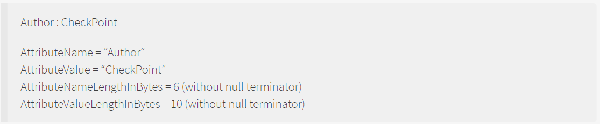
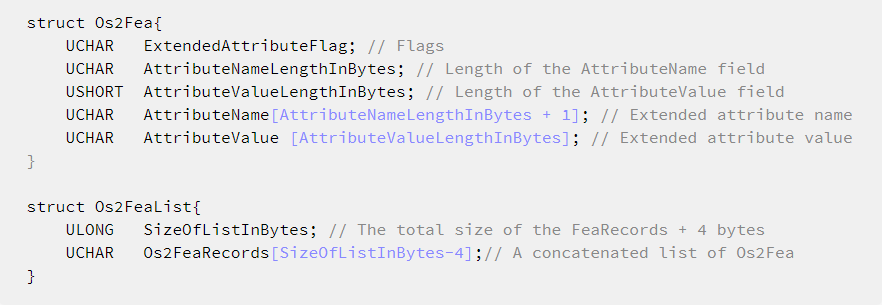
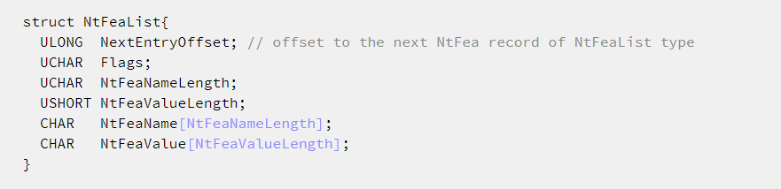
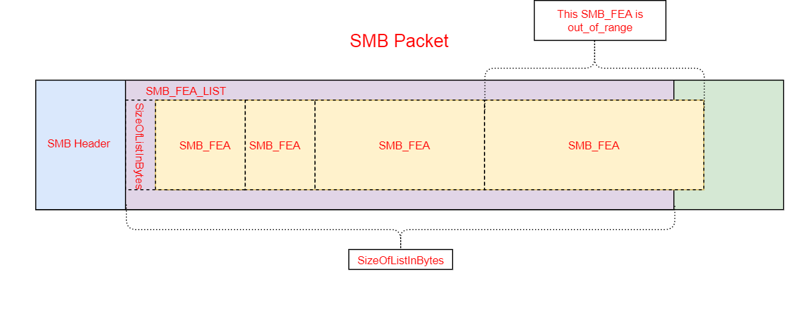
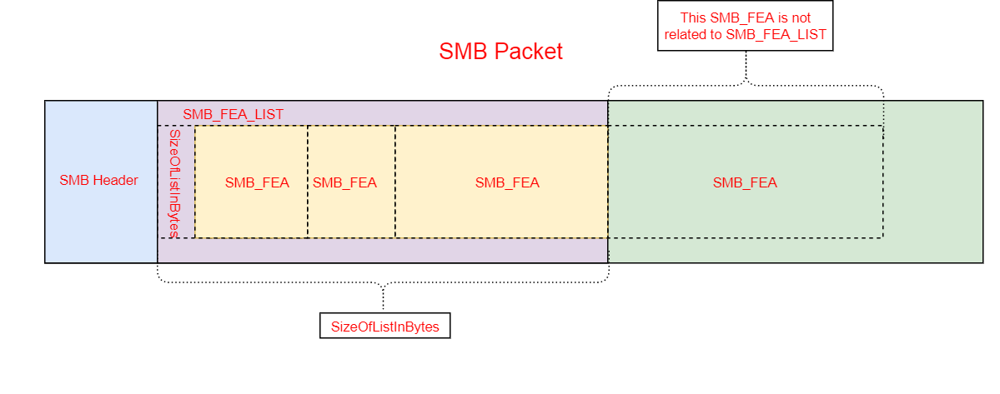
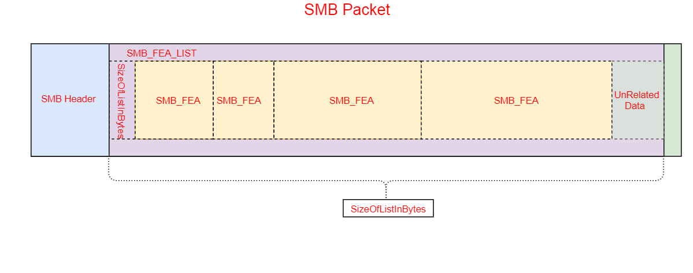
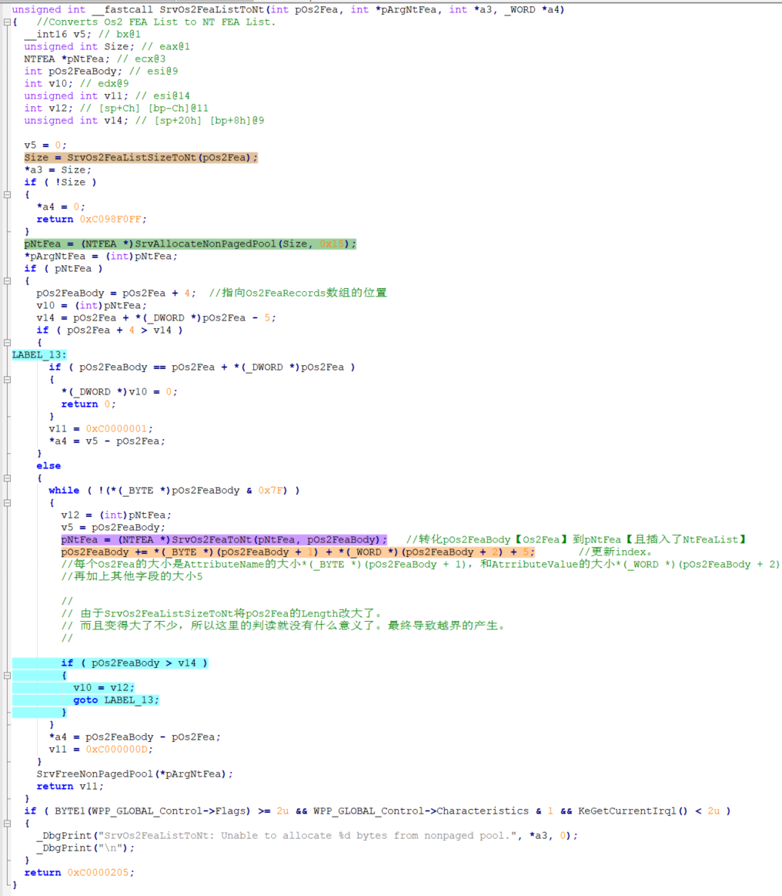

---
layout:	post
title: "Malware Analysis and CVE Recurrence"
subtitle: "坚持就是胜利！"
date: 2020-11-05 11:12:00
author:	 "许大仙"
catalog: true
tags:
    - Malware
---

本文不定期更新，分析新旧恶意软件和CVE POC。

## Meltdown and Spectre

Meltdown对应CVE-2017-5754（乱序执行缓存污染），Spectre对应CVE-2017-5753（边界检查绕过）与CVE-2017-5715（分支目标注入）

Meltdown漏洞影响几乎所有的Intel CPU和部分ARM CPU，而Spectre则影响所有的Intel CPU和AMD CPU，以及主流的ARM CPU。

**<u>背景：预测执行+乱序执行</u>**

- https://zhuanlan.zhihu.com/p/22469702【结尾的双模态预测器(bimodal predictor)】
- https://www.zhihu.com/question/23973128【**2 Level Adaptive Training**】
- https://www.jianshu.com/p/be389eeba589【动态预测器与BTB（Branch Target Buffer）】

> 了解如何如何分支预测自动机的原理，是如何训练的，如何基于历史进行预测的

**<u>漏洞基本原理</u>**

- https://zhuanlan.zhihu.com/p/32757727
- https://www.freebuf.com/articles/system/159811.html【POC分析】

**<u>POC</u>**

- https://github.com/paboldin/meltdown-exploit
- 注释代码：
  - [meltdown.c](https://github.com/spidermana/spidermana.github.io/blob/master/files/meltdown/meltdown.c)
  - [detect_rdtscp.sh](https://github.com/spidermana/spidermana.github.io/blob/master/files/meltdown/detect_rdtscp.sh)

**<u>实战</u>**

- https://xuanxuanblingbling.github.io/ctf/pwn/2020/06/30/meltdown/

**<u>论文</u>**

- [Meltdown: Reading Kernel Memory from User Space](https://meltdownattack.com/meltdown.pdf)
- [Spectre Attacks: Exploiting Speculative Execution](https://spectreattack.com/spectre.pdf)【由于CPU性能问题，该漏洞到2020年仍然有多种CPU未修复】

**<u>额外学习点：</u>**

- “无序”遍历，避免cache预先读取相邻块【避免局部性原理】
 ```c
for (i = 0; i < VARIANTS_READ; i++) {
  		mix_i = ((i * 167) + 13) & 255; //硬编码了 167 和 13 进去，其实就是两个质数，目的就是让 cache 预读摸不着头脑，不会因为线性预读取干扰了测时。
  		//如果读取是非线性的，那么cache不会进行相邻块预读取操作，就不会影响测时
  		//同样是遍历0~255，通过i遍历可能会到cache预读取
  		//而通过mix_i = ((i * 167) + 13) & 255来遍历，不会造成cache预读取，同时还可以保证“无序”遍历0~255
    //遍历过程中mix_i不会重复，且覆盖0~255完整区间
 ```

- 基于时间的cache旁道攻击方法

## Mirai

基本代码框架:

```c
loader/src   将payload上传到受感染的设备
mirai/bot    在受感染设备上运行的恶意payload【发起DoS攻击以及扫描其它可能受感染的设备】
mirai/cnc    恶意者进行控制和管理的接口
mirai/tools  提供的一些工具
```

源码及复现：

- https://github.com/ruCyberPoison/-Mirai-Iot-BotNet
- https://github.com/jgamblin/Mirai-Source-Code

源码分析：

- https://paper.seebug.org/142/
- [Mirai木马总结—从源码到反汇编](https://github.com/spidermana/spidermana.github.io/blob/master/files/Mirai木马总结—从源码到反汇编.pdf)
- [完整注释代码——转载请说明](https://github.com/spidermana/spidermana.github.io/tree/master/files/Mirai)

#### 涉及的DDos攻击方式

DDoS攻击的强度以每秒比特数（BPS），每秒数据包（PPS）或每秒请求数（RPS）度量。

**分析文章：**

- [IoT Attack Handbook](https://www.datacom.cz/userfiles/miraihandbookebook_final.pdf)
- [Usenix security 2017 Understanding the Mirai Botnet](https://www.usenix.org/system/files/conference/usenixsecurity17/sec17-antonakakis.pdf)

**UDP类型**

- 平凡的UDP攻击：

  - 随机变化src_ip，而dst_ip来自于C&C服务器的命令包中指定的待攻击ip。
  - the result is a flood of UDP traffic that can be difficult to fingerprint on an upstream router or firewall because there is no common source IP, source port or destination port.

- Valve Source Engine query flood：基于游戏引擎查询服务进行的Dos放大攻击。【Mirai botnet的特征】

  - Source Engine Query泛洪是使用[Source引擎游戏服务器的查询协议](https://developer.valvesoftware.com/wiki/Server_queries)来进行的攻击，攻击者只需要发送一小段数据包，服务端会返回几倍的数据，形成反射性攻击。
  - [防御Source Engine Query泛洪攻击](https://tlingc.com/2020/01/defense-source-engine-query-flood-attack-1/)

- DNS water torture：类似于随机子域名攻击：在拟攻击的域名url前面加上随机字符串【eg：xyuicosic.www.victimdomain.com、alkdfasd.www.victimdomain.com等，使用DGA算法生成的随机域名】，这样就会有大量的DNS请求堆积到www.victimdomain.com的权威名称服务器。当受害者域名的权威DNS服务器崩溃，无法响应其他请求时，攻击成功。

  - [DGA域名生成算法](https://hackersterminal.com/domain-generation-algorithm-dga-in-malware/)初始是为了避免攻击者的域名【C&C服务器】被加入黑名单或被关闭，攻击者和恶意软件使用相同的DGA生成算法和种子，攻击者在24小时内注册可能的域名，当malware查询该算法生成的所有url域（AGD）成功返回ip时，C&C和malware成功建立连接。

    

  - 现在DGA被广泛用于随机子域名攻击，来Dos权威域名服务器。

  - 常见的DGA家族有cryptolocker、gameover、shifu等。[查看每个DGA系列的详细信息](https://data.netlab.360.com/dga/)

- Plain UDP flood optimized for speed：建立UDP连接，由内核记录对端的ip&port等connect信息，加速发包，增加DOS攻击速度

  - [udp使用connect建立连接与普通udp连接区别](https://blog.csdn.net/pyxllq/article/details/80320489)
  - [UDP连接的高效体现在哪里](https://cloud.tencent.com/developer/article/1004555)

**TCP类型**

- TCP SYN Flood
  - syn flood 是一种经典的 ddos攻击手段：当服务端接收到 SYN 后进入 SYN-RECV 状态，此时的连接称为**半连接**，同时会被服务端写入一个 半连接队列。想象一下，如果攻击者在短时间内不断的向服务端发送大量的 SYN 包而不响应，那么服务器的 半连接队列很快会被写满，从而导致无法工作。
  - 通过启用[syn_cookies](https://zh.wikipedia.org/wiki/SYN_cookie)的方式实现缓解：当服务器的半连接队列满了时，主动丢弃还未ACK的半连接【相当于扩大了半连接队列大小】。如果之后收到了SYN+ACK则通过syn_cookies【其实就是TCP SYN的初始序列号，但是包含了dst和src的单向hash等信息】重建SYN队列条目连接。
- [ACK flood](https://baike.baidu.com/item/ACK%20Flood)
  - 不需要建立连接，只需要不停发带ACK的数据包，但是数据部分的内容无真实意义【甚至不需要数据】，利用服务器检查ACK数据包合法性的复杂过程的资源消耗导致DOS【服务器会检测四元组、checksum是否合法等。】
  - The targeted server has to process each ACK packet received, which uses so much computing power that it is unable to serve legitimate users。
- ACK flood to bypass mitigation devices
  - [TCP STOMP attack](https://www.securityweek.com/mirai-used-stomp-floods-recent-ddos-attacks)是ACK Flood attack的变体，是Mirai专有的一种DDos攻击方法，有三个主要步骤：
    - the botnet device opens an authenticated TCP handshake with a targeted application using STOMP; 
    - after authentication, junk data disguised as a STOMP TCP request is sent to the target;
    - the flood of fake STOMP requests leads to network saturation.
  - [STOMP协议细节](https://stomp.github.io/stomp-specification-1.2.html)
  - [SOCK_RAW](https://github.com/xgfone/snippet/blob/master/snippet/docs/linux/program/raw-socket.md)：如果是SOCK_RAW，发送是自己构造指定向某个ip发送，而接收是全部接收，不管来自哪个ip，就像是没有过滤器的抓包软件了。在Mirai中fd套接字的TCP连接建立一成功，由rfd负责接下来的数据包交互——in-session attack。
    - 对于SOCK_RAW的套接字而言，在进入运输层（如TCP、UDP例程）之前，系统会检查系统中是否有通过`socket(AF_INET, SOCK_RAW, ...)`创建的套接字；如果有的话并且协议相符，系统就给每个这样的socket接收缓冲区发送一个数据包拷贝（不管在任何情况下，永远都包含IP数据包头）。然后进入运输层。
  - 这种攻击方式是为了抵御某种DDOS防御机制：通过建立三次握手成功的TCP连接，得到一个成功的session会话后，再进行ACK FLOOD攻击。
    - 此时attacker_ip和target_ip的session已经被认证是合法的了。所以后来发的ACK包可以更大概率可以绕过WAF等防御机制【in_session attack】。
    - 
    - 貌似上图提到的源port变更现在已经不存在了。现在是真实的in-session attack。
    - the so called “TCP STOMP” attack is a variation of the simple ACK flood intended to bypass mitigation devices. 。在分析此攻击的实际实现时，bot打开了完整的TCP连接，然后继续使用具有合法序号的ACK数据包进行flood，从而以保持TCP连接的有效性。

**GRE类型**

- [GRE](https://www.cloudflare.com/zh-tw/learning/network-layer/what-is-gre-tunneling/)即通用路由封装，可以对网络层协议的数据包进行封装【如封装ip数据包】，使这些被封装的数据报能够在IPv4网络中传输。【也就是GRE是用来支持哪些不能在网络中传输的报文，通过GRE封装得以在网络中传输=>GRE tunneling】。大多数公用路由器都会传递GRE数据包，因为这种通信协议用于在网络节点之间建立直接的点对点连接，如：它是生成VPN连接的一种广泛使用的协议。

- Mirai使用了两种GRE Flood技术：GRE IP Flood和GRE Eth Flood，两者的差异就在于前者分装的是另外的ip数据包，后者封装的是以太网的包。

- 特殊性：

  - GRE is an attack payload that became popular with Mirai. 【因此可以成为Mirai的特征】
  - 各个抓包软件对GRE数据包的解析结果都是不太一样的。如Wireshark，直接基于GRE内部的IPv4数据包进行显示，而没有考虑GRE外层的IP数据包。因此这也成为了为什么GRE attack如此powerful的因素之一。
  - Unlike some other protocols, **the source for GRE packets cannot be faked or spoofed**.To carry out a large GRE DDoS attack, **the attacker must control a large amount of <u>real</u> computing devices in a botnet**.【？】

  

- GRE报文格式及含义：

  - GRE报文的头部的格式就是[GRE头](https://en.wikipedia.org/wiki/Generic_Routing_Encapsulation)+IP头。然后内部再封装一个ip数据包的IP头。
  - GRE adds two headers to each packet: the GRE header, which is 4 bytes long, and an IP header, which is 20 bytes long【常规IP头的大小是20字节】. **The GRE header indicates the protocol type used by the encapsulated packet【GRE packets that are encapsulated within IP use IP protocol type 47】**. The IP header encapsulates the original packet's header and payload. <u>This means that a GRE packet usually has two IP headers</u>: one for the original packet, and one added by the GRE protocol. **Only the routers at each end of the GRE tunnel will reference the original, non-GRE IP header.**

- 仅仅是简单的构造，不停发GRE包的DDOS，只是因为封装导致数据包难以准确辨别【基于GRE的防护策略不足，而且payload在非两端的路由器上是不可解析的】。GRE包只是不停地将GRE包不断发往目的地，类似于UDP包【没有拥塞控制的】。而且分配了512字节的随机字符的payload，非常大的包【junk chunk】，不停的传输。当在tunnel中传输到另一端时，解析这个GRE包之后得到payload，但发现得到payload根本没办法解析【耗费了很多计算资源，使得端头的router效率降低了】，以至于继续传输下去或传给上层应用，因此白传输了。

- 因此target addr，应该是GRE协议中要求的ip头。也就是最外层的IP头的dest应该是指定的target addr。这样所有包才会通过建立tunneling在target addr处进行解封装。其他都字段都可以进行随机。

- legitimate GRE tunneling between two (edge) routers and it floods the victim with all different GRE packets from many bot devices


**Http 类型**

- 特征：
  - Protocol：TCP(HTTP)
  - Bandwidth Profile：LOW BPS, LOW PPS.
  - PACKET SIZE: Medium-Small (373 bytes) 
  - NOTES: Incredibly versatile for crafted HTTP attacks. High amplification factor. **a highly flexible attack** with **several customizations** that could prove difficult to defend.
- 攻击者会首先侦察victim的网络，判断最适合的HTTP Flood攻击方法。
  1. HTTP GET attack：攻击者首先重复构造一些合法的HTTP资源请求包，这些请求都来自一些真实的HTTP client【五个合法HTTP user agents（five user-agents）】，这些client发出真实合法的Http请求（根据攻击者Mirai console定制生成）。攻击的假设是要通过不断的GET请求耗尽服务器资源。**Note that the traffic looks exactly like normal HTTP traffic**。
  2. HTTP POST attack： the HTTP POST attack is intended to abuse the use of forms or input fields on a website。攻击的源是一样的，都是真实设备作为HTTP客户端构造定制的真实POST请求。【由于流量都是真实的，来自不同设备的，因此NetFlow-based DDoS solution是很难检测出来的】
  3. 还有其他很多HTTP请求类型，这些类型的结果基本上不是耗尽网络带宽，而是耗尽服务器的CPU。如HTTP DETELE attack，服务器会返回给攻击者HTTP 405/Method Not Allowed页面。处理这种请求是CPU intensive的，因此就算attack的流量不是很大，对CPU的影响也是很显著的。
- The HTTP attack in Mirai can be used to **deliver not only traditional GET attacks but also complex, precision-targeted HTTP attacks.**
- 

## Trickbot流量分析

Trickbot是一种信息窃取程序和银行恶意软件，自2016年以来一直在感染受害者。Trickbot是通过恶意垃圾邮件（malspam）分发的，还可以由其他恶意软件（例如Emotet，IcedID或Ursnif）。

Trickbot具有独特的流量模式。本期回顾了由两种不同方法引起的Trickbot感染的摘要：恶意垃圾邮件的Trickbot感染和通过其他恶意软件分发的Trickbot。

参考分析：https://unit42.paloaltonetworks.com/wireshark-tutorial-examining-trickbot-infections/


trickbot的基本特征：

- 由受感染主机进行IP地址和网络连通性检查
- TCP 447和449端口的HTTPS / SSL /TLS流量
- TCP 8082的HTTP流量
- HTTP请求以.png结尾的windows可执行文件

分析补充：

1. [通过请求http://www.msftncsi.com/ncsi.txt判断网络连通性](https://dotblogs.com.tw/swater111/2014/01/09/139420)

2. 先分析成功的连接【http.request or ssl.handshake.type == 1】以及请求的对象【HTTP、SMTP等对象分析】

   - 可执行文件开头MZ：Content-type为application/octet-stream【 二进制流数据（如常见的文件下载）】
   - ZIP文件开头PK：Content-type为application/zip
   - [HTTP content-type](https://www.runoob.com/http/http-content-type.html)

3. 观察到第一个初始可执行文件之后，分析其后的所有TCP SYN连接【tcp.flags eq 0x0002】

   - 在下载第一个可执行文件之后，进行443和449连接，并在`187.58.56.26 over TCP port 449`上连接成功

4. 证书检查

   - 检查可疑连接ip的证书，很显然存在恶意：

     

5. 受Trickbot感染的Windows主机将使用许多不同的IP地址检查站点来检查其IP地址【如请求http://www.msftncsi.com/ncsi.txt】。

   - 这些站点不是恶意的，是一些ip检查的公有服务，流量本身也不是恶意的。但是，**这种IP地址检查在Trickbot和其他恶意软件家族中很常见**。Trickbot使用的各种合法IP地址检查服务包括：

       ```
       api.ip.sb
       checkip.amazonaws.com
       icanhazip.com
       ident.me
       ip.anysrc.net
       ipecho.net
       ipinfo.io
       myexternalip.com
       wtfismyip.com
       ```

   - IP地址检查本身并不是恶意的。但是，这种活动与其他网络流量相结合可以提供感染迹象。
     
     - 例如，这里就是刚刚成功连接到一个ip，就立刻进行被入侵主机的ip检查
   
6. Emotet生成的流量和Trickbot生成的流量差异

   - Trickbot经常通过其他恶意软件进行分发。Trickbot通常会做为Emotet（或IcedID、Ursnif）感染后续的恶意软件。
   - 感染后的Emotet活动由HTTP流量和服务器返回的编码数据组成。
   - 这与感染后的Trickbot活动明显不同，后者通常依靠HTTPS / SSL / TLS通信进行命令和控制通信。
   - 基于Emotet进行传播的Trickbot还会存在异常的SMB流量和DC感染。

## EternalBlue漏洞

EternalBlue（永恒之蓝）据称是方程式组织在其漏洞利用框架中一个针对SMB服务进行攻击的模块，由于其涉及漏洞的影响广泛性及利用稳定性，在被公开以后为破坏性巨大的勒索蠕虫 WannaCry所用而名噪一时。

SMB (Server Message Block) 是用来从网络上的服务器系统来请求文件和打印服务的协议。在协议的说明中有允许协议来通信关于文件扩展属性的信息，尤其是文件系统中关于文件特征的元数据。

EternalBlue达到其攻击目的事实上利用了3个独立的MS17-010漏洞：第一个也就是 CVE-2017-0144被用于引发越界内存写；第二个漏洞则用于绕过内存写的长度限制；第三个漏洞被用于攻击数据的内存布局。

Eternalblue本身主要是与漏洞CVE-2017-0144相关[和windows的srv.sys驱动程序有关]，该漏洞通过发送特殊伪造的消息到SMBv1服务器来允许远程攻击者在目标系统上执行任意代码。

漏洞原理：

- https://research.checkpoint.com/2017/eternalblue-everything-know/

- https://paper.seebug.org/280/
- https://github.com/worawit/MS17-010/blob/master/BUG.txt

利用脚本：

- https://github.com/worawit/MS17-010

#### srv.sys驱动程序漏洞点分析

**Os2Fea和NtFea结构体**

FEA结构体是用于描述扩展的文件属性的，如包括存储文档的作者，纯文本文档的字符编码或校验和，密码哈希或数字证书和任意访问控制信息。

> For more information, see https://en.wikipedia.org/wiki/Extended_file_attributes.

这里可以简单将FEA结构体看成键值对，键为 `AttributeName` ，值为`AttributeValue`.

例如：



In Os2 format, the struct looks like this:



After you convert the FEA from Os2 format to Windows format (Nt Format), the structure looks like this:



> Note that the size of the NtFea record is bigger than Os2Fea because it contains another field named NextEntryOffset. There is also an alignment of 4 bytes between the NtFea records.

**漏洞点分析——shrinking the SizeOfListInBytes member of Os2FeaList**


- 可以看到在`SrvOs2FeaListSizeToNt`函数中，在计算完返回“转换成NtFeaList所需要空间”的同时，还**更新了pOs2Fea中的SizeOfListInBytes字段。**
- 如果判断遍历完成了Os2Fea的Record的呢？是通过Os2FeaList的起始指针+**SizeOfListInBytes**字段作为界限，到达之后认为已经遍历完成了Os2Fea的所有Record。
- 那么试想一种情况：
  - If **<u>part of the FEA is in the range of the `SizeOfListInBytes` and the remainder of the FEA is “out of range” (bigger than `SizeOfListInBytes`).</u>** 
  - It will ignore this FEA and any further “out of range” FEA and **shrink the `SizeOfListInByte` to the size of all the “valid” FEAs**.
  - 由于对**SizeOfListInBytes**字段的更新，导致shrunk

**SrvOs2FeaListSizeToNT字段的收缩示例：**

Before Shrinking:



After Shrinking: if the size of `SizeOfListInBytes` is below 2^16:

- 由于计算最后一个SMB的时候，代码中18~21行的结尾判断已经出界了【误认为没有Record了】。不再计算这个SMB为要转换的NtFea。因此这个SMB被抛弃了。
- 但是又更新了`SizeOfListInBytes` 字段，导致了shrunk。



After Shrinking (bug): if the size of `SizeOfListInBytes` is above 2^16:

- 如果`SizeOfListInBytes` 字段本身是富余的。
- 那么由于最后一个SMB还没有超出界限，因此需要继续计算下一个Record/SMB packets【引入了垃圾数据来计算下一个SMB的长度】且增大了`SizeOfListInBytes`的大小。间接地，为NtFea多分配了存储空间。




SrvOs2FeaListToNt调用了上述的SrvOs2FeaListSizeToNt函数。



- 如果之前导致了Os2FeaList中SizeOfListInBytes字段的扩展，那么pNtFea就会被多分配内存。那么之后如果重新遍历Os2FeaList，按照更新后的SizeOfListInBytes字段，来转换成pNtFea。那么pNtFea所分配的内存就会被溢出写。【将不存在SMB packet存储到这个位置】

SrvOs2FeaToNT函数用于将一个Os2Fea record转换为一个NtFea record，并且添加到NtFeaList中，作为pNtFea变量返回。

## Psyb0t


## Malware Nice Post

- [简单的SSH蠕虫病毒](http://hackoftheday.securitytube.net/2013/04/simulating-ssh-worm-using-python.html)——[A wormable SSH bot](https://akijosberryblog.wordpress.com/2020/11/08/yantra-manav-a-wormable-ssh-bot/)
- 

## Malware Paper

- IoT Malware: Comprehensive Survey, Analysis Framework and Case Studies
  - 通过分析malware样本和对应的相关文章，给了在exploited credentials、Yara、IDS/IPS rules、botnet sizes方面给了IOT Malware一个全面的分析。
  - 给出了IOT Malware的一个发展时间线、提交样本和防御手段时间的时间延迟
  - 分析了D-Link厂商路由器的相似漏洞利用的两种恶意样本的发展【Hydra-2008.1IOTReaper】
  - **给了一个搭建IOT Malware分析框架的一个思路**：systemtap内核插桩、Buildroot跨平台工具链、QEMU+Cuckoo、InetSim
- 