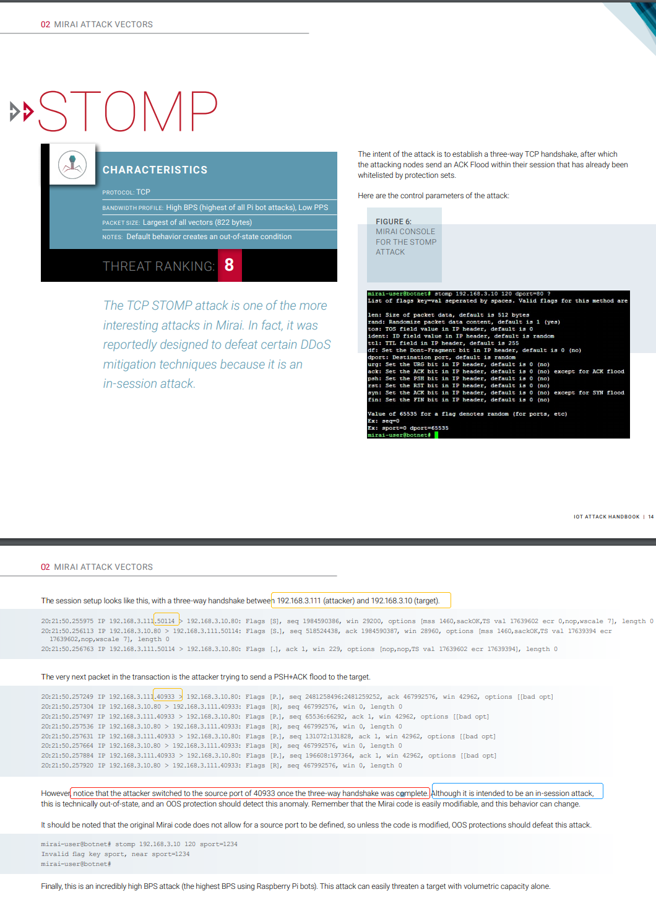

---
layout:	post
title: "Malware Analysis and CVE Recurrence"
subtitle: "坚持就是胜利！"
date: 2020-11-05 11:12:00
author:	 "许大仙"
catalog: true
tags:
    - Malware
---

本文不定期更新，分析新旧恶意软件和CVE POC。

## Meltdown and Spectre

Meltdown对应CVE-2017-5754（乱序执行缓存污染），Spectre对应CVE-2017-5753（边界检查绕过）与CVE-2017-5715（分支目标注入）

Meltdown漏洞影响几乎所有的Intel CPU和部分ARM CPU，而Spectre则影响所有的Intel CPU和AMD CPU，以及主流的ARM CPU。

**<u>背景：预测执行+乱序执行</u>**

- https://zhuanlan.zhihu.com/p/22469702【结尾的双模态预测器(bimodal predictor)】
- https://www.zhihu.com/question/23973128【**2 Level Adaptive Training**】
- https://www.jianshu.com/p/be389eeba589【动态预测器与BTB（Branch Target Buffer）】

> 了解如何如何分支预测自动机的原理，是如何训练的，如何基于历史进行预测的

**<u>漏洞基本原理</u>**

- https://zhuanlan.zhihu.com/p/32757727
- https://www.freebuf.com/articles/system/159811.html【POC分析】

**<u>POC</u>**

- https://github.com/paboldin/meltdown-exploit
- 注释代码：
  - [meltdown.c](https://github.com/spidermana/spidermana.github.io/blob/master/files/meltdown/meltdown.c)
  - [detect_rdtscp.sh](https://github.com/spidermana/spidermana.github.io/blob/master/files/meltdown/detect_rdtscp.sh)

**<u>实战</u>**

- https://xuanxuanblingbling.github.io/ctf/pwn/2020/06/30/meltdown/

**<u>论文</u>**

- [Meltdown: Reading Kernel Memory from User Space](https://meltdownattack.com/meltdown.pdf)
- [Spectre Attacks: Exploiting Speculative Execution](https://spectreattack.com/spectre.pdf)【由于CPU性能问题，该漏洞到2020年仍然有多种CPU未修复】

**<u>额外学习点：</u>**

- “无序”遍历，避免cache预先读取相邻块【避免局部性原理】
 ```c
for (i = 0; i < VARIANTS_READ; i++) {
  		mix_i = ((i * 167) + 13) & 255; //硬编码了 167 和 13 进去，其实就是两个质数，目的就是让 cache 预读摸不着头脑，不会因为线性预读取干扰了测时。
  		//如果读取是非线性的，那么cache不会进行相邻块预读取操作，就不会影响测时
  		//同样是遍历0~255，通过i遍历可能会到cache预读取
  		//而通过mix_i = ((i * 167) + 13) & 255来遍历，不会造成cache预读取，同时还可以保证“无序”遍历0~255
    //遍历过程中mix_i不会重复，且覆盖0~255完整区间
 ```

- 基于时间的cache旁道攻击方法

## Mirai

基本代码框架:

```c
loader/src   将payload上传到受感染的设备
mirai/bot    在受感染设备上运行的恶意payload【发起DoS攻击以及扫描其它可能受感染的设备】
mirai/cnc    恶意者进行控制和管理的接口
mirai/tools  提供的一些工具
```

源码及复现：

- https://github.com/ruCyberPoison/-Mirai-Iot-BotNet
- https://github.com/jgamblin/Mirai-Source-Code

源码分析：

- https://paper.seebug.org/142/
- [Mirai木马总结—从源码到反汇编](https://github.com/spidermana/spidermana.github.io/blob/master/files/Mirai木马总结—从源码到反汇编.pdf)
- 

涉及的DDos攻击方式：

DDoS攻击的强度以每秒比特数（BPS），每秒数据包（PPS）或每秒请求数（RPS）度量。

**分析文章：**

- [IoT Attack Handbook](https://www.datacom.cz/userfiles/miraihandbookebook_final.pdf)
- [Usenix security 2017 Understanding the Mirai Botnet](https://www.usenix.org/system/files/conference/usenixsecurity17/sec17-antonakakis.pdf)

**UDP类型**

- 平凡的UDP攻击：

  - 随机变化src_id，而dst_ip来自于C&C服务器的命令包中指定的待攻击ip。

- Valve Source Engine query flood：基于游戏引擎查询服务进行的Dos放大攻击。

  - Source Engine Query泛洪是使用[Source引擎游戏服务器的查询协议](https://developer.valvesoftware.com/wiki/Server_queries)来进行的攻击，攻击者只需要发送一小段数据包，服务端会返回几倍的数据，形成反射性攻击。
  - [防御Source Engine Query泛洪攻击](https://tlingc.com/2020/01/defense-source-engine-query-flood-attack-1/)

- DNS water torture：类似于随机子域名攻击：在拟攻击的域名url前面加上随机字符串【eg：xyuicosic.www.victimdomain.com、alkdfasd.www.victimdomain.com等，使用DGA算法生成的随机域名】，这样就会有大量的DNS请求堆积到www.victimdomain.com的权威名称服务器。当受害者域名的权威DNS服务器崩溃，无法响应其他请求时，攻击成功。

  - [DGA域名生成算法](https://hackersterminal.com/domain-generation-algorithm-dga-in-malware/)初始是为了避免攻击者的域名【C&C服务器】被加入黑名单或被关闭，攻击者和恶意软件使用相同的DGA生成算法和种子，攻击者在24小时内注册可能的域名，当malware查询该算法生成的所有url域（AGD）成功返回ip时，C&C和malware成功建立连接。

    

  - 现在DGA被广泛用于随机子域名攻击，来Dos权威域名服务器。

  - 常见的DGA家族有cryptolocker、gameover、shifu等。[查看每个DGA系列的详细信息](https://data.netlab.360.com/dga/)

- Plain UDP flood optimized for speed：建立UDP连接，由内核记录对端的ip&port等connect信息，加速发包，增加DOS攻击速度

  - [udp使用connect建立连接与普通udp连接区别](https://blog.csdn.net/pyxllq/article/details/80320489)
  - [UDP连接的高效体现在哪里](https://cloud.tencent.com/developer/article/1004555)

**TCP类型**

- TCP SYN Flood
  - syn flood 是一种经典的 ddos攻击手段：当服务端接收到 SYN 后进入 SYN-RECV 状态，此时的连接称为**半连接**，同时会被服务端写入一个 半连接队列。想象一下，如果攻击者在短时间内不断的向服务端发送大量的 SYN 包而不响应，那么服务器的 半连接队列很快会被写满，从而导致无法工作。
  - 通过启用[syn_cookies](https://zh.wikipedia.org/wiki/SYN_cookie)的方式实现缓解：当服务器的半连接队列满了时，主动丢弃还未ACK的半连接【相当于扩大了半连接队列大小】。如果之后收到了SYN+ACK则通过syn_cookies【其实就是TCP SYN的初始序列号，但是包含了dst和src的单向hash等信息】重建SYN队列条目连接。
- [ACK flood](https://baike.baidu.com/item/ACK%20Flood)
  - 不需要建立连接，只需要不停发带ACK的数据包，但是数据部分的内容无真实意义【甚至不需要数据】，利用服务器检查ACK数据包合法性的复杂过程的资源消耗导致DOS【服务器会检测四元组、checksum是否合法等。】
  - The targeted server has to process each ACK packet received, which uses so much computing power that it is unable to serve legitimate users。
- ACK flood to bypass mitigation devices
  - [TCP STOMP attack](https://www.securityweek.com/mirai-used-stomp-floods-recent-ddos-attacks)是ACK Flood attack的变体，是Mirai专有的一种DDos攻击方法，有三个主要步骤：
    - the botnet device opens an authenticated TCP handshake with a targeted application using STOMP; 
    - after authentication, junk data disguised as a STOMP TCP request is sent to the target;
    - the flood of fake STOMP requests leads to network saturation.
  - [STOMP协议细节](https://stomp.github.io/stomp-specification-1.2.html)
  - [SOCK_RAW](https://github.com/xgfone/snippet/blob/master/snippet/docs/linux/program/raw-socket.md)：如果是SOCK_RAW，发送是自己构造指定向某个ip发送，而接收是全部接收，不管来自哪个ip，就像是没有过滤器的抓包软件了。在Mirai中fd套接字的TCP连接建立一成功，由rfd负责接下来的数据包交互——in-session attack。
    - 对于SOCK_RAW的套接字而言，在进入运输层（如TCP、UDP例程）之前，系统会检查系统中是否有通过`socket(AF_INET, SOCK_RAW, ...)`创建的套接字；如果有的话并且协议相符，系统就给每个这样的socket接收缓冲区发送一个数据包拷贝（不管在任何情况下，永远都包含IP数据包头）。然后进入运输层。
  - 这种攻击方式是为了抵御某种DDOS防御机制：通过建立三次握手成功的TCP连接，得到一个成功的session会话后，再进行ACK FLOOD攻击。
    - 此时attacker_ip和target_ip的session已经被认证是合法的了。所以后来发的ACK包可以更大概率可以绕过WAF等防御机制【in_session attack】。
    - 
    - 貌似上图提到的源port变更现在已经不存在了。现在是真实的in-session attack。

**GRE类型**

- GRE即通用路由封装，可以对网络层协议的数据包进行封装【如封装ip数据包】，使这些被封装的数据报能够在[IPv4](https://baike.baidu.com/item/IPv4)网络中传输。

【……】

## trickbot流量分析

Trickbot是一种信息窃取程序和银行恶意软件，自2016年以来一直在感染受害者。Trickbot是通过恶意垃圾邮件（malspam）分发的，还可以由其他恶意软件（例如Emotet，IcedID或Ursnif）。

Trickbot具有独特的流量模式。本期回顾了由两种不同方法引起的Trickbot感染的摘要：恶意垃圾邮件的Trickbot感染和通过其他恶意软件分发的Trickbot。

参考分析：https://unit42.paloaltonetworks.com/wireshark-tutorial-examining-trickbot-infections/


trickbot的基本特征：

- 由受感染主机进行IP地址和网络连通性检查
- TCP 447和449端口的HTTPS / SSL /TLS流量
- TCP 8082的HTTP流量
- HTTP请求以.png结尾的windows可执行文件

分析补充：

1. [通过请求http://www.msftncsi.com/ncsi.txt判断网络连通性](https://dotblogs.com.tw/swater111/2014/01/09/139420)

2. 先分析成功的连接【http.request or ssl.handshake.type == 1】以及请求的对象【HTTP、SMTP等对象分析】

   - 可执行文件开头MZ：Content-type为application/octet-stream【 二进制流数据（如常见的文件下载）】
   - ZIP文件开头PK：Content-type为application/zip
   - [HTTP content-type](https://www.runoob.com/http/http-content-type.html)

3. 观察到第一个初始可执行文件之后，分析其后的所有TCP SYN连接【tcp.flags eq 0x0002】

   - 在下载第一个可执行文件之后，进行443和449连接，并在`187.58.56.26 over TCP port 449`上连接成功

4. 证书检查

   - 检查可疑连接ip的证书，很显然存在恶意：

     

5. 受Trickbot感染的Windows主机将使用许多不同的IP地址检查站点来检查其IP地址【如请求http://www.msftncsi.com/ncsi.txt】。

   - 这些站点不是恶意的，是一些ip检查的公有服务，流量本身也不是恶意的。但是，**这种IP地址检查在Trickbot和其他恶意软件家族中很常见**。Trickbot使用的各种合法IP地址检查服务包括：

       ```
       api.ip.sb
       checkip.amazonaws.com
       icanhazip.com
       ident.me
       ip.anysrc.net
       ipecho.net
       ipinfo.io
       myexternalip.com
       wtfismyip.com
       ```

   - IP地址检查本身并不是恶意的。但是，这种活动与其他网络流量相结合可以提供感染迹象。
     
     - 例如，这里就是刚刚成功连接到一个ip，就立刻进行被入侵主机的ip检查
   
6. Emotet生成的流量和Trickbot生成的流量差异

   - Trickbot经常通过其他恶意软件进行分发。Trickbot通常会做为Emotet（或IcedID、Ursnif）感染后续的恶意软件。
   - 感染后的Emotet活动由HTTP流量和服务器返回的编码数据组成。
   - 这与感染后的Trickbot活动明显不同，后者通常依靠HTTPS / SSL / TLS通信进行命令和控制通信。
   - 基于Emotet进行传播的Trickbot还会存在异常的SMB流量和DC感染。

## EternalBlue漏洞


## malware相关的不错Post

- [简单的SSH蠕虫病毒](http://hackoftheday.securitytube.net/2013/04/simulating-ssh-worm-using-python.html)——[A wormable SSH bot](https://akijosberryblog.wordpress.com/2020/11/08/yantra-manav-a-wormable-ssh-bot/)
- 