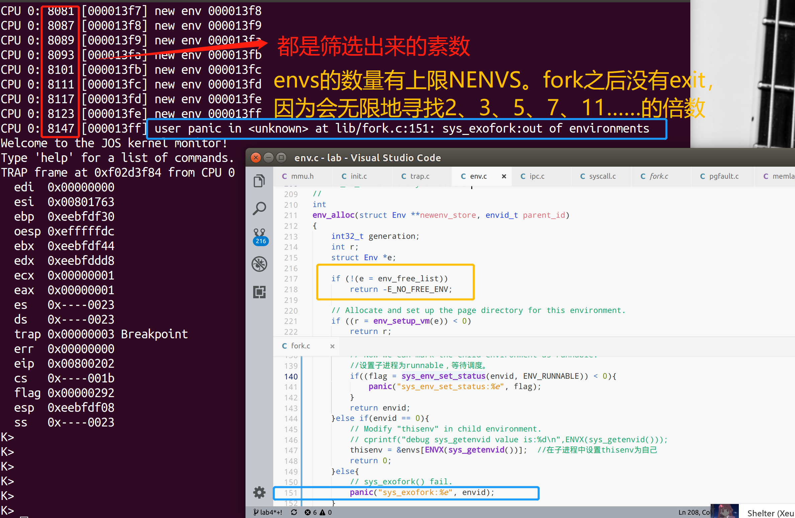

## Lab4 Part B: Copy-on-Write Fork

As mentioned earlier, Unix provides the `fork()` system call as its primary process creation primitive. Fork ()系统调用复制调用进程(父进程)的地址空间，以创建新进程(子进程)。

xv6 kernel对fork的实现方式是：xv6 Unix implements `fork()` by **copying all data from the parent's pages into new pages allocated for the child**. 这种方式和dumbfork()实现的方式是类似的。

```c
void
duppage(envid_t dstenv, void *addr)
{
	int r;

	// This is NOT what you should do in your fork.
	if ((r = sys_page_alloc(dstenv, addr, PTE_P|PTE_U|PTE_W)) < 0)
		panic("sys_page_alloc: %e", r);
	if ((r = sys_page_map(dstenv, addr, 0, UTEMP, PTE_P|PTE_U|PTE_W)) < 0)
		panic("sys_page_map: %e", r);
	memmove(UTEMP, addr, PGSIZE);
	if ((r = sys_page_unmap(0, UTEMP)) < 0)
		panic("sys_page_unmap: %e", r);
}

envid_t
dumbfork(void)
{
	envid_t envid;
	uint8_t *addr;
	int r;
	extern unsigned char end[];

	// Allocate a new child environment.
	// The kernel will initialize it with a copy of our register state,
	// so that the child will appear to have called sys_exofork() too -
	// except that in the child, this "fake" call to sys_exofork()
	// will return 0 instead of the envid of the child.
	envid = sys_exofork();
	if (envid < 0)
		panic("sys_exofork: %e", envid);
	if (envid == 0) {
		// We're the child.
		// The copied value of the global variable 'thisenv'
		// is no longer valid (it refers to the parent!).
		// Fix it and return 0.
		thisenv = &envs[ENVX(sys_getenvid())];
		return 0;
	}

	// We're the parent.
	// Eagerly copy our entire address space into the child.
	// This is NOT what you should do in your fork implementation.
	for (addr = (uint8_t*) UTEXT; addr < end; addr += PGSIZE)
		duppage(envid, addr);

	// Also copy the stack we are currently running on.
	duppage(envid, ROUNDDOWN(&addr, PGSIZE));

	// Start the child environment running
	if ((r = sys_env_set_status(envid, ENV_RUNNABLE)) < 0)
		panic("sys_env_set_status: %e", r);

	return envid;
}
```

但是页面的copy操作是fork中最耗时耗力的工作。【The copying of the parent's address space into the child is the most expensive part of the `fork()` operation.】

但是很多时候在调用fork之后就会紧接着调用exec()来创建别的进程代码【和父进程的代码不同】。This is what the the shell typically does, for example。这样的话之前fork时进行父进程->子进程的页面copy就没有意义了，因为子进程在fork之后，调用 exec()之前只会用到很少的代码内存页。

因此，后来的 Unix 版本利用虚拟内存硬件【virtual memory hardware】，允许父进程和子进程共享（share）映射到各自地址空间的内存，直到其中一个进程实际修改它【 *share* the memory mapped into their respective address spaces until one of the processes actually modifies it.】这种技术被称为写时拷贝【*copy-on-write*】。为此，在 fork ()上，内核会将**地址空间映射**从父进程复制到子进程，而不是复制页面的内容【**copy the address space *mappings*** from the parent to the child **instead of the contents of the mapped pages**，and at the same time **mark the now-shared pages read-only**】，<u>同时将现在共享的页面标记为只读</u>。

当两个进程中的任意一个尝试写入其中一个共享页面时，该进程会出现Page Fault。此时，Unix 内核会意识到这个页面实际上是a "virtual" or "copy-on-write" copy，因此在页错误处理时，生成一个新的、私有的、可写的页面副本（copy）到这个导致页错误的进程空间中。通过这种方式，fork时页面内容实际上不会被复制，直到它们被写入，才会进行复制。这种优化使得子进程在 fork()后紧跟exec()的情况下，成本更低：在调用 exec()之前，子进程可能只需要复制一个页面(the current page of its stack，一个栈帧页。其他页面很可能只是读取，反正fork之前的读取到的内容，只要没写过，就和父进程的内容一样，通过share mappings就可以了)。

在这个实验的Part B部分中，您将实现a "proper" Unix-like `fork()` with copy-on-write，作为用户空间库例程（user space library routine）的一部分。在用户空间下，fork实现和copy-on-write支持有助于内核更加简便，更不容易出错。它还允许单个user-mode的程序为 fork()定义自己的语义，eg：一个程序想要一个稍微不同的实现(例如，昂贵的always-copy版本，比如dumbfork() ，或者一个父子进程实际共享内存的版本) ，那么它可以很容易地完成自己的实现。

### User-level page fault handling

user-level copy-on-write fork ()需要了解如何处理带有写保护（write-protected）的页面上触发的page fault，所以您首先要实现这一点。 **Copy-on-write is only one of many possible uses for user-level page fault handling.**

通常设置一个地址空间，以便页错误指示何时需要执行某些操作。例如，大多数 Unix 内核最初只映射新进程的栈区中的一个页面，随着进程的栈消耗增加，导致尚未映射的栈地址出现页面错误后，根据需要分配和映射额外的栈页面。典型的 Unix 内核必须跟踪进程空间的每个区域出现页面错误，即使采取相应操作。例如，栈区中的页错误通常会分配和映射新的物理内存页。程序BSS区域中的页错误通常会分配一个新页面，并用0填充，然后映射这个页。对于某些系统，按需分页的可执行程序中如果在text段发生页错误，会从磁盘中读取相应的页面，然后实时加载到内存进行映射【In systems with demand-paged executables, a fault in the text region will read the corresponding page of the binary off of disk and then map it】。

这对于内核来说是需要跟踪很多的信息。与采用传统的Unix approach不同，您将决定如何处理用户空间中的每个页错误，使得bugs are less damaging。这种设计的额外好处是允许程序在定义其内存区域时具有很大的灵活性。

you'll use user-level page fault handling later for mapping and accessing files on a disk-based file system.

#### Setting the Page Fault Handler

In order to handle its own page faults, a user environment will need to register a *page fault handler entrypoint* with the JOS kernel. 

用户进程通过系统调用`sys_env_set_pgfault_upcall`来注册自己的页错误处理函数入口（*page fault handler entrypoint*）。同时实验中也在`Env`结构体中增加了`env_pgfault_upcall`字段来存储页错误处理入口函数的信息。

##### Exercise 8

> Implement the `sys_env_set_pgfault_upcall` system call. Be sure to enable permission checking when looking up the environment ID of the target environment, since this is a "dangerous" system call.

实现`sys_env_set_pgfault_upcall` 系统调用，能够给指定Environment绑定一个页错误处理函数入口，存储到`Env`结构体的`env_pgfault_upcall`字段中。

```c
// Set the page fault upcall for 'envid' by modifying the corresponding struct Env's 'env_pgfault_upcall' field.  
// When 'envid' process causes a page fault, the kernel will push a fault record onto the exception stack, then branch to 'func' (parameter 2).
//
// Returns 0 on success, < 0 on error.  Errors are:
//	-E_BAD_ENV if environment envid doesn't currently exist, or the caller doesn't have permission to change envid.
static int
sys_env_set_pgfault_upcall(envid_t envid, void *func)
{
	// LAB 4: Your code here.
	struct Env *nowEnv;
	if(envid2env(envid,&nowEnv,1)<0){
		return -E_BAD_ENV;
	}
	nowEnv->env_pgfault_upcall = func;
	return 0;
	//panic("sys_env_set_pgfault_upcall not implemented");
}
```

#### Normal and Exception Stacks in User Environments

在正常执行期间，JOS 中的用户环境将在*normal* user stack上运行，ESP寄存器起始指向USTACKTOP。一开始push的数据驻留在USTACKTOP-PGSIZE~USTACKTOP-1的页面上。When a page fault occurs in user mode, however, the kernel will restart the user environment running a designated user-level page fault handler on a different stack, namely **the *user exception* stack.** In essence, we will make the JOS kernel implement automatic "stack switching" on behalf of the user environment, in much the same way that the x86 *processor* already implements stack switching on behalf of JOS when transferring from user mode to kernel mode!【然而，当用户模式下发生页错误时，内核将重新启动用户环境，在另一个栈，即用户异常栈（*user exception* stack）上运行指定的用户页错误处理程序。本质上，我们将使 JOS 内核代替用户环境实现自动的“栈帧切换”，就像 x86处理器已经代表JOS 实现从用户模式到内核模式的栈切换一样！】

到目前为止出现了三个栈：

```c
　　[KSTACKTOP-KSTKSIZE,  KSTACKTOP) 
　　内核态系统栈
　　[UXSTACKTOP - PGSIZE, UXSTACKTOP)
　　用户态错误处理栈【异常处理栈帧】
　　[UTEXT, USTACKTOP)
　　用户态运行栈
```

内核态系统栈是运行内核相关程序的栈，在有中断被触发之后，CPU会将栈自动切换到内核栈上来，而内核栈是在kern/trap.c的trap_init_percpu()中设置的。而这里的页错误，由JOS kernel将用户栈切换为异常栈。

JOS 用户异常栈（ the user exception stack）也只有一个页面大小，它的顶部被定义为虚拟地址UXSTACKTOP，因此用户异常栈的有效字节为UXSTACKTOP-PGSIZE~UXSTACKTOP-1。在此异常栈上运行时，the user-level page fault handler 可以使用 JOS 的常规系统调用来映射新页面或调整页映射，以便修复最初导致页错误的任何问题【While running on this exception stack, the user-level page fault handler can use JOS's regular system calls to map new pages or adjust mappings so as to fix whatever problem originally caused the page fault】。然后，the user-level page fault handler通过一小段汇编片段返回到导致页错Invoking the User Page Fault Handler误的代码所在的原始栈上（eg：*normal* user stack）。

此外，希望实现自己的user-level page fault handling的用户进程需要为自己的异常栈帧分配内存，可以直接使用part A的`sys_page_alloc()`函数。

#### Invoking the User Page Fault Handler

现在需要更改 kern/trap.c 中的页错误处理代码，以处理用户模式中的页错误，如下所示。我们将页错误发生时用户环境的状态称为*trap-time* state.

如果没有注册页错误处理程序，JOS 内核会像以前一样通过message机制销毁用户环境。否则，**内核会在异常栈帧上设置一个trap frame（looks like a `struct UTrapframe` from `inc/trap.h`**）

```c
struct UTrapframe {
	/* information about the fault */
	uint32_t utf_fault_va;	/* va for T_PGFLT, 0 otherwise */
	uint32_t utf_err;
	/* trap-time return state */
	struct PushRegs utf_regs;
	uintptr_t utf_eip;
	uint32_t utf_eflags;
	/* the trap-time stack to return to */
	uintptr_t utf_esp;
} __attribute__((packed));
```

相比于Trapframe，这里多了utf_fault_va，因为要记录触发错误的内存地址，同时还少了es,ds,ss等。**因为从用户态栈切换到异常栈，或者从异常栈再切换回去，实际上都是一个用户进程，所以不涉及到段的切换，不用记录。**在实际使用中，Trapframe是作为记录进程完整状态的结构体存在的，也作为函数参数进行传递；而UTrapframe只在处理用户定义错误的时候用。

- <u>当正常执行过程中发生了页错误，那么栈的切换是</u>
  - 用户运行栈—>内核栈【硬件trap捕获page fault】—>异常栈
- <u>而如果在异常处理程序中发生了也错误，那么栈的切换是</u>
  - 异常栈—>内核栈【硬件trap捕获page fault】—>异常栈

具体来说第一种情况，当用户模式出现页错误时，处理器将切换到内核栈，并push旧的SS，ESP，ESP，EFLAGS，CS和EIP【由硬件压入，是TrapFrame的一部分】。然后，它将CS:EIP设置为IDT表中设置的条目内所包含的处理程序【eg：page fault handler】。然后，kernel将其他寄存器的值【通用寄存器、ES、DS等】压入内核栈，最终形成Trapframe。此后，调用`kern/trap.c`中的`trap`，根据发生的陷阱类型进行分派`trap_dispatch`。然后我们发现它是一个`T_PGFLT`陷阱，因此我们转到`page_fault_handler`。

在函数中`page_fault_handler`，我们发现页错误发生在用户模式下。目前，发生故障时用户进程的状态即为trap-time state（存储在`page_fault_handler`的`TrapFrame tf`参数中）。然后在`page_fault_handler`中，我们需要设置inc / trap.h中`UTrapframe`结构体到异常栈上作为异常堆栈上的Trap frame。

具体的UTrap Frame布局如下：

```
+------------------+ <- UXSTACKTOP					---			高地址
| trap-time esp    |  	[挨着UENV，比用户栈帧更高]        |
+------------------+                                   |
| trap-time eflags |                                   |
+------------------+                                   |
| trap-time eip    |                                   |
+------------------+ <- Start of struct PushRegs.      |
| trap-time ecx    |                                   |
+------------------+                                   |
|     ……   ……      |                                   \
+------------------+                                    \ Last User-Trap-Frame
| trap-time esp    |                                    /  【trap-time state】
+------------------+                                   /
| trap-time ebp    |                                   |
+------------------+                                   |
| trap-time esi    |                                   |
+------------------+                                   |
| trap-time edi    |                                   |
+------------------+ <- End of struct PushRegs.        |
| tf_err:error code|                                   |
+------------------+                                   |
| fault_va         |                                   |
+------------------+ <- %esp(@) when handler is run. ---
|                  | <== 【在_pgfault_upcall中，会用于存储上一轮导致page fault的指令位置】
+------------------+  |After we have called _pgfault_handler specified by user 
| *trap-time esp   |  |environment, we have to store *trap-time eip to address %esp(@)-4.
+------------------+  |Up to this point, upon we have restored necessary status or 
| *trap-time eflags|  |registers of the User-Trap-Frame such as PushRegs and eflags 
+------------------+  |register,we could use instruction "ret" to pop the *trap-time eip
| *trap-time eip   | ===  we have stored before to register %eip. In other words, that is 
+~~~~~~~~~~~~~~~~~~+  also the reason why we need to store *trap-time eip to %esp(@) -4.
| ................ |
+~~~~~~~~~~~~~~~~~~+											低地址
```

之后内核会重新安排user environment恢复执行【通过页错误处理程序在这个exception stack上运行，解析stack frame】。注意虚拟地址`fault_va`就是导致页错误的位置【缺页的地址，而不是导致缺页的指令地址】。

**还有一些特殊情况**，<u>比如已经运行在exception stack的用户进程发生了异常怎么办？</u>【If the user environment is *already* running on the user exception stack when an exception occurs】也就是说页错误处理程序本身存在错误。在这种情况下，我们需要在当前tf->tf_esp下面启动新的Stack Frame【start the new stack frame just under the current `tf->tf_esp` rather than at `UXSTACKTOP`，You should first push an empty 32-bit word, then a `struct UTrapframe`】，还需要压入空4字节是为了递归page fault在一层层处理完之后可以回溯。

注意，实现时需要判断whether `tf->tf_esp` is already on the user exception stack。请检查它是否在UXSTACKTOP-PGSIZE~ UXSTACKTOP-1之间（inclusive）。

<u>在进入Exercise 9 之前我们来理顺一下思路：</u>

使用专门的User Exception Stack来处理page fault，为了能够在处理完page fault之后能够恢复现场(**这一次不是通过调用env\_run之后的env\_pop\_tf来恢复现场了，因为env\_run用来进入\_pgfault\_upcall(lib/pfentry.S)用户程序了！)**，我们需要在User Exception Stack上构造User Trap Frame。<u>由于page fault可能递归触发</u>，因此我们构造User Trap Frame时需要检测trap-time esp是否已经在User Exception Stack上了，并且针对这种情况，我们需要额外预留4字节的空间以便后续将trap-time eip保存到这预留的4字节空间中，只有这样才能在调用`ret`指令的时候，将trap-time eip从栈中弹出到%eip中【回到上次page fault的指令，才能递归处理一次次页错误】，才能实现从触发此次page fault的指令开始执行的效果！

你可能会有这样的疑问，**为什么第一次在User Exception Stack上构造User Trap Frame时不需要预留4字节的空间？因为User Exception Stack栈顶的UTrapFrame的trap-time esp的值实际上是属于User Normal Stack的！【trap-time esp -4 的位置是在用户栈上，而不是异常栈帧上】**而在调用`ret`指令之前，我们首先会把trap-time esp - 4恢复到寄存器%esp中，这样的话，当我们再调用`ret`指令时，栈指针实际上就指向了返回地址！

##### Exercise 9

>Implement the code in `page_fault_handler` in `kern/trap.c` required to dispatch page faults to the user-mode handler. Be sure to take appropriate precautions when writing into the exception stack. 
>
>(What happens if the user environment runs out of space on the exception stack?)【注意递归page fault的情况】

Exercise 9实际上就是要我们完成User trap frame的构造，以及把控制转移到用户程序`_pgfault_upcall`【之前的exercise 8在struct Env的env_pgfault_upcall字段中设置了用户自定义的page fault handler】，以及完成从User Normal Stack到User Exceptiob Stack的切换：

```c
void
page_fault_handler(struct Trapframe *tf)
{
	uint32_t fault_va;

	// Read processor's CR2 register to find the faulting address
	fault_va = rcr2();		//从处理器的CR2寄存器中读取到导致页错误的虚拟内存地址

	// Handle kernel-mode page faults.

	// LAB 3: Your code here.
	if((tf->tf_cs & 3) == 0){		//如果是kernel中的page fault，那么直接panic
		panic(":( Your kernel triger a page fault at va@0x%08x !Bad kernel", fault_va);
	}

	// 接下来，只能是page fault happened in user mode.
	// Call the environment's page fault upcall, if one exists.  Set up a
	// page fault stack frame on the user exception stack (below
	// UXSTACKTOP), then branch to curenv->env_pgfault_upcall.
	// 
	// The page fault upcall might cause another page fault, in which case
	// we branch to the page fault upcall recursively, pushing another
	// page fault stack frame on top of the user exception stack.
	//
	// Hints:
	//   user_mem_assert() and env_run() are useful here.
	//   To change what the user environment runs, modify 'curenv->env_tf'
	//   (the 'tf' variable points at 'curenv->env_tf').
	// tf指针就是指向curenv->env_tf
	if(curenv->env_pgfault_upcall){
		struct UTrapframe *utf;
        //判断是递归的page fault还是第一次page fault
        //从而为分配UTrapframe空间。
		if(tf->tf_esp >=UXSTACKTOP-PGSIZE && tf->tf_esp <= (UXSTACKTOP - 1)){
            // the user environment is already running on the exception stack when an exception occurs.
			// Thus,we should start the new stack frame just under the tf->tf_esp.We have to push a word at the top of the trap-time stack as a scratch space.
            // 如果是递归，多分配4字节的空位置。【之后用于恢复执行用】
			utf = (struct UTrapframe *)(tf->tf_esp - 4 - sizeof(struct UTrapframe));
		}
		else
		{
			utf = (struct UTrapframe *)(UXSTACKTOP - sizeof(struct UTrapframe));
		}
        // 1.We have to check whether the environment allocate a page with permissions PTE_W for its exception stack and whether the exception stack overflows.
		// 2.Set size to 1 is enough here,because the user environment exception stack's size is only on page,
		// user_mem_assert function will definitely fail as long as the utf's virtual address is already lower than UXSTACKTOP-PGSIZE.Actually,any value between 1 and sizeof(struct UTrapFrame) is okay here.
		// 3.if user_mem_assert fail,this function will not return,just invoke env_destroy and sys_yield.
		user_mem_assert(curenv,(void *)utf,1,PTE_W);
        //通过trapframe来设置utrapframe【通过赋值完成了UTrapfram的布局】
        //结合UTrapframe结构体和布局图来看
		utf->utf_esp = tf->tf_esp;
		utf->utf_eflags = tf->tf_eflags;
		utf->utf_eip = tf->tf_eip;
		utf->utf_regs = tf->tf_regs;
		utf->utf_err = tf->tf_err;
		utf->utf_fault_va = fault_va;
		
        //设置eip为env_pgfault_upcall和栈帧esp位置，从而实现调用用户自定义的页错误处理程序。
        //branch to curenv->env_pgfault_upcall.
		curenv->env_tf.tf_eip = (uintptr_t)curenv->env_pgfault_upcall;
        // Don't forget set stack pointer.
		curenv->env_tf.tf_esp = (uintptr_t)utf;
        // ↓ never return. 
		env_run(curenv);	//转入env_pgfault_upcall执行【权限为用户态】，在异常栈帧上执行。
	}		
	// Destroy the environment that caused the fault.
    //如果没有设置页错误处理程序，则直接终止导致页错误的进程env_destroy(curenv)【注意不是panic kernel噢】
	cprintf("[%08x] user fault va %08x ip %08x\n",
		curenv->env_id, fault_va, tf->tf_eip);
	print_trapframe(tf);
	env_destroy(curenv);
}
```

#### User-mode Page Fault Entrypoint

接下来，需要实现assembly routine ，负责调用 C page fault handler并在原始的导致错误的指令处继续执行。This assembly routine is the handler that will be registered with the kernel using `sys_env_set_pgfault_upcall()`.

##### Exercise 10

> Implement the `_pgfault_upcall` routine in `lib/pfentry.S`. 
>
>The interesting part is returning to the original point in the user code that caused the page fault. 
>
>You'll return directly there, without going back through the kernel. The hard part is simultaneously switching stacks and re-loading the EIP.
>
>【完成恢复现场的工作】

```c
//这段汇编的含义可以直接参考：https://blog.csdn.net/bysui/article/details/51842817中的几个图片。
.text
.globl _pgfault_upcall
_pgfault_upcall:
	// Call the C page fault handler.
	pushl %esp			// function argument: pointer to UTF
	movl _pgfault_handler, %eax
	call *%eax
	addl $4, %esp			// pop function argument
	
	// Now the C page fault handler has returned and you must return
	// to the trap time state.
	// Push trap-time %eip onto the trap-time stack.
	// 以下需要return到之前的状态【转回上层递归page fault或者转回非递归的page fault即回到用户程序】
    // 退栈或栈帧转移【转回上层递归page fault的栈帧或转回普通用户栈】
 	movl 48(%esp), %ebp
    subl $4, %ebp		// UTrapFrame.utf_esp - 4 and store back
    movl %ebp, 48(%esp)	// 如果是递归page fault，
        				// 那么现在的trap-time esp就是下一个utf的栈顶【跳过了空的4字节位置】
        				// 否则就是用户运行栈的栈顶【陷入内核的时候tf->tf_esp存储的是用户栈栈顶】。
        				// 之后只要pop %esp就可以完成退栈或者栈帧转移
    movl 40(%esp), %eax 
    movl %eax, (%ebp)   //将原来出错指令的eip(即trap-time eip)取出放入保留的4字节位置
        			    //以便后来ret执行时pop eip，来恢复原程序继续运行。
        				//注意这时候%ebp已经被设置为UTrapFrame.utf_esp - 4，也就是保留的4字节位置
        				//或者是用户态栈帧栈顶的空四字节位置

	addl $0x8, %esp         // Set %esp to the end of struct PushRegs
	popal                   // Restore the trap-time registers.(struct PushRegs)

	addl $0x4, %esp         // now we are located at trap-time eip,so we have to increment %esp with 4.【跳过eip】
	popfl                   // Restore eflags register.	【pop eflags】

	popl %esp               // Just restore the adjusted trap-time stack pointer.
							// 恢复esp
	ret                     // We are now on the trap-time stack,since we have saved trap-time eip above trap-time esp,ret instruction will pop this trap-time eip to register %eip which known as PC at this time.Thus,we can return to re-execute the instruction that faulted.
```

##### Exercise 11

最后，需要实现C user library side of the user-level page fault handling mechanism.

>Finish `set_pgfault_handler()` in `lib/pgfault.c`.
>
>【该函数属于库函数的导出函数，内部调用的sys_env_set_pgfault_upcall属于kernel系统调用，需要增加syscall的case】

```c
// Set the page fault handler function.
// If there isn't one yet, _pgfault_handler will be 0.
// The first time we register a handler, we need to
// allocate an exception stack (one page of memory with its top
// at UXSTACKTOP), and tell the kernel to call the assembly-language
// _pgfault_upcall routine when a page fault occurs.
//
void
set_pgfault_handler(void (*handler)(struct UTrapframe *utf))	//注意用户自定义的page fault handler是有一个参数utf的。
{
	int r;
	if (_pgfault_handler == 0) {
		// First time through!	=> Allocate an exception stack[one page]
		// LAB 4: Your code here.
        // 分配异常栈【一个page】，参数0表示curenv
		if(sys_page_alloc(0,(void *)UXSTACKTOP-PGSIZE,PTE_W|PTE_U|PTE_P)<0)
			panic("set_pgfault_handler:sys_page_alloc failed");
	}
	// Save handler pointer for assembly to call.
	_pgfault_handler = handler;	//设置全局变量_pgfault_handler为用户态自定义的page fault handler【只会会被_pgfault_upcall所在的汇编位置调用】
    //设置当前env的env_pgfault_upcall字段为_pgfault_upcall。
    if (sys_env_set_pgfault_upcall(thisenv->env_id,_pgfault_upcall)<0)	
        panic("set_pgfault_handler:sys_env_set_pgfault_upcall failed");
}
```

现在我们大致了解了每个Exercise的函数的含义。然后我们需要把整个流程连贯起来。

来看一下页错误的触发过程以及自定义页错误函数的处理流程。

首先用户会通过`set_pgfault_handler`来分配异常栈帧，并且设置好自定义的page fault handler到全局变量`_pgfault_handler`中，且设置env_pgfault_upcall字段为`_pgfault_upcall`。

当JOS在用户地址空间环境下由于写时复制机制（eg：fork中的Copy on write）而产生的缺页异常，会由硬件捕获，通过trap的一系列过程，最终转入内核态的`page_fault_handler`(kern/trap.c)，然后在rc2寄存器中获取导致异常的指令地址，并且根据当前的esp位置来在异常栈上分配UTrapframe的空间【非递归的话，就直接从UXSTACKTOP位置分配，否则继续从当前异常栈的tf_esp往下分配；异常栈总共就一页，如果递归太多次，超出异常栈的空间会进入非法内存的区域，在user_mem_assert(curenv,(void *)utf,1,PTE_W)检查时会触发错误】

```c
        //通过trapframe来设置utrapframe【通过赋值完成了UTrapfram的布局】
        //结合UTrapframe结构体和布局图来看
		utf->utf_esp = tf->tf_esp;
		utf->utf_eflags = tf->tf_eflags;
		utf->utf_eip = tf->tf_eip;
		utf->utf_regs = tf->tf_regs;
		utf->utf_err = tf->tf_err;
		utf->utf_fault_va = fault_va;
```


此后，会将trapframe中存储的有需要的寄存器状态放置到分配的UTrapframe空间中。然后设置当前进程的程序计数器和栈指针（curenv->eip和curenv->esp），然后通过`env_run()`重启这个进程。注意！这一次不是通过调用env\_run之后的env\_pop\_tf来恢复现场了，因为env\_run会用来来进入\_pgfault\_upcall(lib/pfentry.S)用户程序了！【env_run中的env_pop_tf(&(e->env_tf))会读取之前设置的curenv->eip和curenv->esp】

```c
	curenv->env_tf.tf_eip = (uintptr_t)curenv->env_pgfault_upcall;	//即_pgfault_upcall
	curenv->env_tf.tf_esp = (uintptr_t)utf;	//异常栈帧的顶部。
	env_run(curenv);	//进入_pgfault_upcall
```

在运行\_pgfault\_upcall汇编代码时，是以用户级ring3来运行environment，且运行在异常栈帧上。

首先在会调用存储在全局变量\_pgfault\_handler中的用户态自定义page fault处理函数入口，根据用户自定义的处理方式来处理页错误。注意handler的要求是`void (*handler)(struct UTrapframe *utf)`，以utrapframe为参数，因此直接压入异常栈帧的栈顶，即为指向utf的指针。

```c
_pgfault_upcall:
	// Call the C page fault handler.
	pushl %esp			// function argument: pointer to UTF
	movl _pgfault_handler, %eax
	call *%eax
	addl $4, %esp			// pop function argument【清理调用后的栈帧】
```

在调用完用户地址空间中的page fault handler之后，_pgfault_upcall中的后半段汇编需要把控制最终转移回触发这次page fault的用户程序指令。存在缺页的内存地址是由utf->fault_va记录的，而导致缺页的指令地址是utf->tf_eip，因此通过ret【pop utf->tf_eip到%eip】来转回用户空间，同时需要pop出utf->tf_esp到%esp，回到普通用户栈帧。

整个的Control Flow如下所示(省略了一些函数调用)：


最后，我们来理清一下递归page fault需要多分配空的4字节空间的意义。要讲明白这个，需要搞清楚_pgfault_upcall汇编的后半部分干了什么。

考虑第二次Page fault，首先是做一些退出前的准备操作，黑色为调用完_pgfault_handler的异常栈状态。相应颜色指令对应相应颜色的执行结果。


接下里是退栈和恢复执行：


考虑非递归的Page fault返回到用户程序继续执行的过程：


现在应该明确为什么说：

>It is **convenient** for our code which returns from a page fault (lib/pfentry.S) to have one word【4字节】 of scratch space at the top of the trap-time stack; it allows us to more easily restore the eip/esp. 
>
>In the non-recursive case, we don't have to worry about this because the top of the regular user stack is free.  【在非递归的情况下，本来user stack栈顶以下都是空的空间，可以直接存储eip。
>
>In the recursive case,  this means we have to leave an extra word between the current top of the exception stack and the new stack frame because the exception stack _is_ the trap-time stack.【但是如果是递归的情况下，需要留出空的4字节空间存储eip，不然下一层的utrapframe叠加上来以后就没地方存储了】

在完成以上部分后，make grade可以得到50/80。

### Implementing Copy-on-Write Fork

现在我们可以开始实现copy-on-write fork() 了。

Lab4已经在`lib/fork.c`的`fork()`给出了实现的大致框架。类似于`dumbfork()`，`fork()`需要创建一个新的environment，然后扫描整个父进程的地址空间，并在子进程中设置相应的页面映射。但两者差别在于，dumbfork复制所有pages的内容，而fork初始只复制页面映射，仅当父子进程其中一个尝试写某个页面时才会复制整个该页面的实际内容。

`fork()`的基本实现流程:

1. The parent installs `pgfault()` as the C-level page fault handler, using the `set_pgfault_handler()` function you implemented above.

   - 父进程通过C运行库中的`set_pgfault_handler()` 函数来设置页错误处理程序。

2. The parent calls `sys_exofork()` to create a child environment.

   - 之后调用`sys_exofork()`创新子进程。

3. For each writable or copy-on-write page in its address space below UTOP, the parent calls `duppage`, which should map the page copy-on-write into the address space of the child and then *remap* the page copy-on-write in its own address space.【对于每一个在UTOP之下的可写或写时拷贝的page，父进程都会调用`duppage`在父子进程的页表中进行设置】 

   - [ Note: The **ordering here** (i.e., <u>marking a page as COW in the child before marking it in the parent</u>) **actually matters**! Can you see why? Try to think of a specific case where reversing the order could cause trouble. ]
   -  `duppage` sets both PTEs so that the page is not writeable, and to contain `PTE_COW` in the "avail" field to distinguish copy-on-write pages from genuine read-only pages.【通过在avail字段设置`PTE_COW`来区别<u>不可写即只读页</u>和<u>写时拷贝页</u>】

   The exception stack is *not* remapped this way, however. Instead you need to <u>allocate a fresh page in the child for the exception stack.</u> Since the page fault handler will be doing the actual copying and the page fault handler runs on the exception stack, **the exception stack cannot be made copy-on-write**: who would copy it?

   `fork()` also needs to handle pages that are present, but not writable or copy-on-write.

4. The parent sets the user page fault entrypoint for the child to look like its own.【父进程为子进程设置子进程的页错误处理程序的入口】

5. The child is now ready to run, so the parent marks it runnable.

每当其中一个进程写了一个尚未写过的 copy-on-write page时，就会出现一个页错误。以下是用户页错误处理程序的control flow：

1. The kernel propagates the page fault to `_pgfault_upcall`, which calls `fork()`'s `pgfault()` handler.
2. <u>`pgfault()` checks that the fault is a write (check for `FEC_WR` in the error code) and that the PTE for the page is marked `PTE_COW`. </u>If not, panic.【panic说明是写了只读页，不合法】
3. `pgfault()` allocates a new page mapped at a temporary location and <u>copies the contents of the faulting page into it.</u> Then the fault handler maps the new page at the appropriate address <u>with read/write permissions, in place of the old read-only mapping.</u>


user-level的`lib/fork.c`代码必须参考进程的页表来执行上面的几个操作(例如，标记页面对应的PTE中的权限为PTE_COW)。The kernel maps the environment's page tables at `UVPT` exactly for this purpose。它使用了一种巧妙的[映射技巧](https://pdos.csail.mit.edu/6.828/2018/labs/lab4/uvpt.html)，使得用户级代码查找PTE变得更加容易。`lib/entry.S`已经定义了uvpt 和 uvpd，因此在 lib/fork.c中可以方便地查找页表信息。

```c
/*
 * The page directory entry corresponding to the virtual address range
 * [UVPT, UVPT + PTSIZE) points to the page directory itself.  Thus, the page
 * directory is treated as a page table as well as a page directory.
 *
 * One result of treating the page directory as a page table is that all PTEs
 * can be accessed through a "virtual page table" at virtual address UVPT (to
 * which uvpt is set in lib/entry.S).  The PTE for page number N is stored in
 * uvpt[N].  (It's worth drawing a diagram of this!)
 *
 * A second consequence is that the contents of the current page directory
 * will always be available at virtual address (UVPT + (UVPT >> PGSHIFT)), to
 * which uvpd is set in lib/entry.S.
 */
extern volatile pte_t uvpt[];     // VA of "virtual page table"
extern volatile pde_t uvpd[];     // VA of current page directory
#endif
```

##### Exercise 12

>Implement `fork`, `duppage` and `pgfault` in `lib/fork.c`.
>
>Test your code with the `forktree` program.

采取的方法是在子进程映射的时候，**将父进程空间中所有可以写的页表的部分全部标记为可读且COW【因此读取的时候不会进入pgfault，但是写的时候会触发pgfault】。**而当父进程或者子进程任意一个发生了写的时候，因为页表现在都是不可写的，所以会触发异常，进入到我们设定的page fault处理例程，当检测到是对COW页的写操作的情况下，就可以将要写入的页的内容全部拷贝一份，重新映射。

首先来实现`pgfault`,处理page fault时的写时拷贝【之后fork就通过`set_pgfault_handler(pgfault)`将其设置为页错误处理函数】

```c
static void
pgfault(struct UTrapframe *utf) //通过pgfault完成写时拷贝
{
        int r;
        void *addr = (void *) utf->utf_fault_va;
        uint32_t err = utf->utf_err;
		// Check that the faulting access was (1) a write, and (2) to a
		// copy-on-write page.  If not, panic.
		// Hint:
		//   Use the read-only page table mappings at uvpt
		//   (see <inc/memlayout.h>).
    	// 是写造成的错误，并且写的页面标记是COW。如果不是这种情况，就panic【没有别的情况了】
        if (!((err & FEC_WR) && (uvpd[PDX(addr)] & PTE_P) && 
			(uvpt[PGNUM(addr)] & PTE_P) && (uvpt[PGNUM(addr)] & PTE_COW)))
                panic("pgfault: it's not writable or attempt to access a non-cow page!");
        // Allocate a new page, map it at a temporary location (PFTEMP),
        // copy the data from the old page to the new page, then move the new page to the old page's address.
    	//为这个进程分配的新的页面。到PFTEMP虚拟地址处【空的】
        envid_t envid = sys_getenvid();
        if ((r = sys_page_alloc(envid, (void *)PFTEMP, PTE_P | PTE_W | PTE_U)) < 0)
                panic("pgfault: page allocation failed %e", r);
	
        addr = ROUNDDOWN(addr, PGSIZE);
    	//把addr的内容拷贝到PFTEMP位置
        memmove(PFTEMP, addr, PGSIZE);	//PFTEMP处于低地址处，暂用于处理pgfault
        // LAB 4: Your code here.
        //解除addr对应的页表项，直接清空*pte=0
         if ((r = sys_page_unmap(envid, addr)) < 0)
                    panic("pgfault: page unmap failed %e", r);
        //构建新的页表项，也就是在addr虚拟地址处构建和PFTEMP虚拟地址映射一样的物理页
        if ((r = sys_page_map(envid, PFTEMP, envid, addr, PTE_P | PTE_W |PTE_U)) < 0)	//注意加入了PTE_W权限
                    panic("pgfault: page map failed %e", r);
        //解除PFTEMP的映射【以便处理下一次pgfault】
        if ((r = sys_page_unmap(envid, PFTEMP)) < 0)
                    panic("pgfault: page unmap failed %e", r);
```

在pgfault函数中先判断是否页错误是由写时拷贝造成的，如果不是则panic。借用了一个一定不会被用到的位置PFTEMP，专门用来发生page fault的时候拷贝内容用的。先解除addr原先的页映射关系，然后将addr映射到PFTEMP映射的页，最后解除PFTEMP的页映射关系。

接下来是`duppage`函数，负责进行COW方式的页复制，将当前进程的第pn页对应的物理页的映射到envid的第pn页上去，同时将这一页都标记为COW。

```c
// Map our virtual page pn (address pn*PGSIZE) into the target envid
// at the same virtual address.  If the page is writable or copy-on-write,
// the new mapping must be created copy-on-write, and then our mapping must be
// marked copy-on-write as well.  (Exercise: Why do we need to mark ours
// copy-on-write again if it was already copy-on-write at the beginning of
// this function?)
//
// Returns: 0 on success, < 0 on error.
// It is also OK to panic on error.
static int
duppage(envid_t envid, unsigned pn)	//envid子进程id，0或thisenv->env_id为当前进程id，通过函数，为进程envid设置一个和当前进程pn页一样的页表项/写时拷贝页表项。
{
        int r;

        void *addr;
        pte_t pte;
        int perm;

        addr = (void *)((uint32_t)pn * PGSIZE);
        pte = uvpt[pn];
    	//如果这个页是可写的页或者本身是写时拷贝页【还没有拷贝还是COW权限，比如fork后继续fork，那么子子进程还是要对子进程的COW页进行COW权限的设置】，那么就要标记COW
        if((pte & PTE_COW) || (pte & PTE_W))
        {
            r = sys_page_map(0, addr, envid, addr, PTE_COW | PTE_U | PTE_P);
            if(r < 0)
                panic("duppage: sys_page_map fail\n");
            r = sys_page_map(0, addr, 0, addr, PTE_COW | PTE_U | PTE_P);
            if(r < 0)
                panic("duppage: sys_page_map fail\n");
        }
        else	//如果这个页就是普通的可读页，那么就依旧标记为可读页就好了。不需要写时拷贝，直接在父子进程之间共享。
        {
            r = sys_page_map(0, addr, envid, addr, PTE_U | PTE_P);
            if(r < 0)
                panic("duppage: sys_page_map fail\n");
        }
	return 0;
}
```

最后是`fork`函数的实现，将页映射拷贝过去，这里需要考虑的地址范围就是从UTEXT到UXSTACKTOP为止，而在此之上的范围因为都是相同的，在env_alloc的时候已经设置好了【以kernel_pgdir为模板的】。

```c
// User-level fork with copy-on-write.
// Set up our page fault handler appropriately.
// Create a child.
// Copy our address space and page fault handler setup to the child.
// Then mark the child as runnable and return.
//
// Returns: child's envid to the parent, 0 to the child, < 0 on error.
// It is also OK to panic on error.
//
// Hint:
//   Use uvpd, uvpt, and duppage.
//   Remember to fix "thisenv" in the child process.
//   Neither user exception stack should ever be marked copy-on-write,
//   so you must allocate a new page for the child's user exception stack.
//
envid_t
fork(void)
{
	envid_t envid;
	uintptr_t pageVa;
	unsigned pn;
	set_pgfault_handler(pgfault);
    //sys_exofork创建一个tf一样的env，并且设置status为ENV_NOT_RUNNABLE
	if((envid = sys_exofork()) > 0){	//返回子进程id
		// parent environment.
		// Copy parent address space.
		for(pageVa = UTEXT; pageVa < USTACKTOP; pageVa += PGSIZE){
			// check permissions.
			pn = PGNUM(pageVa);
			if((uvpd[PDX(pageVa)] & PTE_P) && (uvpt[pn] & PTE_P) && (uvpt[pn] & PTE_U)){	//父进程中的页表项如果有效，就duppage一份。为子进程envid设置写时拷贝页或可读页的页表项。
				duppage(envid, pn);
			}
		}
		// Allocate a new page for the child's user exception stack.
		int32_t flag;
		if((flag = sys_page_alloc(envid, (void *)(UXSTACKTOP - PGSIZE), (PTE_P | PTE_U | PTE_W))) < 0){	//异常栈是自己的，是全新的，空的。
			panic("sys_page_alloc:%e", flag);
		}
		// Copy parent page fault handler setup to the child.
		extern void _pgfault_upcall(void);	//给子进程设置和父进程一样的pgfault handler
        //上面子进程的异常栈已经帮忙分配好了，因此这里只需要设置异常处理函数就好了
		if((flag = sys_env_set_pgfault_upcall(envid, _pgfault_upcall)) < 0){
			panic("sys_set_pgfault_upcall:%e", flag);
		}
		// Now we can mark the child environment as runnable.
        //设置子进程为runnable，等待调度。
		if((flag = sys_env_set_status(envid, ENV_RUNNABLE)) < 0){
			panic("sys_env_set_status:%e", flag);
		}
		return envid;
	}else if(envid == 0){
		// Modify "thisenv" in child environment.
		// cprintf("debug sys_getenvid value is:%d\n",ENVX(sys_getenvid()));
		thisenv = &envs[ENVX(sys_getenvid())];	//在子进程中设置thisenv为自己
		return 0;
	}else{
		// sys_exofork() fail.
		panic("sys_exofork:%e", envid);
	}
}
```

首先需要为父进程设定错误处理例程。这里调用set_pgfault_handler函数是因为当前并不知道父进程是否已经建立了异常栈，没有的话就会建立一个，而sys_env_set_pgfault_upcall则不会建立异常栈。
调用sys_exofork准备出一个和父进程状态相同的子进程，状态暂时设置ENV_NOT_RUNNABLE。然后进行拷贝映射的部分，在当前进程的页表中所有标记为PTE_P的页的映射都需要拷贝到子进程空间中去。**但是有一个例外，是必须要新申请一页，就是用户异常栈。因为copy-on-write就是依靠用户异常栈实现的，所以说这个栈要在fork完成的时候每个进程都有一个，唯一的，独立的。**

最后有很多需要分析和思考的点，可以参考[该链接](https://zhuanlan.zhihu.com/p/50169125)的最后Exercise12部分。

##### *challenge*！

> 参考：https://qinstaunch.github.io/2020/01/24/MIT-6-828-LAB4-Preemptive-Multitasking/#challenge-implement-shared-memory-sfork

至此Part B部分就完成了。


## Part C: Preemptive Multitasking and Inter-Process communication (IPC)

在实验4的最后一部分，我们将修改kernel以抢占某些”不配合“的进程【抢占式多任务】，并允许进程之间显式地进行传递消息。

### Clock Interrupts and Preemption

运行 user/spin 测试程序。这个测试程序fork出一个子进程，这个子进程一旦得到CPU的控制就会spin forever（`while(1)`）。无论是父进程还是kernel都不会重新获得CPU。This is obviously not an ideal situation in terms of protecting the system from bugs or malicious code in user-mode environments, 因为任何用户模式环境只要进入一个无限循环并且永远不退还 CPU，就可能使整个系统陷入停顿（halt）。为了允许内核抢占（*preempt* ）一个运行环境，强制重新控制 CPU，我们必须扩展 JOS 内核来支持来自时钟硬件的外部硬件中断（external hardware interrupts from the clock hardware）。

#### Interrupt discipline

外部中断External Interrupts (即设备中断Device Interrupts)被称为IRQs。有16种可能的IRQs，编号为[0,15]。IRQ 号到 IDT 条目的映射是不固定的。`pic_init`  in `picirq.c` maps IRQs 0-15 to IDT entries `IRQ_OFFSET` through `IRQ_OFFSET+15`。

在`inc/trap.h`中，IRQ_OFFSET设置为32（十进制）。因此IDT条目32-47对应于 IRQs 0-15。例如，时钟中断是 IRQ0，因此IDT[IRQ _ offset + 0]，即IDT[32]存储了the address of the clock's interrupt handler routine in the kernel。之所以选择这个IRQ_OFFSET值是为了使设备中断与处理器异常不重叠（事实上，在PC运行 MS-DOS的早期，IRQ_OFFSET实际上是零，这确实在处理硬件中断和处理器异常之间造成了巨大的混乱！)。

在 JOS，与 xv6 Unix 相比，我们做了一个关键的简化。外部设备中断在内核中总是禁用的，而和xv6一致，在用户空间中是启用。外部中断由%eflags寄存器的`FL_IF`标志位控制(参见 inc/mmu.h)。当这个位被设置时，外部中断被启用。虽然这个位可以通过几种方式修改，但是由于我们的简化，在进入和离开用户模式时，我们将只通过保存和恢复%eflags寄存器的过程来处理它。

我们必须确保在用户运行时在用户环境中设置FL_IF标志，以便当中断到来时，它被传递到处理器并由中断代码处理。否则，中断将被屏蔽或忽略，直到中断被重新启用。此前，我们在bootloader的第一条指令中设置了中断屏蔽(masked interrupts)，到目前为止我们还没有重新启用过它们。

##### Exercise 13

>Modify `kern/trapentry.S` and `kern/trap.c` to initialize the appropriate entries in the IDT and provide handlers for IRQs 0 through 15. 
>
>Then modify the code in `env_alloc()` in `kern/env.c` to ensure that user environments are always run with interrupts enabled.
>
>Also uncomment the `sti` instruction in `sched_halt()` so that idle CPUs unmask interrupts(不屏蔽中断请求).
>
>The processor never **pushes an error code** when invoking a hardware interrupt handler.

修改kern/trapentry.S和kern/trap.c来初始化IDT中IRQs0-15的入口和处理函数。然后修改env_alloc函数来确保进程在用户态运行时中断是打开的。

模仿原先设置默认中断向量即可，注意在发生硬件中断的时候，不会push error code，在kern/trapentry.S中定义IRQ0-15的处理例程时需要使用`TRAPHANDLER_NOEC`。

```c
// kern/trapentry.S
TRAPHANDLER_NOEC(IRQ0_Timer_handler, IRQ_OFFSET + IRQ_TIMER);
TRAPHANDLER_NOEC(IRQ1_Kbd_handler, IRQ_OFFSET + IRQ_KBD);
TRAPHANDLER_NOEC(IRQ_2, IRQ_OFFSET + 2);
TRAPHANDLER_NOEC(IRQ_3, IRQ_OFFSET + 3);
TRAPHANDLER_NOEC(IRQ4_Serial_handler, IRQ_OFFSET + IRQ_SERIAL);
TRAPHANDLER_NOEC(IRQ_5, IRQ_OFFSET + 5);
TRAPHANDLER_NOEC(IRQ_6, IRQ_OFFSET + 6);
TRAPHANDLER_NOEC(IRQ7_Spurious_handler, IRQ_OFFSET + IRQ_SPURIOUS);
TRAPHANDLER_NOEC(IRQ_8, IRQ_OFFSET + 8);
TRAPHANDLER_NOEC(IRQ_9, IRQ_OFFSET + 9);
TRAPHANDLER_NOEC(IRQ_10, IRQ_OFFSET + 10);
TRAPHANDLER_NOEC(IRQ_11, IRQ_OFFSET + 11);
TRAPHANDLER_NOEC(IRQ_12, IRQ_OFFSET + 12);
TRAPHANDLER_NOEC(IRQ_13, IRQ_OFFSET + 13);
TRAPHANDLER_NOEC(IRQ14_Ide_handler, IRQ_OFFSET + IRQ_IDE);
TRAPHANDLER_NOEC(IRQ_15, IRQ_OFFSET + 15);

// kern/trap.c
	void IRQ0_Timer_handlr();
	SETGATE(idt[IRQ_OFFSET + IRQ_TIMER], 0, GD_KT, IRQ0_Timer_handlr, 0);
	void IRQ1_Kbd_handler();
	SETGATE(idt[IRQ_OFFSET + IRQ_KBD], 0, GD_KT, IRQ1_Kbd_handler, 0);
	void IRQ_2();
	SETGATE(idt[IRQ_OFFSET + 2], 0, GD_KT, IRQ_2, 0);
	void IRQ_3();
	SETGATE(idt[IRQ_OFFSET + 3], 0, GD_KT, IRQ_3, 0);
	void IRQ4_Serial_handler();
	SETGATE(idt[IRQ_OFFSET + IRQ_SERIAL], 0, GD_KT, IRQ4_Serial_handler, 0);
	void IRQ_5();
	SETGATE(idt[IRQ_OFFSET + 5], 0, GD_KT, IRQ_5, 0);
	void IRQ_6();
	SETGATE(idt[IRQ_OFFSET + 6], 0, GD_KT, IRQ_6, 0);
	void IRQ7_Spuriou_handler();
	SETGATE(idt[IRQ_OFFSET + IRQ_SPURIOUS], 0, GD_KT, IRQ7_Spuriou_handler, 0);
	void IRQ_8();
	SETGATE(idt[IRQ_OFFSET + 8], 0, GD_KT, IRQ_8, 0);
	void IRQ_9();
	SETGATE(idt[IRQ_OFFSET + 9], 0, GD_KT, IRQ_9, 0);
	void IRQ_10();
	SETGATE(idt[IRQ_OFFSET + 10], 0, GD_KT, IRQ_10, 0);
	void IRQ_11();
	SETGATE(idt[IRQ_OFFSET + 11], 0, GD_KT, IRQ_11, 0);
	void IRQ_12();
	SETGATE(idt[IRQ_OFFSET + 12], 0, GD_KT, IRQ_12, 0);
	void IRQ_13();
	SETGATE(idt[IRQ_OFFSET + 13], 0, GD_KT, IRQ_13, 0);
	void IRQ14_Ide_handler();
	SETGATE(idt[IRQ_OFFSET + IRQ_IDE], 0, GD_KT, IRQ14_Ide_handler, 0);
	void IRQ_15();
	SETGATE(idt[IRQ_OFFSET + 15], 0, GD_KT, IRQ_15, 0);
```

然后在env_alloc函数中为创建的environment设置中断开启。

```c
 // Enable interrupts while in user mode.
        e->env_tf.tf_eflags |= FL_IF;
```

最后要将`sched_halt()`函数中的`sti`指令的注释解除掉，设置中断开启，允许接收时钟硬件中断：

```c
// Halt this CPU when there is nothing to do. Wait until the timer interrupt wakes it up. This function never returns.
//
void
sched_halt(void)
{
	int i;
	/* …… */
	// Reset stack pointer, enable interrupts and then halt.
	asm volatile (
		"movl $0, %%ebp\n"
		"movl %0, %%esp\n"
		"pushl $0\n"
		"pushl $0\n"
		// Uncomment the following line after completing exercise 13
		"sti\n"	//取消注释
		"1:\n"
		"hlt\n"
		"jmp 1b\n"
	: : "a" (thiscpu->cpu_ts.ts_esp0));
}
```

#### Handling Clock Interrupts

在 user/spin程序中，在子进程第一次运行之后，它只是在循环中spin，内核不再能得到控制权。因此我们需要对硬件进行编程来周期性地产生时钟中断，从而迫使CPU控制权回到内核中，故我们可以在不同的用户环境中切换控制。

通过调用 `lapic_init` and `pic_init`(from `i386_init` in `init.c`, 这两个函数已经实现好了）设置了时钟和中断控制器来生成中断。现在需要编写处理这些中断的代码。

##### Exercise 14

>Modify the kernel's `trap_dispatch()` function so that it calls `sched_yield()` to find and run a different environment whenever a clock interrupt takes place.
>
>You should now be able to get the `user/spin` test to work: the parent environment should fork off the child, `sys_yield()` to it a couple times but in each case regain control of the CPU after one time slice, and finally kill the child environment and terminate gracefully.

内核代码需要对时钟中断进行处理，调用之前实现的sched_yield，来调度别的environment使用CPU即可：

```c
// trap.c/trap_dispatch()
// Handle clock interrupts. Don't forget to acknowledge the interrupt using lapic_eoi() before calling the scheduler!
// LAB 4: Your code here.
if(tf->tf_trapno == IRQ_OFFSET+IRQ_TIMER){
	lapic_eoi();
    // Choose a user environment to run and run it.
	sched_yield();	//never return
	return;
}
```

This is a great time to do some *regression testing*.<u>Make sure that you haven't broken any earlier part of that lab that used to work (e.g. `forktree`) by enabling interrupts</u>. 另外，尝试使用 make cpu = 2 target 运行多个 cpu。Run make grade，应该可以收获65/80 score。

>注意，在Lab3中设置的SETGATE的第二个参数应该全为0。第二个参数设为1就会在开始处理中断时将 FL_IF 位重新置1，而设为 0 则保持 FL_IF 位不变。
>
>如果有误，则会触发如下错误：
>
>kernel panic on CPU 0 at kern/trap.c: assertion failed: !(read_eflags() & FL_IF)

### Inter-Process communication (IPC)

(Technically in JOS this is "inter-environment communication" or "IEC", but everyone else calls it IPC, so we'll use the standard term.)

我们一直专注于操作系统的隔离方面，它提供了一种每个程序都拥有一台自己的机器的错觉。操作系统的另一个重要服务是允许程序在需要的时候进行彼此通信。能让程序与其他程序交互是非常强大的，比如Unix 管道模型就是一个典型的例子。

进程间通信有许多模型。即使在今天，关于哪种模型是最好的，仍然存在争论。我们不会讨论这个问题。相反，我们将实现一个简单的 IPC 机制，然后进行尝试。

#### IPC in JOS

您将实现一些附加的 JOS 内核系统调用，以共同提供了一个简单的进程间通信机制。具体而言，需要实现两种系统调用`sys_ipc_recv` 和`sys_ipc_try_send`。然后，您将实现两个对应的library wrapper，即`ipc _ recv`和`ipc _ send`。

用户环境使用 JOS 的 IPC 机制相互发送的“消息”由两个组件组成：

- a single 32-bit value
- optionally a single page mapping. 

Allowing environments to pass page mappings in messages provides an efficient way to transfer more data than will fit into a single 32-bit integer, and also allows environments to set up shared memory arrangements easily（而且还允许环境轻松地设置共享内存）.

#### Sending and Receiving Messages

为了接收消息，进程会调用`sys_ipc_recv`。这个系统调用解除（de-schedule）当前进程的调度，并且在收到消息之前不再运行它。当进程等待接收消息时，任何其他进程都可以向其发送消息——不仅仅是特定的某个进程，也不仅仅是与接收进程有父/子关系的进程。换句话说，您在Part A中实现的权限检查将不适用于 IPC, because the IPC system calls are carefully designed so as to be "safe": 一个进程不能仅仅通过发送消息而导致另一个进程发生故障(除非目标环境也有错误)。

为了尝试发送一个value，一个进程调用`sys_ipc_try_send`，以接收者的进程id和要发送的值为参数。If the named environment is actually receiving (it has called `sys_ipc_recv` and not gotten a value yet), then the send delivers the message and returns 0。否则，发送将返回`-E_IPC_NOT_RECV`，表示目标环境当前不期望接收value。

用户空间中的库函数`ipc_recv`将负责调用`sys_ipc_recv`，然后在当前环境的结构体Env 中查找有关接收值的信息。

类似地，库函数`ipc_send`会负责不断调用`sys_ipc_try_send`尝试进行发送，直到发送成功。

#### Transferring Pages

当某个进程在调用`sys_ipc_recv` with a valid `dstva` parameter (below `UTOP`)时，这个进程则在声明它愿意接收一个页面映射（page mapping）。如果发送方发送一个页面，那么该页面should be mapped at `dstva` in the receiver's address space.。如果接收方已经had a page mapped at `dstva`，那么之前映射的这个页面将被取消映射。

当某个进程调用`sys_ipc_try_send` with a valid `srcva` (below `UTOP`)时，这意味着发送方希望发送一个page currently mapped at `srcva`给接收方（with permission `perm`）。在一个成功的 IPC 之后，发送方在其自身的地址空间`srcva `处，保留原始的页面映射，但是接收方也会保留a mapping for this same physical page at the `dstva` originally specified by the receiver。**因此，这个页面在发送方和接收方之间共享。**

If either the sender or the receiver does not indicate that a page should be transferred, then no page is transferred. 

在任何IPC之后，kernel都会取设置一下接收者的struct Env中的新字段 `env_ipc_perm`，设为the permissions of the page received, or zero if no page was received.

#### Implementing IPC

##### Exercise 15

>1.Implement `sys_ipc_recv` and `sys_ipc_try_send` in `kern/syscall.c`. Read the comments on both before implementing them, since they have to work together. 
>
>When you call `envid2env` in these routines, you should set the `checkperm` flag to 0, meaning that any environment is allowed to send IPC messages to any other environment, and <u>the kernel does no special permission checking other than verifying that the target envid is valid.</u>
>
>2.Then implement the `ipc_recv` and `ipc_send` functions in `lib/ipc.c`.	

`sys_ipc_try_send`的实现如下，具体参考注释提示：

```c
// Try to send 'value' to the target env 'envid'.
// If srcva < UTOP, then also send page currently mapped at 'srcva',
// so that receiver gets a duplicate mapping of the same page.
//
// The send fails with a return value of -E_IPC_NOT_RECV if the
// target is not blocked, waiting for an IPC.
//
// The send also can fail for the other reasons listed below.
//
// Otherwise, the send succeeds, and the target's ipc fields are
// updated as follows:
//    env_ipc_recving is set to 0 to block future sends;
//    env_ipc_from is set to the sending envid;
//    env_ipc_value is set to the 'value' parameter;
//    env_ipc_perm is set to 'perm' if a page was transferred, 0 otherwise.
// The target environment is marked runnable again, returning 0
// from the paused sys_ipc_recv system call.  (Hint: does the sys_ipc_recv function ever actually return?)【no】
//

// If the sender wants to send a page but the receiver isn't asking for one,
// then no page mapping is transferred, but no error occurs.
// The ipc only happens when no errors occur.
//
// Returns 0 on success, < 0 on error.
// Errors are:
//	-E_BAD_ENV if environment envid doesn't currently exist.
//		(No need to check permissions.)
//	-E_IPC_NOT_RECV if envid is not currently blocked in sys_ipc_recv,
//		or another environment managed to send first.
//	-E_INVAL if srcva < UTOP but srcva is not page-aligned.
//	-E_INVAL if srcva < UTOP and perm is inappropriate
//		(see sys_page_alloc).
//	-E_INVAL if srcva < UTOP but srcva is not mapped in the caller's
//		address space.
//	-E_INVAL if (perm & PTE_W), but srcva is read-only in the
//		current environment's address space.
//	-E_NO_MEM if there's not enough memory to map srcva in envid's
//		address space.
static int
sys_ipc_try_send(envid_t envid, uint32_t value, void *srcva, unsigned perm)
{
	// LAB 4: Your code here.
	struct Env *receiveEnv,*currentEnv;
	int32_t error, leastPerm = (PTE_U|PTE_P);
    // obtain current environment.
	envid2env(0,&currentEnv,0);
	assert(currentEnv);
    // Environment envid doesn't currently exist.
	if((error = envid2env(envid,&receiveEnv,0))<0)
		return error;	//bad env
    // Envid is not currently blocked in sys_ipc_recv or another enviironment managed to send first.【标识现在接收方等待接收】
	if(!receiveEnv->env_ipc_recving)	
		return -E_IPC_NOT_RECV;
   	// Need to send page currently mapped at 'srcva'.
	if((uintptr_t)srcva<UTOP){
		struct PageInfo *pageinfo;
		pte_t *pte;
        // srcva is not page-aligned.
		if((uintptr_t)srcva&(PGSIZE-1))
			return -E_INVAL;
        // Permissions deny.
		if((uint32_t)(leastPerm&perm)!=leastPerm || (perm&(~PTE_SYSCALL)))
			return -E_INVAL;
        // srcva is not mapped in the caller's address space.
		if(!(pageinfo = page_lookup(currentEnv->env_pgdir,srcva,&pte)))
			return -E_INVAL;
        // if(perm & PTE_W),but srcva is read-only in the current environment's address space.
		if((perm&PTE_W)&&!((*pte)&PTE_W))
			return -E_INVAL;
		if ((uintptr_t)receiveEnv->env_ipc_dstva < UTOP)
		{
			if((error = page_insert(receiveEnv->env_pgdir,pageinfo,receiveEnv->env_ipc_dstva,perm))<0)
				return error;
		}		
	}
    // restore status.
	receiveEnv->env_ipc_recving = 0;
	receiveEnv->env_ipc_from = currentEnv->env_id;
	receiveEnv->env_ipc_value = value;
	receiveEnv->env_ipc_perm = perm;
	// Then we should mark the receiver environment as ENV_RUNNABLE.
	receiveEnv->env_status = ENV_RUNNABLE;
	// Return 0 from the paused sys_env_recv system call.
	// Howerver,the corresponding sys_ipc_recv function will never return,so we need to modify receiver's environment's trapframe.
    receiveEnv->env_tf.tf_regs.reg_eax = 0;
    // sys_ipc_try_send could return 0.
	return 0;
	//panic("sys_ipc_try_send not implemented");
}
```

`sys_ipc_recv`的实现如下：

```c
// Block until a value is ready.  
// Record that you want to receive using the env_ipc_recving and env_ipc_dstva fields of struct Env, mark yourself not runnable, and then give up the CPU.
//
// If 'dstva' is < UTOP, then you are willing to receive a page of data.
// 'dstva' is the virtual address at which the sent page should be mapped.
//
// This function only returns on error, but the system call will eventually return 0 on success.【因为在send函数中会设置eax返回值，因此syscall的返回值是0，但是实际上不是从sys_ipc_recv中返回的，该函数中的return语句不会被执行到】
// Return < 0 on error.  Errors are:
//	-E_INVAL if dstva < UTOP but dstva is not page-aligned.
static int
sys_ipc_recv(void *dstva)
{
	// LAB 4: Your code here.
	if((uintptr_t)dstva < UTOP && (uintptr_t)dstva & (PGSIZE - 1))return -E_INVAL;
	// Willing wo receive a page of data.
	struct Env *currentEnv;
	envid2env(0, &currentEnv, 0);
	assert(currentEnv);

	currentEnv->env_status = ENV_NOT_RUNNABLE;
	currentEnv->env_ipc_recving = 1;
	currentEnv->env_ipc_dstva = dstva;
    //give up CPU，调度别的进程执行
	sys_yield();
    //因此之后控制权交由别的进程，这个进程不会从这里返回。直到下次被调度，直接从tf中获取eip回到用户态执行【返回值从tf->reg_eax中得到，其值在send中设置为0】
	return 0; // eliminate compile error.
    //panic("sys_ipc_recv not implemented");
}

```

接下来要实现lib中对上述两个syscall封装的ipc_send和ipc_recv：

```c
// Receive a value via IPC and return it.
// If 'pg' is nonnull, then any page sent by the sender will be mapped at that address.
// If 'from_env_store' is nonnull, then store the IPC sender's envid in *from_env_store.
// If 'perm_store' is nonnull, then store the IPC sender's page permission in *perm_store (this is nonzero iff a page was successfully
//	transferred to 'pg').
// If the system call fails, then store 0 in *fromenv and *perm (if they're nonnull) and return the error.
// Otherwise, return the value sent by the sender
//
// Hint:
//   Use 'thisenv' to discover the value and who sent it.
//   If 'pg' is null, pass sys_ipc_recv a value that it will understand as meaning "no page".  (Zero is not the right value, since that's a perfectly valid place to map a page.)【因此可以设置为任何一个大于等于UTOP的值，这样两个sys会认为没有page需要transfer】

int32_t
ipc_recv(envid_t *from_env_store, void *pg, int *perm_store)
{
	int error;
	if(!pg)pg = (void *)UTOP; // 如果设置为UTOP，这个值其实可以比UTOP大，设置为这个值认为pg无效了，不会进行页面传递【共享页面的设置】，而是只进行值value的传递。
	if((error = sys_ipc_recv(pg)) < 0){
		if(from_env_store)*from_env_store = 0;
		if(perm_store)*perm_store = 0;
		return error;
	}

	thisenv = &envs[ENVX(sys_getenvid())]; // for lab4's challenge sfork().

	if(from_env_store)*from_env_store = thisenv->env_ipc_from;
	if(perm_store)*perm_store = thisenv->env_ipc_perm;
	return thisenv->env_ipc_value;
}


// Send 'val' (and 'pg' with 'perm', if 'pg' is nonnull) to 'toenv'.
// This function keeps trying until it succeeds.
// It should panic() on any error other than -E_IPC_NOT_RECV.
//
// Hint:
//   Use sys_yield() to be CPU-friendly.
//   If 'pg' is null, pass sys_ipc_try_send a value that it will understand
//   as meaning "no page".  (Zero is not the right value.)

void
ipc_send(envid_t to_env, uint32_t val, void *pg, int perm)
{
	if(!pg)pg = (void *)UTOP; // 不会进行页面共享，只会sending message。
	int error;
	// Keep trying until it succeeds.
	while((error = sys_ipc_try_send(to_env, val, pg, perm)) < 0){
        //如果error是没有接收者，那么就会继续尝试send
		if(error != -E_IPC_NOT_RECV){
			panic("sys_ipc_try_send:%e", error);
		}
        //但是不是一味的占用cpu，而是尝试一次就释放CPU，等待再次被调度，才会重新send，寻找receiver。
		sys_yield(); // To be CPU-friendly.
	}
}
```

最后记得在trap->syscall（in `/kern/syscall.c`）中加入对应的case。

```c
	case SYS_ipc_try_send:
		return sys_ipc_try_send((envid_t)a1,(uint32_t)a2,(void*)a3,(unsigned int)a4);
		break;
	case SYS_ipc_recv:
		return sys_ipc_recv((void *)a1);
		break;
```

使用 user/ping 和 user/primes程序来测试IPC实现的正确性。User/primes 将为每个素数生成一个新环境，直到 JOS 用完所有环境。You might find it interesting to read `user/primes.c` to see all the forking and IPC going on behind the scenes.【primes.c使用send、recv以及fork实现了素数筛法，很有趣】

```c
// Concurrent version of prime sieve of Eratosthenes.
// Invented by Doug McIlroy, inventor of Unix pipes.
// See http://swtch.com/~rsc/thread/.
// The picture halfway down the page and the text surrounding it explain what's going on here.
//
// Since NENV is 1024, we can print 1022 primes before running out.
// The remaining two environments are the integer generator at the bottom of main and user/idle.

#include <inc/lib.h>

unsigned
primeproc(void)
{
	int i, id, p;
	envid_t envid;

	// fetch a prime from our left neighbor
top:
	p = ipc_recv(&envid, 0, 0);	//除了第一次接收2，之后这个recv是由fork的子进程运行的，只能从while循环中的send接收。
	cprintf("CPU %d: %d ", thisenv->env_cpunum, p);

	// fork a right neighbor to continue the chain
	if ((id = fork()) < 0)
		panic("fork: %e", id);
	if (id == 0)
		goto top;	//不断fork出子进程

	// filter out multiples of our prime
	while (1) {
        //fork对应的父进程就不断接收值。【起初，从原始进程的id接收，即开始这个recv只能从umain中的send处接收，之后只能从下方的if内的send接收，接收未筛掉的数】
		i = ipc_recv(&envid, 0, 0);	
        //这个其实是素数筛法。把2的倍数都排除掉不send，通过fork，再把3的倍数排除掉。
		if (i % p)	//不整除才send
			ipc_send(id, i, 0, 0);	//并且把接收到的【和fork之前接收到的值不成倍数关系的】筛选出来，发送给fork的子进程。
	}	
    //第一次fork只能把2的倍数筛掉，然后send非2倍数的数值，由下一次轮的p先接收一个值，……。
    //第二次fork只能把3的倍数筛掉，然后send非3倍数的数值，由下一次轮的p先接收一个值，……。
    //第二次fork只能把5的倍数筛掉，然后send非5倍数的数值，由下一次轮的p先接收一个值，剩下的由i接收，进行筛除，筛不掉的再send到下一轮的p。
}

void
umain(int argc, char **argv)
{
	int i, id;

	// fork the first prime process in the chain
	if ((id = fork()) < 0)
		panic("fork: %e", id);
	if (id == 0)
		primeproc();

	// feed all the integers through
    // 最外层的父进程产生从2起的所有整数。
	for (i = 2; ; i++)
		ipc_send(id, i, 0, 0);
    //fork没有停止条件，因此这里的素数筛法没有规定上限，会一直筛到env不够用。
}
```



## Ending PartC and Lab4

第三部分结束。Make sure you pass all of the make grade tests.


## 参考

【1】 [Intel® 64 and IA-32 Architectures Software Developer’s Manual](https://pdos.csail.mit.edu/6.828/2018/readings/ia32/IA32-3A.pdf)
【2】 Liedtke, Jochen. Improving IPC by kernel design[J]. ACM SIGOPS Operating Systems Review, 1993, 27(5):175-188.[PDF](http://citeseerx.ist.psu.edu/viewdoc/download?doi=10.1.1.158.4191&rep=rep1&type=pdf)

【3】fork实现：https://github.com/QinStaunch/MIT-6.828/blob/master/lib/fork.c

【4】https://pdos.csail.mit.edu/6.828/2018/readings/i386/s09_02.htm

- [CLI](https://pdos.csail.mit.edu/6.828/2018/readings/i386/CLI.htm) (Clear Interrupt-Enable Flag) and [STI](https://pdos.csail.mit.edu/6.828/2018/readings/i386/STI.htm) (Set Interrupt-Enable Flag) explicitly alter IF (bit 9 in the flag register). These instructions may be executed only if CPL <= IOPL. A protection exception occurs if they are executed when CPL > IOPL.

  The IF is also affected implicitly by the following operations:【IF有多种设置的方式】

  - The instruction [PUSHF](https://pdos.csail.mit.edu/6.828/2018/readings/i386/PUSHF.htm) stores all flags, including IF, in the stack where they can be examined.
  - Task switches and the instructions [POPF](https://pdos.csail.mit.edu/6.828/2018/readings/i386/POPF.htm) and [IRET](https://pdos.csail.mit.edu/6.828/2018/readings/i386/IRET.htm) load the flags register; therefore, they can be used to modify IF.
  - Interrupts through interrupt gates automatically reset IF, disabling interrupts. (Interrupt gates are explained later in this chapter.)

