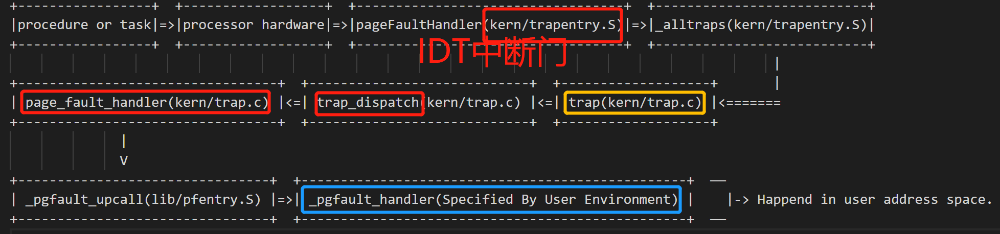

## Lab4 Part B: Copy-on-Write Fork

As mentioned earlier, Unix provides the `fork()` system call as its primary process creation primitive. Fork ()系统调用复制调用进程(父进程)的地址空间，以创建新进程(子进程)。

xv6 kernel对fork的实现方式是：xv6 Unix implements `fork()` by **copying all data from the parent's pages into new pages allocated for the child**. 这种方式和dumbfork()实现的方式是类似的。

```c
void
duppage(envid_t dstenv, void *addr)
{
	int r;

	// This is NOT what you should do in your fork.
	if ((r = sys_page_alloc(dstenv, addr, PTE_P|PTE_U|PTE_W)) < 0)
		panic("sys_page_alloc: %e", r);
	if ((r = sys_page_map(dstenv, addr, 0, UTEMP, PTE_P|PTE_U|PTE_W)) < 0)
		panic("sys_page_map: %e", r);
	memmove(UTEMP, addr, PGSIZE);
	if ((r = sys_page_unmap(0, UTEMP)) < 0)
		panic("sys_page_unmap: %e", r);
}

envid_t
dumbfork(void)
{
	envid_t envid;
	uint8_t *addr;
	int r;
	extern unsigned char end[];

	// Allocate a new child environment.
	// The kernel will initialize it with a copy of our register state,
	// so that the child will appear to have called sys_exofork() too -
	// except that in the child, this "fake" call to sys_exofork()
	// will return 0 instead of the envid of the child.
	envid = sys_exofork();
	if (envid < 0)
		panic("sys_exofork: %e", envid);
	if (envid == 0) {
		// We're the child.
		// The copied value of the global variable 'thisenv'
		// is no longer valid (it refers to the parent!).
		// Fix it and return 0.
		thisenv = &envs[ENVX(sys_getenvid())];
		return 0;
	}

	// We're the parent.
	// Eagerly copy our entire address space into the child.
	// This is NOT what you should do in your fork implementation.
	for (addr = (uint8_t*) UTEXT; addr < end; addr += PGSIZE)
		duppage(envid, addr);

	// Also copy the stack we are currently running on.
	duppage(envid, ROUNDDOWN(&addr, PGSIZE));

	// Start the child environment running
	if ((r = sys_env_set_status(envid, ENV_RUNNABLE)) < 0)
		panic("sys_env_set_status: %e", r);

	return envid;
}
```

但是页面的copy操作是fork中最耗时耗力的工作。【The copying of the parent's address space into the child is the most expensive part of the `fork()` operation.】

但是很多时候在调用fork之后就会紧接着调用exec()来创建别的进程代码【和父进程的代码不同】。This is what the the shell typically does, for example。这样的话之前fork时进行父进程->子进程的页面copy就没有意义了，因为子进程在fork之后，调用 exec()之前只会用到很少的代码内存页。

因此，后来的 Unix 版本利用虚拟内存硬件【virtual memory hardware】，允许父进程和子进程共享（share）映射到各自地址空间的内存，直到其中一个进程实际修改它【 *share* the memory mapped into their respective address spaces until one of the processes actually modifies it.】这种技术被称为写时拷贝【*copy-on-write*】。为此，在 fork ()上，内核会将**地址空间映射**从父进程复制到子进程，而不是复制页面的内容【**copy the address space *mappings*** from the parent to the child **instead of the contents of the mapped pages**，and at the same time **mark the now-shared pages read-only**】，<u>同时将现在共享的页面标记为只读</u>。

当两个进程中的任意一个尝试写入其中一个共享页面时，该进程会出现Page Fault。此时，Unix 内核会意识到这个页面实际上是a "virtual" or "copy-on-write" copy，因此在页错误处理时，生成一个新的、私有的、可写的页面副本（copy）到这个导致页错误的进程空间中。通过这种方式，fork时页面内容实际上不会被复制，直到它们被写入，才会进行复制。这种优化使得子进程在 fork()后紧跟exec()的情况下，成本更低：在调用 exec()之前，子进程可能只需要复制一个页面(the current page of its stack，一个栈帧页。其他页面很可能只是读取，反正fork之前的读取到的内容，只要没写过，就和父进程的内容一样，通过share mappings就可以了)。

在这个实验的Part B部分中，您将实现a "proper" Unix-like `fork()` with copy-on-write，作为用户空间库例程（user space library routine）的一部分。在用户空间下，fork实现和copy-on-write支持有助于内核更加简便，更不容易出错。它还允许单个user-mode的程序为 fork()定义自己的语义，eg：一个程序想要一个稍微不同的实现(例如，昂贵的always-copy版本，比如dumbfork() ，或者一个父子进程实际共享内存的版本) ，那么它可以很容易地完成自己的实现。

### User-level page fault handling

user-level copy-on-write fork ()需要了解如何处理带有写保护（write-protected）的页面上触发的page fault，所以您首先要实现这一点。 **Copy-on-write is only one of many possible uses for user-level page fault handling.**

通常设置一个地址空间，以便页错误指示何时需要执行某些操作。例如，大多数 Unix 内核最初只映射新进程的栈区中的一个页面，随着进程的栈消耗增加，导致尚未映射的栈地址出现页面错误后，根据需要分配和映射额外的栈页面。典型的 Unix 内核必须跟踪进程空间的每个区域出现页面错误，即使采取相应操作。例如，栈区中的页错误通常会分配和映射新的物理内存页。程序BSS区域中的页错误通常会分配一个新页面，并用0填充，然后映射这个页。对于某些系统，按需分页的可执行程序中如果在text段发生页错误，会从磁盘中读取相应的页面，然后实时加载到内存进行映射【In systems with demand-paged executables, a fault in the text region will read the corresponding page of the binary off of disk and then map it】。

这对于内核来说是需要跟踪很多的信息。与采用传统的Unix approach不同，您将决定如何处理用户空间中的每个页错误，使得bugs are less damaging。这种设计的额外好处是允许程序在定义其内存区域时具有很大的灵活性。

you'll use user-level page fault handling later for mapping and accessing files on a disk-based file system.

#### Setting the Page Fault Handler

In order to handle its own page faults, a user environment will need to register a *page fault handler entrypoint* with the JOS kernel. 

用户进程通过系统调用`sys_env_set_pgfault_upcall`来注册自己的页错误处理函数入口（*page fault handler entrypoint*）。同时实验中也在`Env`结构体中增加了`env_pgfault_upcall`字段来存储页错误处理入口函数的信息。

说了这么多，我们来看一下页错误的触发过程以及自定义处理流程。

不同于Unix的fork，JOS在用户地址空间环境下由于写时复制机制而产生的缺页异常，会由内核态的`page_fault_handler`(kern/trap.c)捕获，最终转移到用户地址空间中指定的page fault handler（例如后面的Exercise要实现的`pgfault`(lib/fork.c)），并且在调用完用户地址空间中的page fault handler之后，还需要把控制最终转移回触发这次page fault的用户程序指令，而这是通过`_pgfault_upcall`(lib/pfentry.S)来实现的。整个的Control Flow如下所示(省略了一些函数调用)：



##### Exercise 8

> Implement the `sys_env_set_pgfault_upcall` system call. Be sure to enable permission checking when looking up the environment ID of the target environment, since this is a "dangerous" system call.

实现`sys_env_set_pgfault_upcall` 系统调用，能够给指定Environment绑定一个页错误处理函数入口，存储到`Env`结构体的`env_pgfault_upcall`字段中。

```c
// Set the page fault upcall for 'envid' by modifying the corresponding struct Env's 'env_pgfault_upcall' field.  
// When 'envid' process causes a page fault, the kernel will push a fault record onto the exception stack, then branch to 'func' (parameter 2).
//
// Returns 0 on success, < 0 on error.  Errors are:
//	-E_BAD_ENV if environment envid doesn't currently exist, or the caller doesn't have permission to change envid.
static int
sys_env_set_pgfault_upcall(envid_t envid, void *func)
{
	// LAB 4: Your code here.
	struct Env *nowEnv;
	if(envid2env(envid,&nowEnv,1)<0){
		return -E_BAD_ENV;
	}
	nowEnv->env_pgfault_upcall = func;
	return 0;
	//panic("sys_env_set_pgfault_upcall not implemented");
}
```

#### Normal and Exception Stacks in User Environments

在正常执行期间，JOS 中的用户环境将在*normal* user stack上运行，ESP寄存器起始指向USTACKTOP。一开始push的数据驻留在USTACKTOP-PGSIZE~USTACKTOP-1的页面上。When a page fault occurs in user mode, however, the kernel will restart the user environment running a designated user-level page fault handler on a different stack, namely **the *user exception* stack.** In essence, we will make the JOS kernel implement automatic "stack switching" on behalf of the user environment, in much the same way that the x86 *processor* already implements stack switching on behalf of JOS when transferring from user mode to kernel mode!【然而，当用户模式下发生页错误时，内核将重新启动用户环境，在另一个栈，即用户异常栈（*user exception* stack）上运行指定的用户页错误处理程序。本质上，我们将使 JOS 内核代替用户环境实现自动的“栈帧切换”，就像 x86处理器已经代表JOS 实现从用户模式到内核模式的栈切换一样！】

JOS 用户异常栈（ the user exception stack）也只有一个页面大小，它的顶部被定义为虚拟地址UXSTACKTOP，因此用户异常栈的有效字节为UXSTACKTOP-PGSIZE~UXSTACKTOP-1。在此异常栈上运行时，the user-level page fault handler 可以使用 JOS 的常规系统调用来映射新页面或调整页映射，以便修复最初导致页错误的任何问题【While running on this exception stack, the user-level page fault handler can use JOS's regular system calls to map new pages or adjust mappings so as to fix whatever problem originally caused the page fault】。然后，the user-level page fault handler通过一小段汇编片段返回到导致页错Invoking the User Page Fault Handler误的代码所在的原始栈上（eg：*normal* user stack）。

此外，希望实现自己的user-level page fault handling的用户进程需要为自己的异常栈帧分配内存，可以直接使用part A的`sys_page_alloc()`函数。

#### Invoking the User Page Fault Handler

现在需要更改 kern/trap.c 中的页错误处理代码，以处理用户模式中的页错误，如下所示。我们将页错误发生时用户环境的状态称为*trap-time* state.

如果没有注册页错误处理程序，JOS 内核会像以前一样通过message机制销毁用户环境。否则，**内核会在异常栈帧上设置一个trap frame（looks like a `struct UTrapframe` from `inc/trap.h`**）

```c
struct UTrapframe {
	/* information about the fault */
	uint32_t utf_fault_va;	/* va for T_PGFLT, 0 otherwise */
	uint32_t utf_err;
	/* trap-time return state */
	struct PushRegs utf_regs;
	uintptr_t utf_eip;
	uint32_t utf_eflags;
	/* the trap-time stack to return to */
	uintptr_t utf_esp;
} __attribute__((packed));
```

具体的Trap Fram布局如下：

```
//trap-time state//
              <-- UXSTACKTOP[挨着UENV，比用户栈帧更高]
trap-time esp
trap-time eflags
trap-time eip
trap-time eax       start of struct PushRegs
trap-time ecx
trap-time edx
trap-time ebx
trap-time esp
trap-time ebp
trap-time esi
trap-time edi       end of struct PushRegs
tf_err (error code)
fault_va            <-- %esp when handler is run
```

之后内核会重新安排user environment恢复执行【通过页错误处理程序在这个exception stack上运行，解析stack frame】。注意虚拟地址`fault_va`就是导致页错误的位置。

**还有一些特殊情况**，<u>比如已经运行在exception stack的用户进程发生了异常怎么办？</u>【If the user environment is *already* running on the user exception stack when an exception occurs】也就是说页错误处理程序本身存在错误。在这种情况下，我们需要在当前tf->tf_esp下面启动新的Stack Frame【start the new stack frame just under the current `tf->tf_esp` rather than at `UXSTACKTOP`，You should first push an empty 32-bit word, then a `struct UTrapframe`】

注意，实现时需要判断whether `tf->tf_esp` is already on the user exception stack。请检查它是否在UXSTACKTOP-PGSIZE~ UXSTACKTOP-1之间（inclusive）。

##### Exercise 9

>Implement the code in `page_fault_handler` in `kern/trap.c` required to dispatch page faults to the user-mode handler. Be sure to take appropriate precautions when writing into the exception stack. (What happens if the user environment runs out of space on the exception stack?)