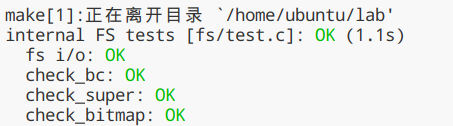

# Lab 5: File system, Spawn and Shell

在lab5中，我们将实现`spawn`，一个库调用，可以加载并在磁盘上运行的可执行程序【a library call that loads and runs on-disk executables】。然后我们还会完善kernel和library，使得JOS足以run a shell on the console。这些特性需要一个文件系统，本实验室引入了一个简单的读/写文件系统。

在开始之前，我们需要commit提交lab4，并且git checkout切换都lab5分支，然后`git merge lab4`。

lab5实验的主要新组件是位于fs目录（新添加）中的文件系统环境。此外，在 user 和 lib 目录中还有一些与文件系统相关的新文件。

- fs/fs.c	Code that mainipulates the file system's on-disk structure.
  - 主要处理文件系统磁盘结构的代码
- fs/bc.c	A simple block cache built on top of our user-level page fault handling facility.
  - 构建在用户级页错误处理工具之上一个简单的块缓存
- fs/ide.c	Minimal PIO-based (non-interrupt-driven) IDE driver code.
  - 基于最小的PIO(非中断驱动) 的IDE 驱动程序代码
- fs/serv.c	The file system server that interacts with client environments using file system IPCs.
  - 使用文件系统IPC与客户端进程交互的文件系统服务器
- lib/fd.c	Code that implements the general UNIX-like file descriptor interface.
  - 实现通用类 unix 文件描述符接口的代码
- lib/file.c	The driver for on-disk file type, implemented as a file system IPC client.
  - 磁盘文件类型的驱动程序，作为文件系统 IPC 客户机实现
- lib/console.c	The driver for console input/output file type.
  - 控制台输入/输出文件类型的驱动程序
- lib/spawn.c	Code skeleton of the spawn library call.

在merge新的实验5代码之后，您应该再次运行实验4中pingpong, primes, and forktree测试用例。

由于JOS还没有实现file system，因此在开始Exercise 1之前，需要注释`ENV_CREATE(fs_fs)`（在`kern/init.c`中），because `fs/fs.c` tries to do some I/O, which JOS does not allow yet. 此外还需要暂时注释`close_all()`（在`lib/exit.c`中），因为这个函数调用的子例程在之后的实验中才会实现，如果现在就调用会panic。

# File system preliminaries

初步介绍：您将使用的文件系统比大多数“真正的”文件系统(包括 xv6 UNIX 文件系统)要简单得多，但是它足够强大，可以提供基本功能: 创建、读取、写入和删除files organized in a hierarchical directory structure（层级目录结构）。

我们(至少目前)只开发了一个单用户操作系统，它提供了足够的protection 来捕捉 bug，但不能保护多个相互可疑的用户免受彼此的攻击（protect multiple mutually suspicious users from each other）。因此，我们的文件系统不支持文件所有权或权限的 UNIX 概念（the UNIX notions of file ownership or permissions）。我们的文件系统目前也不支持硬链接、符号链接、时间戳或特殊设备文件 like most UNIX file systems do。

## On-Disk File System Structure

<u>大多数 UNIX 文件系统将可用的磁盘空间划分为两种主要类型的区域: inode区域和数据区域</u>。UNIX 文件系统为文件系统中的每个文件分配一个 inode。<u>一个文件的 inode 保存了文件相关的重要元数据（critical meta-data about the file），例如文件的 stat 属性和指向其数据块的指针。</u>数据区域被划分为较大的数据块(通常为8KB 或更大) ，<u>在这些数据块中，文件系统存储了文件数据和目录元数据（directory meta-data）</u>。

【The data regions are divided into much larger (typically 8KB or more) *data blocks*, within which the file system stores file data and directory meta-data. 】

目录条目（Directory entries ）包含文件名和指向inodes的指针; 如果文件系统中的多个目录条目引用该文件的 inode，则称该文件为硬链接（*hard-linked*）。由于我们的文件系统不支持硬链接，我们不需要这种级别的间接性（we do not need this level of indirection ），因此可以简化：我们的文件系统将根本不使用 inode，而只是将一个文件的(或子目录的)元数据存储在描述该文件的(唯一的)目录条目中。【our file system will not use inodes at all and instead will simply store all of a file's (or sub-directory's) meta-data within the (one and only) directory entry describing that file.】

>JOS的file system把inode信息存储到目录条目中

也就是说JOS kernel实现的是简化版文件系统，相较于常规文件系统`FILE-INODE(META DATA)-BLOCKS`的模式，JOS kernel直接使用file的meta data来记录该文件所占用的Blocks信息，即`FILE(META DATA)-BLOCKS`的模式：

从逻辑上讲，文件和目录都由一系列数据块组成，这些数据块可能分散在磁盘中，much like the pages of an environment's virtual address space can be scattered throughout physical memory。通过提供读写文件任意偏移处字节的接口（presenting interfaces for reading and writing sequences of bytes at arbitrary offsets within files），文件系统环境隐藏了块布局的细节。作为执行操作（诸如文件创建和删除等）的一部分，文件系统环境在内部处理对目录的所有修改。我**们的文件系统允许用户环境直接读取目录元数据(例如，with read) ，这意味着用户环境可以自己执行目录扫描操作(例如，实现 ls 程序) ，而不必依赖于对文件系统的额外特殊调用**。<u>这种目录扫描方法的**缺点**以及大多数现代 UNIX 变体不鼓励这种方法的原因是，它使应用程序依赖于目录元数据的格式，使得在不改变或至少重新编译应用程序的情况下很难改变文件系统的内部布局。</u>

### Sectors and Blocks

大多数磁盘不能以字节粒度执行读写操作，而是以sector为单位执行读写操作 。在JOS中，扇区（sector）大小为512字节。文件系统实际上以block（块）分配和使用磁盘存储空间。

尤其需要注意sector和block在概念上的区别：

-  *sector size* is a property of the disk hardware【硬件属性】
- whereas *block size* is an aspect of the operating system using the disk.【OS的使用视角】

<u>文件系统的块大小（block size）必须是底层磁盘扇区大小的倍数，即512*n的block size。</u>

UNIX xv6文件系统使用512字节的块大小，与底层磁盘的扇区大小相同（n=1）。然而，大多数现代文件系统使用更大的块大小，**因为存储空间变得更便宜，而且在更大的粒度下管理存储更有效**。<u>我们的文件系统将使用**4096字节的块大小**（n=8），便于匹配处理器的页面大小</u>。【这样从磁盘块中导入内存页面就很方便了】

### Superblocks

**文件系统往往会把磁盘上某些"easy-to-find"的磁盘块用于存储描述<u>整个文件系统属性</u>的元数据**（比如块大小、磁盘大小、用于寻找根目录的元数据，文件系统最后一次挂载时间，文件系统最后一次检测到错误的时间等）。<u>这些特殊的块，我们称其为superblocks（超级块）。</u>

File systems typically reserve certain disk blocks at "easy-to-find" locations on the disk (such as the very start or the very end) to hold meta-data describing properties of the file system as a whole, such as the block size, disk size, any meta-data required to find the root directory, the time the file system was last mounted, the time the file system was last checked for errors, and so on. These special blocks are called *superblocks*.


我们的<u>文件系统将只有一个超级块，它将始终位于磁盘上的block 1（</u>其布局定义在 `struct Super` in `inc/fs.h`）。而**block 0通常保留用于引导加载程序（boot loaders）和分区表（partition tables），因此文件系统通常不使用the very first disk block（即Block 0）**。**许多“Real”文件系统会维护多个超级块，在磁盘的几个间隔很大的区域中复制这些超级块，因此，如果其中一个超级块损坏，或者磁盘在该区域中出现了media error，仍然可以找到其他超级块并使用它们访问文件系统。**

综上，`struct File`也存储在磁盘上，<u>需要找到一个特定的File，就得有一个根File，它能够直接被文件系统获取而不用查找，这个根目录记录在Super Block【superblock中还记录很多文件系统的整体信息】</u>，在具体实现中，编号为1的Block作为Super Block（Block 0存储boot loader，文件系统不使用block 0），<u>除此之外，还需要记录每个Block的使用情况，将Block 2作为bitmap用来记录Block的占用空闲情况</u>。

JOS kernel直接将磁盘至多3GB空间直接加载到内存当中，并且将其映射到内存线性地址空间`DISKMAP` ~ `DISKMAP + 3GB`，**换而言之，在文件系统进程的地址空间中，`DISKMAP` ~ `DISKMAP + 3GB`就是磁盘内容，这部分只有文件系统能够访问，不会与其它User Environment共享**，并且由于文件系统地址空间中的Block与磁盘内容直接映射，因此能够直接直接通过线性地址计算出Block Number，从而找到需要加载的Sector，例如线性地址va，其对应的BLock Number为`(va - DISKMAP) / PGSIZE`【注意在JOS中，页大小和块大小一致】，相应地，<u>如果文件系统在va产生了page fault，就需要加载磁盘sector编号为`BLKSECTORS * (va - DISKMAP) / PGSIZE`为起始sector的共`BLKSECTORS`个sector即可</u>。在JOS的文件系统中，Block size是4096 bytes，因此BLKSECTORS是`4096 / 512 = 8`。

### File Meta-data

在我们的文件系统中，关于文件的元数据布局在`inc/fs.h`的`struct File`中描述。这些元数据包含文件名、文件大小、文件类型（regular file or directory）以及指向构成文件的blocks的指针。如上所述，我们没有 inode，所以这个元数据存储在磁盘上的目录项中。与大多数“real”文件系统不同，为了简单起见，**我们将使用这个`struct File`来表示文件元数据（*both on disk and in memory* ）【文件结构】**

```c
struct File {
	char f_name[MAXNAMELEN];	// filename
	off_t f_size;			// file size in bytes
	uint32_t f_type;		// file type

	// Block pointers.
	// A block is allocated iff its value is != 0.
	uint32_t f_direct[NDIRECT];	// direct blocks【每个数组元素存储了一个块编号】
	uint32_t f_indirect;		// indirect block【存储了一个块号，这个块号对应的块中存储了这个file的多个块编号】

	// Pad out to 256 bytes; must do arithmetic in case we're compiling
	// fsformat on a 64-bit machine.
	uint8_t f_pad[256 - MAXNAMELEN - 8 - 4*NDIRECT - 4];	//uint8_t为char(1字节)
} __attribute__((packed));	// required only on some 64-bit machines
//File结构体的大小为256字节。一个block的大小为4096字节，因此File结构体是block的整数倍
//因此block可以完完整整存储好多个File structure【这也就是padding的意义了】
```

The `f_direct` array in `struct File` 包括了用于存储文件前10个(NDIRECT为10)块的<u>块编号的空间</u>，我们称之为文件的直接块（file’s direct block）。对于大小为10 * 4096 = 40KB 的小文件【即只需10个块就可以存储好一个文件内容】，这意味着文件的所有块的块编号将fit directly within the `File` structure itself。但是对于较大的文件，我们需要一个位置来保存文件的其余的块编号。因此，对于任何大于40KB的文件，我们分配一个额外的磁盘块（被称为file‘s indirect block）以容纳最多4096/4 = 1024个额外的块号【这个磁盘块专门用于存储块号，一个磁盘块的大小为4096字节，一个块号为4字节，一共可以存储1024个块号】。因此，我们的文件系统允许文件的大小达到1034个块（10个块号存储在direct block+1024个块号存储在indirect block），或超过4M字节。为了支持更大的文件，“real”文件系统通常也支持双重和三重间接块。


### Directories versus Regular Files

`struct File`结构体在我们的文件系统中既可以表示一个常规文件（regular file），还可以表示一个目录（directory）。这两种类型的“files”可以通过`File`结构体的`type`字段来做区分。文件系统实际上对普通文件和目录文件的管理方式是一样的。只是对于目录文件，文件系统根本不会解析与常规文件相关联的data blocks的内容，而文件系统会将目录文件内容解析为一系列目录内的描述文件和子目录的`struct File `结构体。

```c
// File types
#define FTYPE_REG	0	// Regular file
#define FTYPE_DIR	1	// Directory
```

我们文件系统中的superblock 包含一个 `struct File` 结构体(`struct Super`中的s_root字段) ，其中包含了文件系统根目录的元数据。这个目录文件的内容是一系列描述文件系统根目录中的文件和目录的`struct File`。根目录中的任何子目录都可能包含更多表示内部子目录的`struct File`，依此类推。

```c
struct Super {
	uint32_t s_magic;		// Magic number: FS_MAGIC
	uint32_t s_nblocks;		// Total number of blocks on disk
	struct File s_root;		// Root directory node
};
```

## Design Philosophy of File System

> 转载自[QinStaunch的MIT-6.828-LAB5 File system,Spawn and Shell](https://qinstaunch.github.io/2020/01/31/MIT-6-828-LAB5-File-system-Spawn-and-Shell/)

<u>实际操作系统将文件系统作为内核代码实现，因此进程调用文件系统接口最终都会陷入内核态来处理</u>，然而，在JOS中，整个文件系统本质上是一个特殊的User Environment，Normal User Environment调用的文件系统接口是通过IPC实现。**换而言之，可以将JOS的文件系统看作一个Server，而Normal User Environment都是Client，Client通过IPC向Server发送请求，而Server则始终准备着接受来自Client的请求。**

文件系统是JOS运行的第一个Environment，在`kern/init.c:i386_init`中直接创建文件系统。文件系统的main入口函数在fs/serv.c中，它完成的主要工作是：

1. `fs/serv.c:serve_init` —— **openfile table的初始化，以及file descriptor的地址划分**。
2. `fs/fs.c:fs_init` ——调用`fs/bc.c:bc_init`，校验Super Block和bitmap Block的合法性并记录它们的虚拟地址到全局变量`super`和`bitmap`。
   - `fs/bc.c:bc_init` - 正如此前讨论的一样，当我们知晓了需要加载的Block的虚拟地址va之后，就能够得到它对应的Block Number为`(va - DISKMAP) / PGSIZE`，相应地，该虚拟地址对应地page就需要从disk中加载serctor编号为`BLKSECTORS * (va - DISKMAP) / PGSIZE`到`BLKSECTORS * (va - DISKMAP) / PGSIZE + BLKSECTORS`的sector到内存。因此我们需要**设置page fault handler**，就像我们在实现fork中做的一样。
   - 除此之外，`bc.c`还需要**完成Super Block和bitmap Block的初始化**。
3. `fs/serv.c:serve`——接受Regular User Environment发送的请求，并且调用相应的handler来处理请求，再返回响应。但是文件系统同一时间只能够处理一个请求，效率不高。可以考虑多几个File system environment，但是这样需要对一些资源加锁，例如File descriptor，openfile table等，从而避免并发错误。

在提供给用户使用的接口方面，统一接口在`lib/fd.c`中，同时JOS将一些子系统抽象成Device，例如File Device，Pipe Device以及后面需要实现的Network Driver，Dev结构体包括了Dev id以及相应的处理函数指针:

```
struct Dev {
	int dev_id;
	const char *dev_name;
	ssize_t (*dev_read)(struct Fd *fd, void *buf, size_t len);
	ssize_t (*dev_write)(struct Fd *fd, const void *buf, size_t len);
	int (*dev_close)(struct Fd *fd);
	int (*dev_stat)(struct Fd *fd, struct Stat *stat);
	int (*dev_trunc)(struct Fd *fd, off_t length);
};
```

通过Devices的抽象以及File Descriptor，**统一了用户接口**（在lib/fd.c中），并且提供了高度的可定制性和可插拔性。我绘制了一个示意图，**Client与Server端都划分了三层**：


**注解：**

- USER API - lib/fd.c
- DEVICE
  - For instance:
    - devfile:lib/file.c; 
    - devpipe:lib/pipe.c; 
    - devcons:lib/console.c
- IPC - lib/ipc.c
- SERVER - fs/serv.c
- FILE SYSTEM - fs/fs.c

<u>以devfile的read操作为例，其Control flow如下所示：</u>

```
      Regular env           FS env
   +---------------+   +---------------+
   |      read     |   |   file_read   |
   |   (lib/fd.c)  |   |   (fs/fs.c)   |
...|.......|.......|...|.......^.......|...............
   |       v       |   |       |       | RPC mechanism[远程过程调用]
   |  devfile_read |   |  serve_read   |
   |  (lib/file.c) |   |  (fs/serv.c)  |
   |       |       |   |       ^       |
   |       v       |   |       |       |
   |     fsipc     |   |     serve     |
   |  (lib/file.c) |   |  (fs/serv.c)  |
   |       |       |   |       ^       |
   |       v       |   |       |       |
   |   ipc_send    |   |   ipc_recv    |
   |       |       |   |       ^       |
   +-------|-------+   +-------|-------+
           |                   |
           +-------------------+
```

**任何操作都是通过File Descriptor作为媒介来实现的**，并且File Descriptor是File System Environment与Regular User Environment**共享**的：

```c
struct Fd {
	int fd_dev_id;
	off_t fd_offset;
	int fd_omode;
	union {
		// File server files
		struct FdFile fd_file;
	};
};
```

通过Fd的dev_id能够找到相应的Devices，并且调用其处理函数，而fd_file则是OpenFile的索引，控制最终转移到File system时，能够通过fd_file拿到OpenFile，而OpenFile结构体中保留了File指针，在File System Environment的地址空间中，能通过该File指针获取到相应的struct File的引用：

```c
struct OpenFile {
	uint32_t o_fileid;	// file id
	struct File *o_file;	// mapped descriptor for open file
	int o_mode;		// open mode
	struct Fd *o_fd;	// Fd page
};
```

**文件系统环境和Regular User Environment之间的结构如下所示：**【可以在实践之后重新阅读这一节】


# The File System

这个实验室的目标不是让您实现整个文件系统，而是让您只实现某些关键组件。特别是，需要完成：

- 块读入块缓存（block cache）并将它们刷新（flush back）回磁盘; 
- 分配磁盘块; 
- 将文件偏移映射到磁盘块; 
- 在 IPC 接口中实现read, write, and open。

因为您不会自己实现所有的文件系统内容，所以熟悉所提供的代码和各种文件系统接口非常重要。

## Disk Access

操作系统中的 file system environment需要能够访问磁盘，但是我们还没有在内核中实现任何磁盘访问功能。**我们没有采用传统的“单一”的OS策略，即向内核添加 IDE 磁盘驱动程序（IDE是很老的磁盘接口）以及允许文件系统访问IDE磁盘的必要系统调用**，而是<u>将 IDE 磁盘驱动程序作为用户级文件系统环境（user-level file system environment）的一部分来实现。</u>我们仍然需要稍微修改内核，以便set things up，使文件系统环境具有实现磁盘访问本身所需的特权。【这里应该是通过kernel给文件系统进程提升权限，来直接操作磁盘，将driver的功能融到文件系统进程中】

只要我们依靠轮询、基于“"programmed I/O" (PIO)的磁盘访问，并且不使用磁盘中断，就很容易在用户空间实现磁盘访问。在用户模式下也可以实现中断驱动的设备驱动程序（interrupt-driven device drivers ），(例如，L3和 L4内核就是这样做的) 。但是由于内核必须成功应对设备中断并将它们发送/分派到正确的用户模式进程中，因此实现起来更加困难。

X86处理器使用EFLAGS寄存器中的 IOPL 位来确定是否允许保护模式代码执行特殊的设备I/O指令，比如IN and OUT instructions. 由于我们需要访问的所有 IDE 磁盘寄存器都位于 x86的I/O space，而不是memory-mapping，因此为了允许文件系统访问这些寄存器，我们需要做的唯一一件事就是给予file system environment一定的“I/O特权”。实际上，EFLAGS 寄存器中的 IOPL 位为内核提供了一种简单的“全有或全无”（"all-or-nothing"）的方法来控制用户模式代码是否能够访问I/O space。在我们的示例中，我们希望文件系统环境/进程能够访问I/O space，但是我们根本不希望任何其他环境/进程能够访问I/O空间。

#### Exercise 1

>`i386_init` identifies the file system environment by passing the type `ENV_TYPE_FS` to your environment creation function, `env_create`. Modify `env_create` in `env.c`, so that it gives the file system environment I/O privilege, but never gives that privilege to any other environment.
>
>Make sure you can start the file environment without causing a General Protection fault. You should pass the "fs i/o" test in `make grade`.
>
>【记得测试前取消ENV_CREATE(fs_fs, ENV_TYPE_FS);的注释】

可以看到`/kern/init.c`的`i386_init()`函数中启动了file system：

```c
void
i386_init(void)
{
	// Initialize the console.
	// Can't call cprintf until after we do this!
	cons_init();

	cprintf("6828 decimal is %o octal!\n", 6828);

	// Lab 2 memory management initialization functions
	mem_init();

	// Lab 3 user environment initialization functions
	env_init();
	trap_init();

	// Lab 4 multiprocessor initialization functions
	mp_init();	//
	lapic_init();

	// Lab 4 multitasking initialization functions
	pic_init();

	// Acquire the big kernel lock before waking up APs
	// Your code here:
	lock_kernel();

	// Starting non-boot CPUs
	boot_aps();

	// Start fs.【创建文件系统环境】
	ENV_CREATE(fs_fs, ENV_TYPE_FS);

	// Should not be necessary - drains keyboard because interrupt has given up.
	kbd_intr();

	// Schedule and run the first user environment!
	sched_yield();
}
```

`ENV_CREATE`宏会间接调用`env_create()`，因此需要在 `env_create()`中根据创建的进程是否为文件系统进程来设置eflags寄存器的IOPL标识位。

```c
//env.c
void
env_create(uint8_t *binary, enum EnvType type)
{
	// LAB 3: Your code here.
	struct Env *env = NULL;
	assert(!env_alloc(&env,0));
	env->env_parent_id = 0;
	env->env_type = type;
	// If this is the file server (type == ENV_TYPE_FS) give it I/O privileges.
	// LAB 5: Your code here.
	if(type == ENV_TYPE_FS)
    { //赋予文件系统进程I/O权限
		env->env_tf.tf_eflags |=FL_IOPL_MASK;
	}
	load_icode(env,binary);

}
//mmu.h
#define FL_IOPL_MASK	0x00003000	// I/O Privilege Level bitmask
#define FL_IOPL_0	0x00000000	//   IOPL == 0
#define FL_IOPL_1	0x00001000	//   IOPL == 1
#define FL_IOPL_2	0x00002000	//   IOPL == 2
#define FL_IOPL_3	0x00003000	//   IOPL == 3
```

#### Question

1. Do you have to do anything else to ensure that this I/O privilege setting is saved and restored properly when you subsequently switch from one environment to another? Why?

   当然不用，啥也不用做。进程切换的时候，eflags也会跟着切换。eflags寄存器也会在发生switch的时候自动保存到env->env_tf中。即trap时会自动保存这些寄存器的值。

>Note that the `GNUmakefile` file in this lab sets up QEMU to use the file `obj/kern/kernel.img` as the image for disk 0 (typically "Drive C" under DOS/Windows) as before, and to use the (new) file `obj/fs/fs.img` as the image for disk 1 ("Drive D"). In this lab our file system should only ever touch disk 1; disk 0 is used only to boot the kernel.

## The Block Cache

 在我们的文件系统中，我们实现一个简单的“buffer cache”(实际上只是一个块的缓存) with the help of the processor's virtual memory system。块缓存的代码在 fs/bc.c 中。我们的文件系统将仅限于处理大小为3 GB 或更小的磁盘。**我们在文件系统进程的地址空间中保留一个大的、固定的3GB区域【从0x10000000(DISKMAP)到0xD000000(DISKMAP + DISKMAX) 】，作为磁盘的“内存映射”版本。**

例如，将磁盘块0【disk 0】映射到虚拟地址0x1000000，将磁盘块1【disk 1】映射到虚拟地址0x10001000，以此类推。The `diskaddr` function in `fs/bc.c`实现了从磁盘块号到虚拟地址的转换，以及一些sanity checking。

这里的块缓存其实是相对与磁盘来说，将内存当作磁盘块缓存。用户访问磁盘时，如果内存中已经有这个磁盘块【虚拟地址没有导致缺页】，那么就认为缓冲命中；否则触发页错误处理函数，从磁盘中读取扇区到内存中，得到新的磁盘块，这就是一个缓存的过程。

```
/*
  *     4 Gig --------> +-----------------------------------+
  *                     :                .                  :
  *                     :                .                  :	kernel 【1G】
  *                     :                .                  :
  *     USTACKTOP --->  +-----------------------------------+ 0xeebfe000
  *                     |           Normal User Stack       | RW/RW PGSIZE
  *                     +-----------------------------------+ 0xeebfd000
  *                     :                .                  :
  *                     :                .                  :
  *                     +-----------------------------------+ FILEDATA
  *                     |               32                  | 32 x PGSIZE
  *                     |           struct Fd *             |
  * DISKMAP + DISKSIZE  +-----------------------------------+ 0xd0000000/FDTABLE
  *                     |                                   |
  *                     |                                   |
  *                     |       3GB IDE Disk Space          |
  *                     |                                   |
  *                     |                                   |
  *        DISKMAP ---> +-----------------------------------+ 0x10000000
  *                     |       union Fsipc *fsreq          | RW/RW PGSIZE
  *         fsreq  ---> +-----------------------------------+ 0x0ffff000
  *                     :                .                  :
  *                     :                .                  :
  *                     |-----------------------------------|
  *                     |       Program Data & Heap         |
  *    UTEXT --------> +-----------------------------------+ 0x00800000
  *    PFTEMP -------> |           Empty Memory (*)        | PTSIZE
  *                    |                                   |
  *    UTEMP --------> +-----------------------------------+ 0x00400000  --+    
  *                    |           Empty Memory (*)        |               |       *					|									|				|
  *                    |- - - - - - - - - - - - - - - - - -|             PTSIZE  
  *                    |       User STAB Data (optional)   |               |     
  *    USTABDATA ----> +-----------------------------------+ 0x00200000    |    
  *                    |           Empty Memory (*)        | 			   |
  *     0 ------------> +-----------------------------------+            --+   
```

由于我们的文件系统环境有自己的虚拟地址空间，独立于系统中其他所有其他环境的虚拟地址空间。而文件系统进程唯一需要做的事情就是实现对文件的访问，it is reasonable to reserve most of the file system environment's address space in this way。It would be awkward for a real file system implementation on a 32-bit machine to do this since modern disks are larger than 3GB. Such a buffer cache management approach may still be reasonable on a machine with a 64-bit address space.

32位机器的内存要加载映射3GB大小以上的磁盘是不太可能的，因此需要引入block cache，而64位机器也兼容这样的block cache模式。当然，将整个磁盘读入内存需要很长时间，因此我们将实现一种*demand paging*（请求分页）的形式，即我们只在磁盘映射区域（disk map region）中分配页面，并从磁盘中读取相应的块，以响应该区域中的页面错误【通过分页的方式，按页读取，而不是加载整个磁盘】。这样，我们可以假装整个磁盘都在内存中。【Of course, it would take a long time to read the entire disk into memory, so instead we'll implement a form of *demand paging*, wherein we only allocate pages in the disk map region and read the corresponding block from the disk in response to a page fault in this region. This way, we can pretend that the entire disk is in memory.】

#### Exercise 2

>Implement the `bc_pgfault` and `flush_block` functions in `fs/bc.c`. 
>
>`bc_pgfault` is a page fault handler, just like the one your wrote in the previous lab for copy-on-write fork, except that its job is to load pages in from the disk in response to a page fault. When writing this, keep in mind that (1) `addr` may not be aligned to a block boundary and (2) `ide_read` operates in sectors, not blocks.
>
>The `flush_block` function should write a block out to disk *if necessary*. `flush_block` shouldn't do anything if the block isn't even in the block cache (that is, the page isn't mapped) or if it's not dirty. We will use the VM hardware to keep track of whether a disk block has been modified since it was last read from or written to disk. To see whether a block needs writing, we can just look to see if the `PTE_D` "dirty" bit is set in the `uvpt` entry. (The `PTE_D` bit is set by the processor in response to a write to that page; see 5.2.4.3 in [chapter 5](http://pdos.csail.mit.edu/6.828/2011/readings/i386/s05_02.htm) of the 386 reference manual.) After writing the block to disk, `flush_block` should clear the `PTE_D` bit using `sys_page_map`.

在具体的实现之前，我们首先要看查看一下IDE磁盘访问的操作，详见`fs/ide.c`：

```c
// Minimal PIO-based (non-interrupt-driven) IDE driver code
// !!IDE磁盘驱动代码!!
// 在此前的exercise 1我们已经完成了，eflags寄存器中IOPL的开启，允许保护模式代码执行特殊的设备I/O指令，即in、out等，来读取IDE磁盘的相关设备寄存器。
#include "fs.h"
#include <inc/x86.h>

#define IDE_BSY		0x80
#define IDE_DRDY	0x40
#define IDE_DF		0x20  //Drive Fault Error (does not set ERR).
#define IDE_ERR		0x01  //Indicates an error occurred. Send a new command to clear it (or nuke it with a Software Reset).

static int diskno = 1;

static int
ide_wait_ready(bool check_error)
{
	int r;
	//等待，直到磁盘准备好被操作，eg：发送读取命令
	//inb 从I/O端口读取一个字，而outb 向I/O端口写入一个字节
	//IDE硬盘控制器的0x1F7端口：可以读磁盘的状态寄存器。【Used to read the current status.】
	//其Bit6为DRY Bit，当其置1表明磁盘上电完成,磁盘驱动器准备好了。在对于磁盘做任何操作（除了复位）之前务必要保证该Bit为1。
    //其Bit7为BSY Bit，当其置1表明磁盘忙。在你向磁盘发送任何指令前务必保证该Bit为0。
	while (((r = inb(0x1F7)) & (IDE_BSY|IDE_DRDY)) != IDE_DRDY)
		/* do nothing */;
	
	if (check_error && (r & (IDE_DF|IDE_ERR)) != 0)	//检查磁盘本身是否出错
		return -1;
	return 0;
}

bool
ide_probe_disk1(void)
{
	int r, x;

	// wait for Device 0 to be ready
	ide_wait_ready(0);	//等待disk 0 

	// switch to Device 1
	// 0x1F6寄存器又称Drive/Head寄存器。【Used to select a drive and/or head.】
	// idx=4  DRV  Selects the drive number.
	// idx=6  LBA  Uses CHS addressing if clear or LBA addressing if set.
	// 0xE0设置启用LBA寻址
	// 1<<4设置使用disk 1
	outb(0x1F6, 0xE0 | (1<<4));

	// check for Device 1 to be ready for a while
	for (x = 0;
	     x < 1000 && ((r = inb(0x1F7)) & (IDE_BSY|IDE_DF|IDE_ERR)) != 0;
	     x++)
		/* do nothing */;

	// switch back to Device 0
	outb(0x1F6, 0xE0 | (0<<4));	//设置Drive/Head Register的DRV位为0，切换到disk 0

	cprintf("Device 1 presence: %d\n", (x < 1000));
	return (x < 1000);	//返回disk 1空闲/无错误了多久【是否超过1000次CPU计数】
}

void
ide_set_disk(int d)	//设置现在操作的IDE disk
{
	if (d != 0 && d != 1)	//目前就这两块硬盘设备。
		panic("bad disk number");
	diskno = d;
}


//进行磁盘读取
//这里采用ATA-1规范中定义的28位寻址模式【28bits LBA，逻辑区块寻址】
int
ide_read(uint32_t secno, void *dst, size_t nsecs)
{
	int r;

	assert(nsecs <= 256);

	ide_wait_ready(0);

	outb(0x1F2, nsecs);	//向0x1F2端口写入待操作的扇区数目
	outb(0x1F3, secno & 0xFF);	//向0x1F3-0x1F5端口依次写入LBA的低24位；
	outb(0x1F4, (secno >> 8) & 0xFF);
	outb(0x1F5, (secno >> 16) & 0xFF);
	//(secno>>24)&0x0F：向0x1F6端口的低4位写入LBA的高4位
	//(diskno&1)<<4： 选择操作的磁盘
	//0xE0：采用LBA寻址
	outb(0x1F6, 0xE0 | ((diskno&1)<<4) | ((secno>>24)&0x0F));
	outb(0x1F7, 0x20);	// CMD 0x20 means read sector
	//至此，确定了对diskno磁盘中secno扇区号起的nsecs个扇区进行读取操作
	for (; nsecs > 0; nsecs--, dst += SECTSIZE) {
		if ((r = ide_wait_ready(1)) < 0)
			return r;
		insl(0x1F0, dst, SECTSIZE/4);	//Read a sector to dst
		//0x1F0为R/W Data Register：Read/Write PIO data bytes
		//insl(port addr cnt)指令表示：
		//从(input)port读取cnt dwords到指定的addr(output array addr)；
		//dword表示双字，4字节。因此SECTSIZE/4 dwords=（SECTSIZE/4）*4字节=SECTSIZE字节
	}

	return 0;
}

//进行磁盘写入
int
ide_write(uint32_t secno, const void *src, size_t nsecs)
{
	int r;

	assert(nsecs <= 256);

	ide_wait_ready(0);

	outb(0x1F2, nsecs);
	outb(0x1F3, secno & 0xFF);
	outb(0x1F4, (secno >> 8) & 0xFF);
	outb(0x1F5, (secno >> 16) & 0xFF);
	outb(0x1F6, 0xE0 | ((diskno&1)<<4) | ((secno>>24)&0x0F));
	outb(0x1F7, 0x30);	// CMD 0x30 means write sector

	for (; nsecs > 0; nsecs--, src += SECTSIZE) {
		if ((r = ide_wait_ready(1)) < 0)
			return r;
		outsl(0x1F0, src, SECTSIZE/4);
	}

	return 0;
}
```

> 1.基于ATA总线的IDE磁盘的寻址参考：https://wiki.osdev.org/ATA_PIO_Mode#Addressing_Modes
>
> 现在常用的SATA总线（Serial ATA，即串行ATA）的前身应该就是ATA（并行）
>
> 2.回顾[Lab1](https://spidermana.github.io/2019/05/25/MIT-6.828-Lab1/#%E5%90%AF%E5%8A%A8%E6%AD%A5%E9%AA%A4-boot-up-steps)

`bc_pgfault` 的实现，设置page fault handler以便能够从disk加载fault va对应的Block到内存：

```c
// Fault any disk block that is read in to memory by
// loading it from disk.
static void
bc_pgfault(struct UTrapframe *utf)
{	//缺页的位置【不是触发页错误的指令地址，而是发生页错误的位置】
	void *addr = (void *) utf->utf_fault_va;
    //判断这个位置的块号，需要哪个磁盘块，而现在这个磁盘块还没有map到内存
	uint32_t blockno = ((uint32_t)addr - DISKMAP) / BLKSIZE;
	int r;
	// 以下进行一些安全检查
    // 比如地址必须在DISKMAP~DISKMAP+DISKSIZE之间
    // 块号比如小于块号super->s_nblocks
	// Check that the fault was within the block cache region
	if (addr < (void*)DISKMAP || addr >= (void*)(DISKMAP + DISKSIZE))
		panic("page fault in FS: eip %08x, va %08x, err %04x",
		      utf->utf_eip, addr, utf->utf_err);

	// Sanity check the block number.
	if (super && blockno >= super->s_nblocks)
		panic("reading non-existent block %08x\n", blockno);

	// Allocate a page in the disk map region, read the contents
	// of the block from the disk into that page.
	// Hint: first round addr to page boundary. fs/ide.c has code to read
	// the disk.
    
	// LAB 5: you code here:
	addr = (void *)ROUNDDOWN((uintptr_t)addr,PGSIZE);
	if((r = sys_page_alloc(0,addr,(PTE_U|PTE_P|PTE_W)))<0){
		panic("sys_page_alloc:%e\n",r);
	}
	//内存中缺少块blockno，因此对应着disk中的扇区blockno*BLKSECTS=blockno*8
	//8个扇区为一个块，因此要读取BLKSECTS=8个扇区，才可以完全加载完blockno块到内存中
	if((r=ide_read(blockno*BLKSECTS,addr,BLKSECTS))<0){
		panic("ide_read:%e\n",r);
	}
    
	// Clear the dirty bit for the disk block page since we just read the
	// block from disk
    // 获取原始的页表项权限值uvpt[PGNUM(addr)]
	if ((r = sys_page_map(0, addr, 0, addr, uvpt[PGNUM(addr)] & PTE_SYSCALL)) < 0)
		panic("in bc_pgfault, sys_page_map: %e", r);

	// Check that the block we read was allocated. (exercise for
	// the reader: why do we do this *after* reading the block
	// in?)
    //为什么要在读取相应block后再检查bitmap？
    //这是因为，如果读进来的就是bitmap，那么，在没有读进bitmap前就访问对应的页，会造成缺页错误。
	if (bitmap && block_is_free(blockno))
		panic("reading free block %08x\n", blockno);
}

// fs/fs.h
#define BLKSECTS	(BLKSIZE / SECTSIZE)	// sectors per block
#define BLKSIZE		PGSIZE  //4096字节
#define SECTSIZE	512			// bytes per disk sector
//块大小>扇区大小，8个扇区为一个块
```

实现`flush_block` ，以便能够将内存中的Block同步回DISK，达到数据持久化的效果：

```c
// Flush the contents of the block containing VA out to disk if
// necessary, then clear the PTE_D bit using sys_page_map.
// If the block is not in the block cache or is not dirty, does
// nothing.
// Hint: Use va_is_mapped, va_is_dirty, and ide_write.
// Hint: Use the PTE_SYSCALL constant when calling sys_page_map.
// Hint: Don't forget to round addr down.
void
flush_block(void *addr)
{
	uint32_t blockno = ((uint32_t)addr - DISKMAP) / BLKSIZE;
    int r;

	if (addr < (void*)  || addr >= (void*)(DISKMAP + DISKSIZE))
		panic("flush_block of bad va %08x", addr);

	// LAB 5: Your code here.
	addr = (void *)ROUNDDOWN((uintptr_t)addr, PGSIZE);

	// If the block isn't in the block cache,just not do anything.
    // va_is_mapped判断这个block是否被映射到内存，查看页表项的PTE_P位
    // va_is_dirty判断这个block对应的页表项是否有被设置PTE_D位
    // 这个页被写的时候，会被处理器设置这个PTE_D位
	if(!va_is_mapped(addr) || !va_is_dirty(addr))return;
	
    //如果这个块被映射而且是脏块的话，就把其写回磁盘
	// bit dirty was set,we should write it back to dist.
	if((r = ide_write(blockno * BLKSECTS, addr, BLKSECTS)) < 0){
		panic("ide_write:%e", r);
	}
	// After we write back this dirty block to disk,we should clear the PTE_D bit.
	if((r = sys_page_map(0, addr, 0, addr, uvpt[PGNUM(addr)] & PTE_SYSCALL)) < 0{
		panic("int flush_block, sys_page_map:%e", r);
	}//注意只是消除了脏位，因为内存中的磁盘块缓存和磁盘本身已经一直了。但是这个块没必要换下，还可以继续访问。
}
```

位于fs/fs.c中的`fs_init`函数只是一个关于如何使用块缓存的prime example。在初始化块缓存之后，it simply stores pointers into the disk map region in the `super` global variable. 在此之后，我们可以通过读取`struct super`查看他们是否位于内存中，从而在需要时页错误处理函数会将他们从磁盘读入内存中。

Use `make grade` to test your code. Your code should pass "check_bc", "check_super", and "check_bitmap".



#### *Challenge!* 

> The block cache has no eviction policy. Once a block gets faulted in to it, it never gets removed and will remain in memory forevermore. Add eviction to the buffer cache. Using the `PTE_A` "accessed" bits in the page tables, which the hardware sets on any access to a page, you can track approximate usage of disk blocks without the need to modify every place in the code that accesses the disk map region. Be careful with dirty blocks.
>
> 注意PTE_A权限位和dirty block是不一样的，前者读写都会标识为PTE_A，基于局部性原理一般情况下这些块不会从缓存中替换下来，而dirty block只与写操作有关，读操作不会形成dirty block

参考实现[Challenge - Block Eviction Policy](https://qinstaunch.github.io/2020/01/31/MIT-6-828-LAB5-File-system-Spawn-and-Shell/#OSELAB5_B.2)

## The Block Bitmap

现在我们来看一下`fs_init`函数：

```c
// Initialize the file system
void
fs_init(void)
{
	static_assert(sizeof(struct File) == 256);

	// Find a JOS disk.  Use the second IDE disk (number 1) if available
	if (ide_probe_disk1())	//检测磁盘1是否可用，不能用才考虑使用disk 0【装载的是内核】
		ide_set_disk(1);	//设置diskno=1
	else
		ide_set_disk(0);
	bc_init();	//设置文件系统进程的pgfault handler为bc_pgfault，同时将block 1读取到super全局变量中【第一次读取时可能就会触发页错误】
	
    //设置文件系统的两个重要全局变量super和bitmap
	// Set "super" to point to the super block.
	super = diskaddr(1); //这个函数将块号转换称为虚拟地址
	check_super();	//要求magic正确为FS_MAGIC，此外block的数量不可大于DISKSIZE/BLKSIZE
	//即3G/PGZIE是允许的最多block数量。
    
	// Set "bitmap" to the beginning of the first bitmap block.
	bitmap = diskaddr(2);	//bitmap的大小就是block 2的大小（4096字节）
	check_bitmap();
}

// Return the virtual address of this disk block.
void*
diskaddr(uint32_t blockno)
{
	if (blockno == 0 || (super && blockno >= super->s_nblocks))
		panic("bad block number %08x in diskaddr", blockno);
	return (char*) (DISKMAP + blockno * BLKSIZE);
}

void
bc_init(void)
{
	struct Super super;
	set_pgfault_handler(bc_pgfault);
	check_bc();
	// cache the super block by reading it once
	memmove(&super, diskaddr(1), sizeof super);
}
```

在`fs_init`设置了`bitmap`指针以后，我们就可以将`bitmap`视作打包好的bit数组，数组中的每一个元素/bit对应磁盘中的一个块。See, for example, `block_is_free`函数用于checks whether a given block is marked free in the bitmap.

bitmap感觉就是一个对于块缓存情况的布局说明。

在这里我们可以参考[fs.img是如何构建的](https://github.com/SimpCosm/6.828/tree/master/lab5#how-fsimg-is-created)。

#### Exercise 3

>Use `free_block` as a model to implement `alloc_block` in `fs/fs.c`, which should find a free disk block in the bitmap, mark it used, and return the number of that block. When you allocate a block, you should immediately flush the changed bitmap block to disk with `flush_block`, to help file system consistency.

找到free block的位置，分配Block并且设置bitmap以追踪block使用情况：

```c
// Search the bitmap for a free block and allocate it.  When you
// allocate a block, immediately flush the changed bitmap block
// to disk.
//
// Return block number allocated on success,
// -E_NO_DISK if we are out of blocks.
//
// Hint: use free_block as an example for manipulating the bitmap.
int
alloc_block(void)
{
	// The bitmap consists of one or more blocks.  A single bitmap block
	// contains the in-use bits for BLKBITSIZE blocks.  There are
	// super->s_nblocks blocks in the disk altogether.
	// LAB 5: Your code here.
	uint32_t i;
	for(i = 0; i < super->s_nblocks; ++i){	//遍历所有块
		if(block_is_free(i)){	//找到一个空闲的block位
            // mark this bit as zero which means in use.
            //分配完这个块，标记为已占用，之后不可再分配，除非调用了free_block
			bitmap[i / 32] &= ~(1 << (i % 32)); //设置这个位为in-use（0）
			return i;	//返回free的block number
		}
	}
	return -E_NO_DISK;
}

// Check to see if the block bitmap indicates that block 'blockno' is free.
// Return 1 if the block is free, 0 if not.
bool
block_is_free(uint32_t blockno)
{	
	if (super == 0 || blockno >= super->s_nblocks)	
		return 0;
	if (bitmap[blockno / 32] & (1 << (blockno % 32)))	//0表示in-use，1表示free
		return 1;
	return 0;
}
// defined in fs.h
uint32_t *bitmap;		// bitmap blocks mapped in memory
//注意bitmap数组在定义的时候不是一个bit数组，而是以4字节【32bits】为一个元素的数组。
//但是要以bit数组来使用，因此标记的时候要注意，每一个元素可以记录32个块
//bitmap[blocknumber / 32]计算标识这个block是在bitmap中的哪个元素里面
//找到这个元素以后，标记这个32位元素的哪一个位：(1 << (blocknumber % 32))
struct Super *super;		// superblock[virtual address]
```

Use `make grade` to test your code. Your code should now pass "alloc_block".

## File Operations

我们在 fs/fs.c 中提供了各种函数来实现文件系统的基本功能。我们实现的文件系统需要：解析和管理`struct File`文件结构、扫描和管理目录文件条目以及从根目录遍历文件系统(walk file system from root)以解析绝对路径名。

<u>阅读 fs/fs.c 中的所有代码，并确保在继续之前理解每个函数的作用。【先实现exercise 4中的基础函数之后，再具体看每个函数的Code】</u>

#### Exercise 4

>Implement `file_block_walk` and `file_get_block`. 
>
>`file_block_walk` maps from a block offset within a file to the pointer for that block in the `struct File` or the indirect block, very much like what `pgdir_walk` did for page tables.
>
> `file_get_block` goes one step further and maps to the actual disk block, allocating a new one if necessary.

- `file_block_walk`这个是找到**文件里面第`filebno`块号地址，是指向块号的地址，并不是块的具体地址**【通过参数ppdiskbno返回指定的第filebno个块号存储的位置，这个位置里面放置了具体的块编号】。
- `file_get_block`功能是找到 **`filebno`对应的块号是多少，并返回块号地址，这个是具体地址**。

基本上`fs/fs.c`中的所有文件操作代码都要通过上述两个函数。

1.实现`file_block_walk`，具体如下：

```c
// Find the disk block number slot for the 'filebno'th block in file 'f'.
// Set '*ppdiskbno' to point to that slot.
// The slot will be one of the f->f_direct[] entries,
// or an entry in the indirect block.
// When 'alloc' is set, this function will allocate an indirect block
// if necessary.
//
// Returns:
//	0 on success (but note that *ppdiskbno might equal 0).
//	-E_NOT_FOUND if the function needed to allocate an indirect block, but
//		alloc was 0.
//	-E_NO_DISK if there's no space on the disk for an indirect block.
//	-E_INVAL if filebno is out of range (it's >= NDIRECT + NINDIRECT).
//
// Analogy: This is like pgdir_walk for files.
// Hint: Don't forget to clear any block you allocate.
static int
file_block_walk(struct File *f, uint32_t filebno, uint32_t **ppdiskbno, bool alloc)
{
       // LAB 5: Your code here.
       	uint32_t blockno;
        if(filebno >= NDIRECT + NINDIRECT)return -E_INVAL;
        if(filebno < NDIRECT){
            *ppdiskbno = f->f_direct + filebno;
            return 0;
        }
        if(!(f->f_indirect)){
            // get here means that we need to allocate an indirect block,
            // but alloc was 0.
            if(!alloc)return -E_NOT_FOUND;
            // Now we could allocate an indirect block by using alloc_block.
            if((blockno = alloc_block()) < 0)return -E_NO_DISK;
            //之后在blockno这个块编号对应的块中存储file的块编号们
            f->f_indirect = blockno;
            // claer the block we allocated above.
            // 通过diskaddr将块编号转换为内存空间的虚拟地址，然后清零
            memset(diskaddr(f->f_indirect), 0, BLKSIZE);
            flush_block(diskaddr(f->f_indirect));
        }
        // There is a trick:f->f_indirect is an block number while f->direct is an virtual address.
        // That's why we need to convert f->f_indirect to virtual address firstly.
        *ppdiskbno = ((uint32_t *)diskaddr(f->f_indirect)) + (filebno - NDIRECT);
        return 0;
}
//通过这个函数可以，找到一个文件f中指定第filebno个文件块对应的块编号。
```

然后，我们来实现 `file_get_block` ，通过索引返回该索引对应的block虚拟地址，注意这个索引是相对于这个特定的File而言的：

```c
// Set *blk to the address in memory where the filebno'th block of file 'f' would be mapped.
//
// Returns 0 on success, < 0 on error.  Errors are:
//	-E_NO_DISK if a block needed to be allocated but the disk is full.
//	-E_INVAL if filebno is out of range.
//
// Hint: Use file_block_walk and alloc_block.
int
file_get_block(struct File *f, uint32_t filebno, char **blk)
{
      	int r;
        uint32_t *ppdiskno;

        // value of r might be 0, -E_INVAL, -E_NO_DISK.
        if((r = file_block_walk(f, filebno, &ppdiskno, 1)) < 0)return r;
        // *ppdiskno is zero means that we should allocate a block.
        if(!(*ppdiskno)){	//(*ppdiskno)==0【表示这个文件块为空？还没有分配过块，现在需要申请一个块号，之后访问时来导入】
            if((r = alloc_block()) < 0)return -E_NO_DISK;
            *ppdiskno = r;	//重新赋值【这时候这个文件块已经分配了】
        }
        *blk = (char *)diskaddr(*ppdiskno);	//将块编号转换为块编号对应的虚拟地址。
        return 0;
}
//通过这个函数可以，找到一个文件f中指定第filebno个文件块对应的内存地址。
```

`file_block_walk` and `file_get_block` are the workhorses of the file system. For example, `file_read` and `file_write` are little more than the bookkeeping atop `file_get_block` necessary to copy bytes between scattered blocks and a sequential buffer.

Use `make grade` to test your code. Your code should pass "file_open", "file_get_block", and "file_flush/file_truncated/file rewrite", and "testfile".

#### *Challenge!* 

> The file system is likely to be corrupted if it gets interrupted in the middle of an operation (for example, by a crash or a reboot). Implement soft updates or journalling to make the file system crash-resilient and demonstrate some situation where the old file system would get corrupted, but yours doesn't.

完成上述两个基本函数的实现以后，可以来阅读一下`fs/fs.c`中剩下代码。

```c
// Try to find a file named "name" in dir.  If so, set *file to it.
//
// Returns 0 and sets *file on success, < 0 on error.  Errors are:
//	-E_NOT_FOUND if the file is not found
static int
dir_lookup(struct File *dir, const char *name, struct File **file)
{
	int r;
	uint32_t i, j, nblock;
	char *blk;
	struct File *f;

	// Search dir for name.
	// We maintain the invariant that the size of a directory-file
	// is always a multiple of the file system's block size.
	assert((dir->f_size % BLKSIZE) == 0);
	nblock = dir->f_size / BLKSIZE;	//基于文件的大小，明确这个文件中有多少个block
	for (i = 0; i < nblock; i++) {	//遍历每个文件block
		if ((r = file_get_block(dir, i, &blk)) < 0)	//获取文件block的虚拟地址
			return r;
		f = (struct File*) blk;		//由于是目录文件，因此文件内容就是普通文件。强制转化为File结构体的集合【(struct File*)】
		for (j = 0; j < BLKFILES; j++)	//BLKFILES记录了一个block中可以存储多少个struct File
			if (strcmp(f[j].f_name, name) == 0) {	//遍历目录底下的文件File structure，查看文件名
				*file = &f[j];
				return 0;
			}
	}
	return -E_NOT_FOUND;
}

// Set *file to point at a free File structure in dir.  The caller is
// responsible for filling in the File fields.
static int
dir_alloc_file(struct File *dir, struct File **file)
{
	int r;
	uint32_t nblock, i, j;
	char *blk;
	struct File *f;

	assert((dir->f_size % BLKSIZE) == 0);
	nblock = dir->f_size / BLKSIZE;
	for (i = 0; i < nblock; i++) {
		if ((r = file_get_block(dir, i, &blk)) < 0)
			return r;
		f = (struct File*) blk;
		for (j = 0; j < BLKFILES; j++)
			if (f[j].f_name[0] == '\0') {
				*file = &f[j];	//分配一个新文件的File Structure
				return 0;
			}
	}
	dir->f_size += BLKSIZE;	//没有多余的位置了，就得新申请一个Block。
	if ((r = file_get_block(dir, i, &blk)) < 0)
		return r;
	f = (struct File*) blk;
	*file = &f[0];	//目录下新文件的File structure
	return 0;
}

// Skip over slashes.
static const char*
skip_slash(const char *p)	//跳过斜杠
{
	while (*p == '/')
		p++;
	return p;
}

// Evaluate a path name, starting at the root.
// On success, set *pf to the file we found
// and set *pdir to the directory the file is in.
// If we cannot find the file but find the directory
// it should be in, set *pdir and copy the final path
// element into lastelem.
//从root起开始遍历，找到path指定的文件的struct File，以及其所在的目录。
static int
walk_path(const char *path, struct File **pdir, struct File **pf, char *lastelem)
{
	const char *p;
	char name[MAXNAMELEN];
	struct File *dir, *f;
	int r;

	// if (*path != '/')
	//	return -E_BAD_PATH;
	path = skip_slash(path);
	f = &super->s_root;	//从super->s_root文件系统根目录开始遍历
	dir = 0;
	name[0] = 0;

	if (pdir)
		*pdir = 0;
	*pf = 0;
	while (*path != '\0') {
		dir = f;	//更新目录，继续判断下一个路径文件名
		p = path;
		while (*path != '/' && *path != '\0')
			path++;	
		if (path - p >= MAXNAMELEN)
			return -E_BAD_PATH;
		memmove(name, p, path - p);	//截断反斜杠之前的字符串，得到一部分路径名中的文件名
		name[path - p] = '\0';	//path中name的一部分
		path = skip_slash(path);

		if (dir->f_type != FTYPE_DIR)
			return -E_NOT_FOUND;
		//调用dir_lookup，查找dir目录文件下是否有name的名字的文件
		if ((r = dir_lookup(dir, name, &f)) < 0) {	
			if (r == -E_NOT_FOUND && *path == '\0') {
				if (pdir)
					*pdir = dir;
				if (lastelem)
					strcpy(lastelem, name);
				*pf = 0;
			}
			return r;
		}
	}

	if (pdir)
		*pdir = dir;
	*pf = f;
	return 0;
}
/* …… 之后的文件操作接口都是基于以上几个函数设计的 …… */
```

至此为止，Score: 60/150。

## The file system interface

既然我们在文件系统进程本身中已经具备了必要的功能，那么我们必须使其能够被希望使用该文件系统的其他进程访问。由于其他进程不能直接调用文件系统进程中的函数，因此我们将通过在 JOS 的 IPC 机制之上构建的远程过程调用（*remote procedure call*），or RPC abstraction来公开对文件系统进程的访问。

如下图示例，是对文件系统服务器的调用(比如，read)：


点虚线以下的内容都是从常规进程向文件系统进程获取读请求的机制。从一开始，read（which we provide in lib/fd.c）可以在任何文件描述符file descriptor上工作，并简单地分派到相应的设备read函数。在本例中，对于磁盘设备，使用的设备read函数是devfile_read。`devfile_read` implements `read` specifically for on-disk files. 当然了，我们可以有更多的设备类型，比如管道等，也会有对应的read函数。

**This（`devfile_read`） and the other `devfile_*` functions in `lib/file.c`实现了文件系统操作的客户端**，所有函数的大致工作流程都相似：1. 在请求结构体中绑定参数（bundling up arguments in a request structure）；2.调用`fsipc`发送 IPC 请求；3.解压并返回结果。`fsipc`函数仅处理向服务器发送请求和接收应答的常见细节（The `fsipc` function simply handles the common details of sending a request to the server and receiving the reply.）。

【Starting at the beginning, `read` (which we provide) works on any file descriptor and simply dispatches to the appropriate device read function, in this case `devfile_read` (we can have more device types, like pipes). `devfile_read` implements `read` specifically for on-disk files. This and the other `devfile_*` functions in `lib/file.c` implement the client side of the FS operations and all work in roughly the same way, bundling up arguments in a request structure, calling `fsipc` to send the IPC request, and unpacking and returning the results. The `fsipc` function simply handles the common details of sending a request to the server and receiving the reply.】

**文件系统服务器代码可以在 fs/serv.c 中找到**。它在`serve`函数中使用while(1)循环，通过 IPC 无休止地接收请求，并将请求派发到适当的 handler函数，然后通过IPC将处理结果反馈给客户端。在 read 示例中，`serve`会调用`serve_read`。`serve_read`会处理特定于read请求的IPC细节，比如解压请求结构体，最后调用`file_read`来实际执行文件读取。

【The file system server code can be found in `fs/serv.c`. It loops in the `serve` function, endlessly receiving a request over IPC, dispatching that request to the appropriate handler function, and sending the result back via IPC. In the read example, `serve` will dispatch to `serve_read`, which will take care of the IPC details specific to read requests such as unpacking the request structure and finally call `file_read` to actually perform the file read. 】

回想一下，JOS 的IPC机制允许进程发送单个32位value值，并且可选地共享一个页面映射。为了从客户机向服务器发送请求，我们使用32位编号标识请求类型（request type）(the file system server RPCs are numbered, just like how syscalls were numbered) ，并将请求的参数存储在通过 IPC 共享的页面上的联合 fcipc 中（store the arguments to the request in a `union Fsipc` on the page shared via the IPC）。在客户端部分，我们总是在 fsipcbuf 处共享页面; 在服务器端，我们在 fsreq (0x0ff00)处映射传入请求页面。

服务器还通过IPC发送处理后的响应数据。We use the 32-bit number for the function's return code。对于大多数RPC来说，this is all they return。`FSREQ_READ`和 `FSREQ_STAT`还返回数据，它们只是将数据写入客户机发送请求的页面（which they simply write to the page that the client sent its request on）。不需要在响应IPC中发送此页面，因为客户机与文件系统服务器共享了此页面。此外，作为响应，`FSREQ_OPEN`与客户共享了一个new "Fd page"。We'll return to the file descriptor page shortly.

#### Exercise 5、6

>Implement `serve_read` in `fs/serv.c`.
>
>`serve_read`'s heavy lifting will be done by the already-implemented `file_read` in `fs/fs.c` (which, in turn, is just a bunch of calls to `file_get_block`). `serve_read` just has to provide the RPC interface for file reading. Look at the comments and code in `serve_set_size` to get a general idea of how the server functions should be structured.
>
>Implement `serve_write` in `fs/serv.c` and `devfile_write` in `lib/file.c`.

首先我们需要先看一下`lib/fd.c`中的一些函数，弄明白JOS中的文件描述符以及对应的一些操作函数是如何实现的？此外，还需要了解一下`lib/file.c`、`lib/pipe.c`、`lib/console.c`中的一些函数，了解具体设备文件【文件设备、管道设备、控制台设备】的实现和对应的一些操作函数。

在[The Block Cache这一节](https://spidermana.github.io/2021/02/19/MIT-6.828-MIT-6.828-Fall-2018-lab5/#the-block-cache)中记录了JOS内核的进程内存镜像，在存储完磁盘镜像后【DISKMAP + DISKSIZE】接着的就是用32个页的空间用于存储32个`struct *Fd`文件描述符【即0xD0000000/FDTABLE起始，以FILEDATA=FDTABLE + MAXFD*PGSIZE为结束，文件描述符存储结束之后的部分就是file data page】。

这里主要注意一下文件设备文件（`lib/file.c`中的`devfile_read`函数等），其中对文件的请求、读写等操作都转化成ipc通信，通过`fsipcbuf`这个union缓冲区发送到文件系统进程中【也就是说fsipcbuf作为共享内存在双方进程内存空间中都进行映射了，就是消息传递的通道了】。【注意之前的IPC实现中，send和recv是有顺序的，就是先调用了接收函数，对应进程进行等待以后，对方进程调用send还是合法的】

因此，之前的文件系统服务器的read调用通信图中的流程是这样的。首先需要请求磁盘文件的某个进程A调用了read函数，触发了基于文件描述符的文件设备查找，确定文件设备之后，调用文件设备的读取函数`devfile_read`，其间接调用了`fsipc`函数，触发`ipc_send`请求，请求值value为请求类型FSREQ_READ即请求缓冲区数据，而映射页面为`fsipcbuf`，实际存储了读取的文件内容。

那么接收方呢，是`fs/serv.c`中的`serve`函数，其在while循环中不断调用`ipc_recv`等待接收指令，基于请求的类型，调用对应的处理函数处理，比如读取请求，就会使用`handlers[FSREQ_READ]`，定位到`serve_read`函数，现在我们需要在这个函数中调用`fs/fs.c`内的`file_read`函数进行磁盘读取。

```c
// Read at most ipc->read.req_n bytes from the current seek position
// in ipc->read.req_fileid.  Return the bytes read from the file to
// the caller in ipc->readRet, then update the seek position.  Returns
// the number of bytes successfully read, or < 0 on error.
int
serve_read(envid_t envid, union Fsipc *ipc) //注意这个参数就是fsipcbuf
{
	struct Fsreq_read *req = &ipc->read;
	struct Fsret_read *ret = &ipc->readRet;

	if (debug)
		cprintf("serve_read %08x %08x %08x\n", envid, req->req_fileid, req->req_n);

	// Lab 5: Your code here:
	struct OpenFile *openFile;
	int r;
	if((r = openfile_lookup(envid,req->req_fileid,&openFile)) < 0)	return r;
	if((r = file_read(openFile->o_file,ret->ret_buf,req->req_n)) < 0) return r;
	openFile->o_fd->fd_offset +=r;
	return r;
    //return 0;
}
```

类似地，实现`serve_write`

```c
// Write req->req_n bytes from req->req_buf to req_fileid, starting at
// the current seek position, and update the seek position
// accordingly.  Extend the file if necessary.  Returns the number of
// bytes written, or < 0 on error.
int
serve_write(envid_t envid, struct Fsreq_write *req)
{
	if (debug)
		cprintf("serve_write %08x %08x %08x\n", envid, req->req_fileid, req->req_n);

	// LAB 5: Your code here.
	struct OpenFile *openfile;
	int r,t = 0;
	if((r = openfile_lookup(envid,req->req_fileid,&openfile))< 0) return r;
	req_n = req->req_n > PGSIZE ? PGSIZE:req->req_n;
	if((r = file_write(openfile->o_file,req->req_buf,req_n,openfile->o_fd->fd_offset)) <0)
		return r;
	openfile->o_fd->fd_offset +=r;
	return r;
	//panic("serve_write not implemented");

}
```

别忘了还要实现，`devfile_write`：

```c

// Write at most 'n' bytes from 'buf' to 'fd' at the current seek position.
//
// Returns:
//	 The number of bytes successfully written.
//	 < 0 on error.
static ssize_t
devfile_write(struct Fd *fd, const void *buf, size_t n)
{
	// Make an FSREQ_WRITE request to the file system server.  Be
	// careful: fsipcbuf.write.req_buf is only so large, but
	// remember that write is always allowed to write *fewer*
	// bytes than requested.
	// LAB 5: Your code here
	int r;
    //这些数据的赋值其实就对应着serve_write中读取磁盘的各个参数值
	fsipcbuf.write.req_fileid = fd->fd_file.id;	
	fsipcbuf.write.req_n = n;
	assert(n <= PGSIZE - (sizeof(int) + sizeof(size_t)));
	memcpy(fsipcbuf.write.req_buf, buf, n);
	if((r = fsipc(FSREQ_WRITE,NULL))<0)
		return r;
	assert(r <= n);
	assert(r <= PGSIZE);
	return r;
	//panic("devfile_write not implemented");
}

```

For exercise 5：Use `make grade` to test your code. Your code should pass "serve_open/file_stat/file_close" and "file_read“

For exercise 6：Use `make grade` to test your code. Your code should pass "file_write", "file_read after file_write", "open", and "large file" for a score of 85/150.

> 这一段的JOS实现代码，还可以再具体细看一下，比如如何在内存中维护fd、维护了fd的哪些信息等
>
> 参考解析：https://github.com/SimpCosm/6.828/tree/master/lab5#the-file-system-interface

# 参考

IDE hard drive controller——fs/ide.c

- [AT Attachment with Packet Interface - 6 (working draft)](https://pdos.csail.mit.edu/6.828/2018/readings/hardware/ATA-d1410r3a.pdf), ANSI, December 2001.
- [Programming Interface for Bus Master IDE Controller](https://pdos.csail.mit.edu/6.828/2018/readings/hardware/IDE-BusMaster.pdf), Brad Hosler, Intel, May 1994.
- [The Guide to ATA/ATAPI documentation](http://suif.stanford.edu/~csapuntz/ide.html), Constantine Sapuntzakis, January 2002.

关于JOS硬件相关的编程主要参考官方文档：[6.828 Operating System Engineering PC Hardware Programming](https://pdos.csail.mit.edu/6.828/2018/reference.html)

