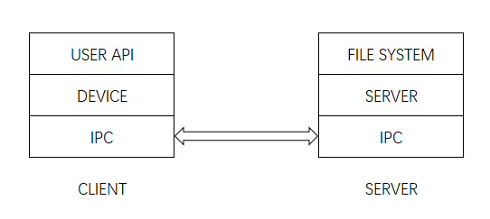
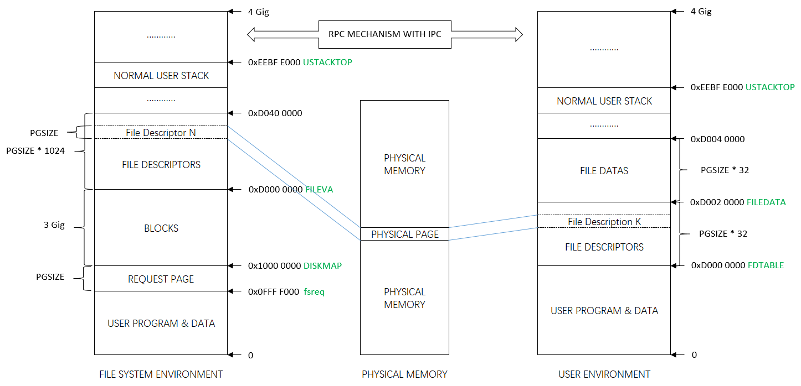

# Lab 5: File system, Spawn and Shell

在lab5中，我们将实现`spawn`，一个库调用，可以加载并在磁盘上运行的可执行程序【a library call that loads and runs on-disk executables】。然后我们还会完善kernel和library，使得JOS足以run a shell on the console。这些特性需要一个文件系统，本实验室引入了一个简单的读/写文件系统。

在开始之前，我们需要commit提交lab4，并且git checkout切换都lab5分支，然后`git merge lab4`。

lab5实验的主要新组件是位于fs目录（新添加）中的文件系统环境。此外，在 user 和 lib 目录中还有一些与文件系统相关的新文件。

- fs/fs.c	Code that mainipulates the file system's on-disk structure.
  - 主要处理文件系统磁盘结构的代码
- fs/bc.c	A simple block cache built on top of our user-level page fault handling facility.
  - 构建在用户级页错误处理工具之上一个简单的块缓存
- fs/ide.c	Minimal PIO-based (non-interrupt-driven) IDE driver code.
  - 基于最小的PIO(非中断驱动) 的IDE 驱动程序代码
- fs/serv.c	The file system server that interacts with client environments using file system IPCs.
  - 使用文件系统IPC与客户端进程交互的文件系统服务器
- lib/fd.c	Code that implements the general UNIX-like file descriptor interface.
  - 实现通用类 unix 文件描述符接口的代码
- lib/file.c	The driver for on-disk file type, implemented as a file system IPC client.
  - 磁盘文件类型的驱动程序，作为文件系统 IPC 客户机实现
- lib/console.c	The driver for console input/output file type.
  - 控制台输入/输出文件类型的驱动程序
- lib/spawn.c	Code skeleton of the spawn library call.

在merge新的实验5代码之后，您应该再次运行实验4中pingpong, primes, and forktree测试用例。

由于JOS还没有实现file system，因此在开始Exercise 1之前，需要注释`ENV_CREATE(fs_fs)`（在`kern/init.c`中），because `fs/fs.c` tries to do some I/O, which JOS does not allow yet. 此外还需要暂时注释`close_all()`（在`lib/exit.c`中），因为这个函数调用的子例程在之后的实验中才会实现，如果现在就调用会panic。

# File system preliminaries

初步介绍：您将使用的文件系统比大多数“真正的”文件系统(包括 xv6 UNIX 文件系统)要简单得多，但是它足够强大，可以提供基本功能: 创建、读取、写入和删除files organized in a hierarchical directory structure（层级目录结构）。

我们(至少目前)只开发了一个单用户操作系统，它提供了足够的protection 来捕捉 bug，但不能保护多个相互可疑的用户免受彼此的攻击（protect multiple mutually suspicious users from each other）。因此，我们的文件系统不支持文件所有权或权限的 UNIX 概念（the UNIX notions of file ownership or permissions）。我们的文件系统目前也不支持硬链接、符号链接、时间戳或特殊设备文件 like most UNIX file systems do。

## On-Disk File System Structure

<u>大多数 UNIX 文件系统将可用的磁盘空间划分为两种主要类型的区域: inode区域和数据区域</u>。UNIX 文件系统为文件系统中的每个文件分配一个 inode。<u>一个文件的 inode 保存了文件相关的重要元数据（critical meta-data about the file），例如文件的 stat 属性和指向其数据块的指针。</u>数据区域被划分为较大的数据块(通常为8KB 或更大) ，<u>在这些数据块中，文件系统存储了文件数据和目录元数据（directory meta-data）</u>。

【The data regions are divided into much larger (typically 8KB or more) *data blocks*, within which the file system stores file data and directory meta-data. 】

目录条目（Directory entries ）包含文件名和指向inodes的指针; 如果文件系统中的多个目录条目引用该文件的 inode，则称该文件为硬链接（*hard-linked*）。由于我们的文件系统不支持硬链接，我们不需要这种级别的间接性（we do not need this level of indirection ），因此可以简化：我们的文件系统将根本不使用 inode，而只是将一个文件的(或子目录的)元数据存储在描述该文件的(唯一的)目录条目中。【our file system will not use inodes at all and instead will simply store all of a file's (or sub-directory's) meta-data within the (one and only) directory entry describing that file.】

>JOS的file system把inode信息存储到目录条目中

也就是说JOS kernel实现的是简化版文件系统，相较于常规文件系统`FILE-INODE(META DATA)-BLOCKS`的模式，JOS kernel直接使用file的meta data来记录该文件所占用的Blocks信息，即`FILE(META DATA)-BLOCKS`的模式：

从逻辑上讲，文件和目录都由一系列数据块组成，这些数据块可能分散在磁盘中，much like the pages of an environment's virtual address space can be scattered throughout physical memory。通过提供读写文件任意偏移处字节的接口（presenting interfaces for reading and writing sequences of bytes at arbitrary offsets within files），文件系统环境隐藏了块布局的细节。作为执行操作（诸如文件创建和删除等）的一部分，文件系统环境在内部处理对目录的所有修改。我**们的文件系统允许用户环境直接读取目录元数据(例如，with read) ，这意味着用户环境可以自己执行目录扫描操作(例如，实现 ls 程序) ，而不必依赖于对文件系统的额外特殊调用**。<u>这种目录扫描方法的**缺点**以及大多数现代 UNIX 变体不鼓励这种方法的原因是，它使应用程序依赖于目录元数据的格式，使得在不改变或至少重新编译应用程序的情况下很难改变文件系统的内部布局。</u>

### Sectors and Blocks

大多数磁盘不能以字节粒度执行读写操作，而是以sector为单位执行读写操作 。在JOS中，扇区（sector）大小为512字节。文件系统实际上以block（块）分配和使用磁盘存储空间。

尤其需要注意sector和block在概念上的区别：

-  *sector size* is a property of the disk hardware【硬件属性】
- whereas *block size* is an aspect of the operating system using the disk.【OS的使用视角】

<u>文件系统的块大小（block size）必须是底层磁盘扇区大小的倍数，即512*n的block size。</u>

UNIX xv6文件系统使用512字节的块大小，与底层磁盘的扇区大小相同（n=1）。然而，大多数现代文件系统使用更大的块大小，**因为存储空间变得更便宜，而且在更大的粒度下管理存储更有效**。<u>我们的文件系统将使用**4096字节的块大小**（n=8），便于匹配处理器的页面大小</u>。【这样从磁盘块中导入内存页面就很方便了】

### Superblocks

**文件系统往往会把磁盘上某些"easy-to-find"的磁盘块用于存储描述<u>整个文件系统属性</u>的元数据**（比如块大小、磁盘大小、用于寻找根目录的元数据，文件系统最后一次挂载时间，文件系统最后一次检测到错误的时间等）。<u>这些特殊的块，我们称其为superblocks（超级块）。</u>

File systems typically reserve certain disk blocks at "easy-to-find" locations on the disk (such as the very start or the very end) to hold meta-data describing properties of the file system as a whole, such as the block size, disk size, any meta-data required to find the root directory, the time the file system was last mounted, the time the file system was last checked for errors, and so on. These special blocks are called *superblocks*.


我们的<u>文件系统将只有一个超级块，它将始终位于磁盘上的block 1（</u>其布局定义在 `struct Super` in `inc/fs.h`）。而**block 0通常保留用于引导加载程序（boot loaders）和分区表（partition tables），因此文件系统通常不使用the very first disk block（即Block 0）**。**许多“Real”文件系统会维护多个超级块，在磁盘的几个间隔很大的区域中复制这些超级块，因此，如果其中一个超级块损坏，或者磁盘在该区域中出现了media error，仍然可以找到其他超级块并使用它们访问文件系统。**

综上，`struct File`也存储在磁盘上，<u>需要找到一个特定的File，就得有一个根File，它能够直接被文件系统获取而不用查找，这个根目录记录在Super Block【superblock中还记录很多文件系统的整体信息】</u>，在具体实现中，编号为1的Block作为Super Block（Block 0存储boot loader，文件系统不使用block 0），<u>除此之外，还需要记录每个Block的使用情况，将Block 2作为bitmap用来记录Block的占用空闲情况</u>。

JOS kernel直接将磁盘至多3GB空间直接加载到内存当中，并且将其映射到内存线性地址空间`DISKMAP` ~ `DISKMAP + 3GB`，**换而言之，在文件系统进程的地址空间中，`DISKMAP` ~ `DISKMAP + 3GB`就是磁盘内容，这部分只有文件系统能够访问，不会与其它User Environment共享**，并且由于文件系统地址空间中的Block与磁盘内容直接映射，因此能够直接直接通过线性地址计算出Block Number，从而找到需要加载的Sector，例如线性地址va，其对应的BLock Number为`(va - DISKMAP) / PGSIZE`【注意在JOS中，页大小和块大小一致】，相应地，<u>如果文件系统在va产生了page fault，就需要加载磁盘sector编号为`BLKSECTORS * (va - DISKMAP) / PGSIZE`为起始sector的共`BLKSECTORS`个sector即可</u>。在JOS的文件系统中，Block size是4096 bytes，因此BLKSECTORS是`4096 / 512 = 8`。

### File Meta-data

在我们的文件系统中，关于文件的元数据布局在`inc/fs.h`的`struct File`中描述。这些元数据包含文件名、文件大小、文件类型（regular file or directory）以及指向构成文件的blocks的指针。如上所述，我们没有 inode，所以这个元数据存储在磁盘上的目录项中。与大多数“real”文件系统不同，为了简单起见，**我们将使用这个`struct File`来表示文件元数据（*both on disk and in memory* ）【文件结构】**

```c
struct File {
	char f_name[MAXNAMELEN];	// filename
	off_t f_size;			// file size in bytes
	uint32_t f_type;		// file type

	// Block pointers.
	// A block is allocated iff its value is != 0.
	uint32_t f_direct[NDIRECT];	// direct blocks
	uint32_t f_indirect;		// indirect block

	// Pad out to 256 bytes; must do arithmetic in case we're compiling
	// fsformat on a 64-bit machine.
	uint8_t f_pad[256 - MAXNAMELEN - 8 - 4*NDIRECT - 4];
} __attribute__((packed));	// required only on some 64-bit machines
```

The `f_direct` array in `struct File` 包括了用于存储文件前10个(NDIRECT为10)块的<u>块编号的空间</u>，我们称之为文件的直接块（file’s direct block）。对于大小为10 * 4096 = 40KB 的小文件【即只需10个块就可以存储好一个文件内容】，这意味着文件的所有块的块编号将fit directly within the `File` structure itself。但是对于较大的文件，我们需要一个位置来保存文件的其余的块编号。因此，对于任何大于40KB的文件，我们分配一个额外的磁盘块（被称为file‘s indirect block）以容纳最多4096/4 = 1024个额外的块号【这个磁盘块专门用于存储块号，一个磁盘块的大小为4096字节，一共可以存储1024个块号】。因此，我们的文件系统允许文件的大小达到1034个块（10个块号存储在direct block+1024个块号存储在indirect block），或超过4M字节。为了支持更大的文件，“real”文件系统通常也支持双重和三重间接块。


### Directories versus Regular Files

`struct File`结构体在我们的文件系统中既可以表示一个常规文件（regular file），还可以表示一个目录（directory）。这两种类型的“files”可以通过`File`结构体的`type`字段来做区分。文件系统实际上对普通文件和目录文件的管理方式是一样的。只是对于目录文件，文件系统根本不会解析与常规文件相关联的data blocks的内容，而文件系统会将目录文件内容解析为一系列目录内的描述文件和子目录的`struct File `结构体。

我们文件系统中的superblock 包含一个 `struct File` 结构体(`struct Super`中的s_root字段) ，其中包含了文件系统根目录的元数据。这个目录文件的内容是一系列描述文件系统根目录中的文件和目录的`struct File`。根目录中的任何子目录都可能包含更多表示内部子目录的`struct File`，依此类推。

```c
struct Super {
	uint32_t s_magic;		// Magic number: FS_MAGIC
	uint32_t s_nblocks;		// Total number of blocks on disk
	struct File s_root;		// Root directory node
};
```

## Design Philosophy of File System[#](https://qinstaunch.github.io/2020/01/31/MIT-6-828-LAB5-File-system-Spawn-and-Shell/#design-philosophy-of-file-system)

<u>实际操作系统将文件系统作为内核代码实现，因此进程调用文件系统接口最终都会陷入内核态来处理</u>，然而，在JOS中，整个文件系统本质上是一个特殊的User Environment，Normal User Environment调用的文件系统接口是通过IPC实现。**换而言之，可以将JOS的文件系统看作一个Server，而Normal User Environment都是Client，Client通过IPC向Server发送请求，而Server则始终准备着接受来自Client的请求。**

文件系统是JOS运行的第一个Environment，在`kern/init.c:i386_init`中直接创建文件系统。文件系统的main入口函数在fs/serv.c中，它完成的主要工作是：

1. `fs/serv.c:serve_init` —— **openfile table的初始化，以及file descriptor的地址划分**。
2. `fs/fs.c:fs_init` ——调用`fs/bc.c:bc_init`，校验Super Block和bitmap Block的合法性并记录它们的虚拟地址到全局变量`super`和`bitmap`。
   - `fs/bc.c:bc_init` - 正如此前讨论的一样，当我们知晓了需要加载的Block的虚拟地址va之后，就能够得到它对应的Block Number为`(va - DISKMAP) / PGSIZE`，相应地，该虚拟地址对应地page就需要从disk中加载serctor编号为`BLKSECTORS * (va - DISKMAP) / PGSIZE`到`BLKSECTORS * (va - DISKMAP) / PGSIZE + BLKSECTORS`的sector到内存。因此我们需要**设置page fault handler**，就像我们在实现fork中做的一样。
   - 除此之外，`bc.c`还需要**完成Super Block和bitmap Block的初始化**。
3. `fs/serv.c:serve`——接受Regular User Environment发送的请求，并且调用相应的handler来处理请求，再返回响应。但是文件系统同一时间只能够处理一个请求，效率不高。可以考虑多几个File system environment，但是这样需要对一些资源加锁，例如File descriptor，openfile table等，从而避免并发错误。

在提供给用户使用的接口方面，统一接口在`lib/fd.c`中，同时JOS将一些子系统抽象成Device，例如File Device，Pipe Device以及后面需要实现的Network Driver，Dev结构体包括了Dev id以及相应的处理函数指针:

```
struct Dev {
	int dev_id;
	const char *dev_name;
	ssize_t (*dev_read)(struct Fd *fd, void *buf, size_t len);
	ssize_t (*dev_write)(struct Fd *fd, const void *buf, size_t len);
	int (*dev_close)(struct Fd *fd);
	int (*dev_stat)(struct Fd *fd, struct Stat *stat);
	int (*dev_trunc)(struct Fd *fd, off_t length);
};
```

通过Devices的抽象以及File Descriptor，**统一了用户接口**（在lib/fd.c中），并且提供了高度的可定制性和可插拔性。我绘制了一个示意图，**Client与Server端都划分了三层**：



**注解：**

- USER API - lib/fd.c
- DEVICE
  - For instance:
    - devfile:lib/file.c; 
    - devpipe:lib/pipe.c; 
    - devcons:lib/console.c
- IPC - lib/ipc.c
- SERVER - fs/serv.c
- FILE SYSTEM - fs/fs.c

<u>以devfile的read操作为例，其Control flow如下所示：</u>

```
      Regular env           FS env
   +---------------+   +---------------+
   |      read     |   |   file_read   |
   |   (lib/fd.c)  |   |   (fs/fs.c)   |
...|.......|.......|...|.......^.......|...............
   |       v       |   |       |       | RPC mechanism[远程过程调用]
   |  devfile_read |   |  serve_read   |
   |  (lib/file.c) |   |  (fs/serv.c)  |
   |       |       |   |       ^       |
   |       v       |   |       |       |
   |     fsipc     |   |     serve     |
   |  (lib/file.c) |   |  (fs/serv.c)  |
   |       |       |   |       ^       |
   |       v       |   |       |       |
   |   ipc_send    |   |   ipc_recv    |
   |       |       |   |       ^       |
   +-------|-------+   +-------|-------+
           |                   |
           +-------------------+
```

**任何操作都是通过File Descriptor作为媒介来实现的**，并且File Descriptor是File System Environment与Regular User Environment**共享**的：

```
struct Fd {
	int fd_dev_id;
	off_t fd_offset;
	int fd_omode;
	union {
		// File server files
		struct FdFile fd_file;
	};
};
```

通过Fd的dev_id能够找到相应的Devices，并且调用其处理函数，而fd_file则是OpenFile的索引，控制最终转移到File system时，能够通过fd_file拿到OpenFile，而OpenFile结构体中保留了File指针，在File System Environment的地址空间中，能通过该File指针获取到相应的struct File的引用：

```
struct OpenFile {
	uint32_t o_fileid;	// file id
	struct File *o_file;	// mapped descriptor for open file
	int o_mode;		// open mode
	struct Fd *o_fd;	// Fd page
};
```

**文件系统环境和Regular User Environment之间的结构如下所示：**【可以在实践之后重新阅读这一节】

[](https://s2.ax1x.com/2020/01/31/13lPN8.png)


# The File System

这个实验室的目标不是让您实现整个文件系统，而是让您只实现某些关键组件。特别是，需要完成：

- 块读入块缓存（block cache）并将它们刷新（flush back）回磁盘; 
- 分配磁盘块; 
- 将文件偏移映射到磁盘块; 
- 在 IPC 接口中实现read, write, and open。

因为您不会自己实现所有的文件系统内容，所以熟悉所提供的代码和各种文件系统接口非常重要。

## Disk Access

操作系统中的 file system environment需要能够访问磁盘，但是我们还没有在内核中实现任何磁盘访问功能。**我们没有采用传统的“单一”的OS策略，即向内核添加 IDE 磁盘驱动程序（IDE是很老的磁盘接口）以及允许文件系统访问IDE磁盘的必要系统调用**，而是<u>将 IDE 磁盘驱动程序作为用户级文件系统环境（user-level file system environment）的一部分来实现。</u>我们仍然需要稍微修改内核，以便set things up，使文件系统环境具有实现磁盘访问本身所需的特权。【这里应该是通过kernel给文件系统进程提升权限，来直接操作磁盘，将driver的功能融到文件系统进程中】

只要我们依靠轮询、基于“"programmed I/O" (PIO)的磁盘访问，并且不使用磁盘中断，就很容易在用户空间实现磁盘访问。在用户模式下也可以实现中断驱动的设备驱动程序（interrupt-driven device drivers ），(例如，L3和 L4内核就是这样做的) 。但是由于内核必须成功应对设备中断并将它们发送/分派到正确的用户模式进程中，因此实现起来更加困难。

X86处理器使用EFLAGS寄存器中的 IOPL 位来确定是否允许保护模式代码执行特殊的设备I/O指令，比如IN and OUT instructions. 由于我们需要访问的所有 IDE 磁盘寄存器都位于 x86的I/O space，而不是memory-mapping，因此为了允许文件系统访问这些寄存器，我们需要做的唯一一件事就是给予file system environment一定的“I/O特权”。实际上，EFLAGS 寄存器中的 IOPL 位为内核提供了一种简单的“全有或全无”（"all-or-nothing"）的方法来控制用户模式代码是否能够访问I/O space。在我们的示例中，我们希望文件系统环境/进程能够访问I/O space，但是我们根本不希望任何其他环境/进程能够访问I/O空间。

#### Exercise 1

>`i386_init` identifies the file system environment by passing the type `ENV_TYPE_FS` to your environment creation function, `env_create`. Modify `env_create` in `env.c`, so that it gives the file system environment I/O privilege, but never gives that privilege to any other environment.
>
>Make sure you can start the file environment without causing a General Protection fault. You should pass the "fs i/o" test in `make grade`.
>
>【记得测试前取消ENV_CREATE(fs_fs, ENV_TYPE_FS);的注释】

可以看到`/kern/init.c`的`i386_init()`函数中启动了file system：

```c
void
i386_init(void)
{
	// Initialize the console.
	// Can't call cprintf until after we do this!
	cons_init();

	cprintf("6828 decimal is %o octal!\n", 6828);

	// Lab 2 memory management initialization functions
	mem_init();

	// Lab 3 user environment initialization functions
	env_init();
	trap_init();

	// Lab 4 multiprocessor initialization functions
	mp_init();	//
	lapic_init();

	// Lab 4 multitasking initialization functions
	pic_init();

	// Acquire the big kernel lock before waking up APs
	// Your code here:
	lock_kernel();

	// Starting non-boot CPUs
	boot_aps();

	// Start fs.【创建文件系统环境】
	ENV_CREATE(fs_fs, ENV_TYPE_FS);

	// Should not be necessary - drains keyboard because interrupt has given up.
	kbd_intr();

	// Schedule and run the first user environment!
	sched_yield();
}
```

`ENV_CREATE`宏会间接调用`env_create()`，因此需要在 `env_create()`中根据创建的进程是否为文件系统进程来设置eflags寄存器的IOPL标识位。

```c
//env.c
void
env_create(uint8_t *binary, enum EnvType type)
{
	// LAB 3: Your code here.
	struct Env *env = NULL;
	assert(!env_alloc(&env,0));
	env->env_parent_id = 0;
	env->env_type = type;
	// If this is the file server (type == ENV_TYPE_FS) give it I/O privileges.
	// LAB 5: Your code here.
	if(type == ENV_TYPE_FS)
    { //赋予文件系统进程I/O权限
		env->env_tf.tf_eflags |=FL_IOPL_MASK;
	}
	load_icode(env,binary);

}
//mmu.h
#define FL_IOPL_MASK	0x00003000	// I/O Privilege Level bitmask
#define FL_IOPL_0	0x00000000	//   IOPL == 0
#define FL_IOPL_1	0x00001000	//   IOPL == 1
#define FL_IOPL_2	0x00002000	//   IOPL == 2
#define FL_IOPL_3	0x00003000	//   IOPL == 3
```

#### Question

1. Do you have to do anything else to ensure that this I/O privilege setting is saved and restored properly when you subsequently switch from one environment to another? Why?

   当然不用，啥也不用做。进程切换的时候，eflags也会跟着切换。eflags寄存器也会在发生switch的时候自动保存到env->env_tf中。即trap时会自动保存这些寄存器的值。

>Note that the `GNUmakefile` file in this lab sets up QEMU to use the file `obj/kern/kernel.img` as the image for disk 0 (typically "Drive C" under DOS/Windows) as before, and to use the (new) file `obj/fs/fs.img` as the image for disk 1 ("Drive D"). In this lab our file system should only ever touch disk 1; disk 0 is used only to boot the kernel.

## The Block Cache


