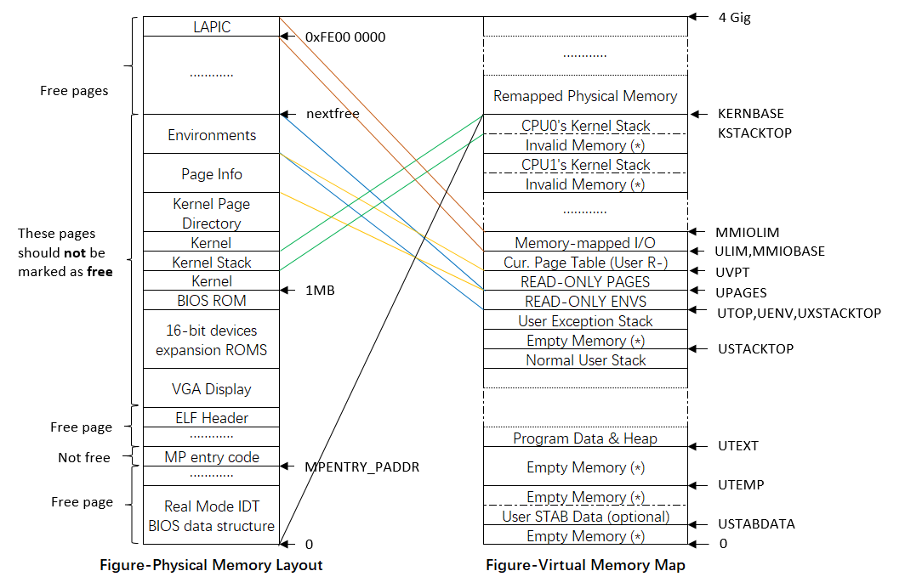
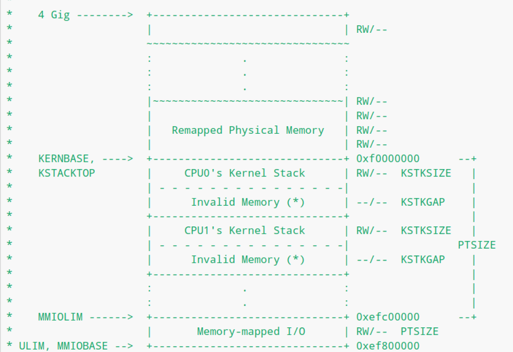
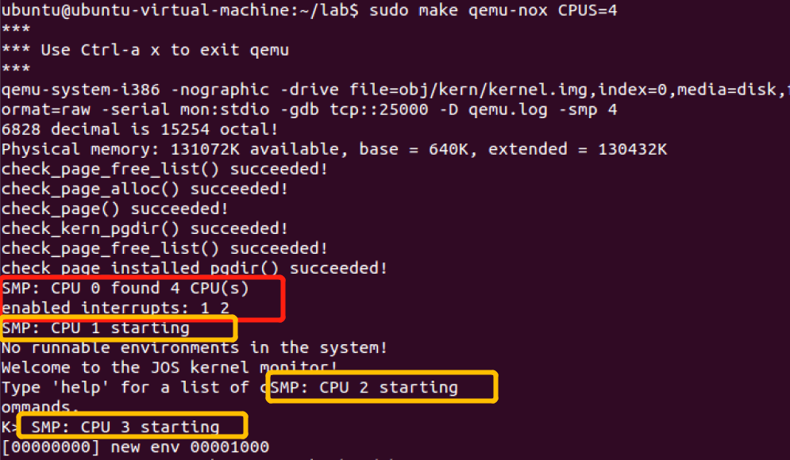
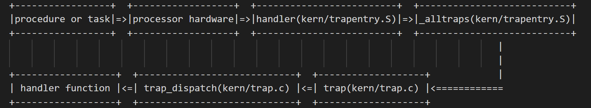

# Lab 4: Preemptive Multitasking

lab3和lab4貌似都是超多的内容。尤其是lab4，一共有3个Part：A、B、C。

在这实验中需要实现抢占式多任务处理（preemptive multitasking），也就是按照优先级来同时运行多个active user-mode environments【用户进程】。

- Part A：将为JOS添加多处理器支持（multiprocessor），实现循环调度（round-robin scheduling），并添加基本的进程管理系统调用（创建和销毁进程环境以及分配/映射内存）。
- Part B：将实现Unix-like `fork()`，它允许用户进程创建其自身的副本。
- Part C：将添加对进程间通信（IPC）的支持，从而允许不同的用户进程之间显式地通信和同步。最终还将添加对硬件时钟中断（hardware clock interrupts）和抢占（preemption）的支持。

首先我们提交Lab3，切换到lab4，然后merge lab4。这里会有一些冲突，解决冲突，保留merge后所有的code。

Lab4相关的文件总览如下：

- kern/cpu.h——Kernel-private definitions for multiprocessor support
- kern/mpconfig.c——Code to read the multiprocessor configuration
- kern/lapic.c——Kernel code driving the local APIC unit in each processor
- kern/mpentry.S——Assembly-language entry code for non-boot CPUs
- kern/spinlock.h——Kernel-private definitions for spin locks, including the big kernel lock
- kern/spinlock.c——Kernel code implementing spin locks
- kern/sched.c——Code skeleton of the scheduler that you are about to implement

整个实验至少要完成一个challenge呀。

## Part A：Multiprocessor Support and Cooperative Multitasking

在PartA部分，我们首先要扩展JOS，使其在多处理器系统上运行，然后实现一些新的 JOS 内核系统调用，以允许用户进程创建其他新环境（to allow user-level environments to create additional new environments）。接着还会实现*cooperative* round-robin scheduling【一种进程调度】：在当前environment主动放弃CPU【voluntarily relinquishes the CPU (or exits)】，以允许kernel能够从一个environment切换到另外一个。在后面Part C中，还将实现抢占式调度，它允许内核在经过一段时间后从environment中重新获得对 CPU 的控制，即使environment并不配合。

### Multiprocessor Support

 对称多处理架构SMP是一种多处理器的电脑硬件架构。在对称多处理架构下，每个处理器的地位都是平等的，对资源的使用权限相同。现代多数的多处理器系统，都采用SMP（对称多处理架构）。在这个系统中，拥有超过一个以上的处理器，**这些处理器都连接到同一个共享的主存上，并由单一操作系统来控制。**在对称多处理系统上，在操作系统的支持下，无论进程是处于用户空间还是内核空间，都可以分配到任何一个处理器上运行。因此，进程可以在不同的处理器间移动，达到负载平衡，使系统的效率提升。

>注意：每个processor跑一个进程，每个core跑一个线程【一个processor可以有多个core】。

在LAB4之前，**所有的JOS代码都是在同一个处理器上执行的，这个处理器一般叫做Bootstrap Processor(BSP)，简单理解来说就是，用于OS启动的那个CPU**【引导处理器】。<u>BSP具体是哪个处理器是由BIOS和硬件共同决定的</u>。

在LAB4的一开始，我们要通过BSP来增加多处理器的支持，除了BSP之外的其它处理器一般叫做应用处理器Application Processors(APs)。多处理器**共享**许多硬件资源，例如内存和I/O总线，但是**也有许多硬件资源并不是共享的**，<u>例如LAPIC单元，TSS等寄存器</u>，**因此需要在BSP初始化好之后再初始化其它APs**，当然，<u>此时page等也不再需要初始化了（**因为内存是共享的**）</u>。

在LAB4中的内存映射关系如下所示，可以和LAB3的内存映射关系对比来看:



SMP架构下，每一个CPU都有一个独立的local APIC (LAPIC) 单元。LAPIC单元负责传送整个系统的中断。LAPIC 还给其连接的 CPU提供了一个唯一标识符APIC ID（The LAPIC also provides its connected CPU with a unique identifier）。

在这个实验室中，我们利用了 LAPIC 单元如下的基本功能(in `kern/lapic.c`) :

- **Reading the LAPIC identifier (APIC ID)** to tell which CPU our code is currently running on (see `cpunum()`).
  - 获取APIC ID，以便允许的代码明确自己跑在哪个CPU上。
- Sending the `STARTUP` interprocessor interrupt (IPI) from the BSP to the APs to bring up other CPUs (see `lapic_startap()`).
  - 发送处理器之间的中断`STARUP`【从BSP发到APs】，来启动其他CPU。
- In part C, we program LAPIC's built-in timer to trigger clock interrupts to support preemptive multitasking (see `apic_init()`).
  - PartC中，我们还会实现LAPIC内部的定时器，来触发始终中断，以支持抢占式多任务机制。【避免一个任务霸占CPU太久】

**处理器使用内存映射memory-mapped I/O (MMIO)访问其 LAPIC。**<u>在 MMIO 中，一部分物理内存硬连线hardwired到某些I/O设备的寄存器，因此通常用于操作内存的load/store指令相当于了访问设备寄存器。</u>此前，其实我们已经在物理地址0xA0000处看到了一个I/O hole(我们用这片内存来写VGA display buffer)。

LAPIC 位于起始地址为物理地址0xFE000000(32MB short of 4GB)的hole。这个地址太高了，我们无法使用我们通常在KERNBASE进行的直接映射访问。【The LAPIC lives in a hole starting at physical address `0xFE000000` (32MB short of 4GB), so it's too high for us to access using our usual direct map at KERNBASE.】

- 回顾之前Lab 2完成的映射，只有[0,4MB]和[KERNBASE,KERNBASE+4MB]的区域一一直接同步对应/映射到物理内存的[0,4MB]区域【0~0x400000】。
- 因此太高的物理内存是不能通过简单+KERNBASE找到对应的虚拟地址的。

JOS 虚拟内存在 MMIOBASE处留下了4MB 的空白内存空间，因此我们有一个地方可以映射LAPIC这样的设备。由于后面的实验室引入了更多的MMIO区域，因此您将编写一个简单的函数来分配该区域的空间并将设备内存映射到该区域。

#### Exercise 1

> Implement `mmio_map_region` in `kern/pmap.c`. To see how this is used, look at the beginning of `lapic_init` in `kern/lapic.c`. 
>
> You'll have to do the next exercise, too, before the tests for `mmio_map_region` will run.

```c
// Reserve size bytes in the MMIO region and map [pa,pa+size) at this location.  
// Return the base of the reserved region.  
// size does *not* have to be multiple of PGSIZE.
// 给某个device，在MMIO区域预定一些位置，返回获得的MMIO子区域的首地址。size不需要是PGSIZE的整数倍。但是分配的时候是要的，请求的参数不要求。
void *
mmio_map_region(physaddr_t pa, size_t size)
{
	// Where to start the next region.  
    // Initially, this is the beginning of the MMIO region. 
    // Because this is static, its value will be preserved between calls to mmio_map_region
	// (just like nextfree in boot_alloc).
	static uintptr_t base = MMIOBASE;	
    // base是静态变量，每个CPU中只会初始化一次。之后要一直维护这个base变量，一直保持为下一个待分配的MMIO内存区域
    // 初始值为 #define MMIOBASE	(MMIOLIM - PTSIZE)
    // 从这里可以看出MMIO区域只有一个页大小

	// Reserve size bytes of virtual memory starting at base and map physical pages [pa,pa+size) to virtual addresses [base,base+size).
    //Since this is device memory and not regular DRAM, you'll have to tell the CPU that it isn't safe to cache access to this memory.【不需要cache，而采用直写】
    // Luckily, the page tables provide bits for this purpose; 
    // simply create the mapping with PTE_PCD|PTE_PWT (cache-disable and write-through) in addition to PTE_W.  (If you're interested in more details on this, see section 10.5 of IA32 volume 3A.)
	// Be sure to round size up to a multiple of PGSIZE and to handle if this reservation would overflow MMIOLIM (it's okay to simply panic if this happens).
	//
	// Hint: The staff solution uses boot_map_region.
	//
	// Your code here:
    size_t sizeUp = ROUNDUP(size,PGSIZE);
	if( base + sizeUp > MMIOLIM || base + sizeUp < base){
        panic("The mmio_map_region function overflows MMIOLIM!");
    }
  	boot_map_region(kern_pgdir,base,sizeUp,pa,(PTE_PCD|PTE_PWT|PTE_W));
    base +=sizeUp;
    return (void *)(base - sizeUp);
	//panic("mmio_map_region not implemented");
}
```

在boot up APs的之前，BSP需要收集一些多处理器系统的信息，比如：

- the total number of CPUs
- their APIC IDs
- the MMIO address of the LAPIC unit

`kern/mpconfig.c`中的`mp_init()`函数通过读取MP configuration table【存储在BIOS'region memory中】来获得以上信息。

此后，`kern/init.c`中的`boot_aps()`函数驱动AP的启动。起初AP以实模式启动【much like how the bootloader started in `boot/boot.S`】，之后`boot_aps()`复制AP的entry code（in `kern/mpentry.S`）到可寻址的内存区域中。与BSP中的bootloader 不同，我们可以控制 AP 从哪里开始执行代码。

在本实验中，我们将entry code复制到0x7000(**MPENTRY_PADDR**) ，但是实际上，任何在640KB以下的未使用的、页面对齐的物理地址作为AP start executing entry code的位置。

此后，`boot_aps()`通过从BSP发送STARTUP IPI（CPU间中断）到相应AP的LAPIC来逐个激活AP，同时传递标识了AP start running entry code的初始的 `CS:IP`地址（(`MPENTRY_PADDR` in our case）。

The entry code in `kern/mpentry.S` is quite similar to that of `boot/boot.S`.

在一些简短的设置和初始化以后，entry code将AP设置为保护模式【开启页表】，然后调用 C setup routine，即`mp_main()`(also in `kern/init.c`)。

在这段期间，BSP执行的`boot_aps()`会等待AP发送CPU_STARTED信号【signal a `CPU_STARTED` flag in `cpu_status` field of its `struct CpuInfo`】，从而判断这个AP已经被激活并初始化完毕。然后BSP会接着再唤醒下一个。

#### Exercise 2

>Read `boot_aps()` and `mp_main()` in `kern/init.c`, and the assembly code in `kern/mpentry.S`. Make sure you understand the control flow transfer during the bootstrap of APs. 
>
>Then modify your implementation of `page_init()` in `kern/pmap.c` to avoid adding the page at `MPENTRY_PADDR` to the free list, so that we can safely copy and run AP bootstrap code at that physical address. 
>

我们回顾`i386_init()`的代码：

```c
void
i386_init(void)
{
	// Initialize the console.
	// Can't call cprintf until after we do this!
	cons_init();
	cprintf("6828 decimal is %o octal!\n", 6828);
	// Lab 2 memory management initialization functions
	mem_init();
	// Lab 3 user environment initialization functions
	env_init();
	trap_init();
	//在前几个lab，我们依次完成了内存初始化、用户空间初始化以及异常中断的初始化。
    //接下来的lab4，我们会进行下述初始化，并最终调用boot_aps()
    //
	// Lab 4 multiprocessor initialization functions
	mp_init();	//从BIOS中读取，多处理器信息
	lapic_init();	//初始化LAPIC

	// Lab 4 multitasking initialization functions
	pic_init();

	// Acquire the big kernel lock before waking up APs
    // 因为在boot_aps中会出现AP和BSP的并行执行，因此在调用boot_aps之前需要申请内核锁。
    //
	// Your code here:

	// Starting non-boot CPUs
	boot_aps();	//从这里开始启动APs，并进行APs的自身初始化。
	
    //在启动完所有APs后，我们将会启动执行第一个user environment
#if defined(TEST)
	// Don't touch -- used by grading script!
	ENV_CREATE(TEST, ENV_TYPE_USER);
#else
	// Touch all you want.
	ENV_CREATE(user_primes, ENV_TYPE_USER);
#endif // TEST*

	// Schedule and run the first user environment!
	sched_yield();
}

```

在`i386_init()`中会调用`boot_aps()`，`boot_aps()`的实现的流程和上述分析一致：

```C
// While boot_aps is booting a given CPU, it communicates the per-core
// stack pointer that should be loaded by mpentry.S to that CPU in
// this variable.
void *mpentry_kstack;	//每个AP CPU的stack位置

// Start the non-boot (AP) processors.
static void
boot_aps(void)
{
	extern unsigned char mpentry_start[], mpentry_end[];
	void *code;
	struct CpuInfo *c;
	
	// Write entry code to unused memory at MPENTRY_PADDR！！
	code = KADDR(MPENTRY_PADDR);	//MPENTRY_PADDR = 0x7000
    //将entry code复制到code 变量位置，也就是MPENTRY_PADDR物理地址【MPENTRY_PADDR+KERNBASE虚拟地址】的位置。
    //mpentry_start和mpentry_end由mpentry.S指定，是entry code的实际内容。此时已经加载到低地址MPENTRY_PADDR=0x7000的内存中，等待调用执行。
	memmove(code, mpentry_start, mpentry_end - mpentry_start);

	// Boot each AP one at a time
    // ncpu 
	for (c = cpus; c < cpus + ncpu; c++) {	//遍历每个cpus
		if (c == cpus + cpunum())  // We've started already.
			continue;

		// Tell mpentry.S what stack to use【确定每一个cpu的stack位置】 
        // 设置kernel stack的大小为KSTKSIZE = 8页大小
        // percpu_kstacks是在mem_init_mp确定的，大概就是KSTACKTOP往下进行分配的，之后会具体涉及。
		mpentry_kstack = percpu_kstacks[c - cpus] + KSTKSIZE;
		// Start the CPU at mpentry_start
		lapic_startap(c->cpu_id, PADDR(code));	//PADDR返回物理地址。通过lapic_startap来发送startup IPI CPU间中断给AP，并且通过PADDR(code)给出entry code的位置。
		// Wait for the CPU to finish some basic setup in mp_main()
        // lapic_startap位于kern/lapic.c，在这里发生了处理器的切换。从mpentry_start开始就是由被激活的CPU执行的，换而言之，从mpentry_start开始，这部分代码和BSP就是完全并行执行。
        //这也是为什么在lapic_startap(c->cpu_id, PADDR(code))之后，需要BSP不断自旋直到该APs初始化完毕的原因：
		while(c->cpu_status != CPU_STARTED)	
			;	//完成一个AP的启动，继续进行下一个AP的启动
	}
}
```

这里我们还需要在阅读一下`kern/mpentry.S`：

```assembly
###################################################################
# entry point for APs
###################################################################

# Each non-boot CPU ("AP") is started up in response to a STARTUP IPI from the boot CPU.
# Section B.4.2 of the Multi-Processor Specification says that the AP will start in real mode with CS:IP set to XY00:0000, where XY is an 8-bit value sent with the STARTUP. 
# Thus this code must start at a 4096-byte boundary.
# BSP CPU会发送STARTUP IPI给APs，且还会附带发送8-bit，即1字节的XY值。在AP收到后，会以实模式启动并且将CS:IP设置为XY00:0000=0xXY000地址处【4KB对齐】。
# 在这里，我们设置CS:IP=0700:0000=0x7000=MPENTRY_PADDR
# Because this code sets DS to zero, it must run from an address in the low 2^16 bytes of physical memory.
#
# boot_aps() (in init.c) copies this code to MPENTRY_PADDR (which satisfies the above restrictions).  
# Then, for each AP, it stores the address of the pre-allocated per-core stack in mpentry_kstack, sends the STARTUP IPI, and waits for this code to acknowledge that it has started (which happens in mp_main in init.c).
# 之后在mp_main(in init.c)中会设置cpu_status为CPU_STARTED表示该AP已启动。
# 这个AP启动(mpentry.S)和BSP启动(boot.S)的差别：
# This code is similar to boot/boot.S except that
#    - it does not need to enable A20
#    - it uses MPBOOTPHYS to calculate absolute addresses of its symbols, rather than relying on the linker to fill them

#define RELOC(x) ((x) - KERNBASE)
#define MPBOOTPHYS(s) ((s) - mpentry_start + MPENTRY_PADDR)
# 依赖于MPBOOTPHYS宏计算符号的绝对地址，而不使用链接器。【其实是转化为了物理地址】
.set PROT_MODE_CSEG, 0x8	# kernel code segment selector
.set PROT_MODE_DSEG, 0x10	# kernel data segment selector

.code16           
.globl mpentry_start
mpentry_start:
	cli            

	xorw    %ax, %ax
	movw    %ax, %ds
	movw    %ax, %es
	movw    %ax, %ss

	lgdt    MPBOOTPHYS(gdtdesc)	# 加载GDT表
	movl    %cr0, %eax
	orl     $CR0_PE, %eax
	movl    %eax, %cr0			# 保护模式使能

	ljmpl   $(PROT_MODE_CSEG), $(MPBOOTPHYS(start32))
	# 实模式跳转。段寄存器：段内偏移。
	# 这条指令执行的结果会将$PROT_MODE_CSEG加载到cs中，cs对应的高速缓冲存储器【selector】会加载GDT代码段描述符，同样将$(MPBOOTPHYS(start32))加载到ip中
	# 跳转到保护模式32位地址下执行。
	# 简单来说就是kern/mpentry.S引用的符号对应的地址是虚拟地址，高于KERNBASE【因为kern/mpentry.S是内核代码，所以符号start32都会被linker解析为虚拟地址的】，直接把虚拟地址当成物理地址，那么必然会加载未知的物理内存数据，必然出错。因此需要使用MPBOOTPHYS切换成物理地址【实模式下】。

.code32			 # Assemble for 32-bit mode 指导生成32位汇编代码
start32:
	movw    $(PROT_MODE_DSEG), %ax
	movw    %ax, %ds
	movw    %ax, %es
	movw    %ax, %ss
	movw    $0, %ax
	movw    %ax, %fs
	movw    %ax, %gs

	# Set up initial page table. We cannot use kern_pgdir yet because we are still running at a low EIP.
	movl    $(RELOC(entry_pgdir)), %eax		#设置初始页表【低端的内存是由人工构造的entry_pgdir来负责映射的】
	movl    %eax, %cr3		# 放置entry_pgdir页表到页目录寄存器cr3中
	# Turn on paging.
	movl    %cr0, %eax
	orl     $(CR0_PE|CR0_PG|CR0_WP), %eax
	movl    %eax, %cr0	#开启虚拟空间【页表寻址】

	# Switch to the per-cpu stack allocated in boot_aps()
	# 设置栈帧，准备运行c代码
	movl    mpentry_kstack, %esp
	movl    $0x0, %ebp       # nuke frame pointer

	# Call mp_main().  (Exercise for the reader: why the indirect call?)
	movl    $mp_main, %eax
	call    *%eax				#注意这里使用了间接跳转【mp_main属于内核代码，在高地址处，所以采用间接跳转比较稳妥？还是说是因为符号解析的问题，mp_main是由linker进行的？】

	# If mp_main returns (it shouldn't), loop.
spin:
	jmp     spin

# Bootstrap GDT
.p2align 2					# force 4 byte alignment
gdt:
	SEG_NULL				# null seg
	SEG(STA_X|STA_R, 0x0, 0xffffffff)	# code seg【XR权限】
	SEG(STA_W, 0x0, 0xffffffff)		# data seg【W权限】

gdtdesc:
	.word   0x17				# sizeof(gdt) - 1
	.long   MPBOOTPHYS(gdt)			# address gdt

.globl mpentry_end
mpentry_end:
	nop

```

最后会在上述entry code中调用`mp_main`，进行APs的set up：

```C
// Setup code for APs
void
mp_main(void)
{
	// We are in high EIP now, safe to switch to kern_pgdir 
    //通过间接跳转，我们进入了高端内存，此后由kern_pgdir负责页表映射。
	lcr3(PADDR(kern_pgdir));	//load cr3
	cprintf("SMP: CPU %d starting\n", cpunum());  //现在启动某个AP，进行下述初始化【lapic、env、trap……】

	lapic_init();
	env_init_percpu();
	trap_init_percpu();
	xchg(&thiscpu->cpu_status, CPU_STARTED); // tell boot_aps() we're up
	//设置cpu_status为CPU_STARTED，告诉正在运行boot_aps()的BSP，这个AP已经启动，此时BSP就能够继续初始化下一个APs或者开始运行第一个User Environment。
	// Now that we have finished some basic setup, call sched_yield() to start running processes on this CPU.  
    // But make sure that only one CPU can enter the scheduler at a time!
	// 这里之后应该要申请内核锁kernel_lock来避免两个处理器并行运行【由于现在kernel_lock是由BSP占有的，所以每个AP都抢不到kernel_lock而进入阻塞状态】。
    //由于此时至少存在两个处理器是并行地运行，若不使用内核锁来确保同时只能有一个CPU执行一些关键的内核代码，就必然会产生并发错误，例如，在不使用内核锁的情况下，假设两个CPU同时进入了Scheduler，那么就可能导致两个CPU同时执行同一个User Environment的严重的并发错误，除此之外，创建Environment，分配Page等等都可能产生Race Condition，这显然不对。
    //也因此BSP在调用boot_aps之前必须申请kernel_lock，这样当所有APs还没初始化成功之前（即BSP的boot_aps还没返回之前）已完成初始化的APs都会被阻塞在mp_main的lock_kernel上，因为此时kernel_lock被BSP持有。
	// Your code here:
	lock_kernel();
    sched_yield();
	// Remove this after you finish Exercise 6
	for (;;);
}
```

整个APs的启动流程就是：

>| kern/init.c:i386_init |==>| kern/init.c:boot_aps | 	=> Pass control to kern/lapic.c: lapic_startap and switch to the booted processor to execute rest code/instruction. => | kern/mpentry.S:mpentry_start | => | kern/init.c:mp_main |

在了解完APs的启动之后，我们修改`page_init()`（in `kern/pmap.c`）以免将`MPENTRY_PADDR`附近区域页面放置到free list中，此后意外分配出去。

```c
void
page_init(void)
{
	size_t i, extendedFree = PGNUM(PADDR(boot_alloc(0)));
	for(i = 0; i < npages; ++i){
		pages[i].pp_ref = 0;
		if(i == 0 || (i >= npages_basemem && i < extendedFree) || i == PGNUM(MPENTRY_PADDR)){	//change here
			pages[i].pp_link = NULL;
		}else{
			pages[i].pp_link = page_free_list;
			page_free_list = &pages[i];
		}
	}
}
```

Your code should pass the updated `check_page_free_list()` test (but might fail the updated `check_kern_pgdir()` test, which we will fix soon).

#### Question

>Compare `kern/mpentry.S` side by side with `boot/boot.S`. 
>
>Bearing in mind that `kern/mpentry.S` is compiled and linked to run above `KERNBASE` just like everything else in the kernel, what is the purpose of macro `MPBOOTPHYS`? Why is it necessary in `kern/mpentry.S` but not in `boot/boot.S`? In other words, what could go wrong if it were omitted in `kern/mpentry.S`?
>
>Hint: recall the differences between the link address and the load address that we have discussed in Lab 1.

kern/mentry.S与boot/boot.S主要有以下两点区别：

1. kern/mentry.S不需要使能A20；
2. kern/mentry.S需要使用宏MPBOOTPHYS来计算它所引用的符号（symbol）的绝对地址而不是和boot/boot.S一样依赖于链接器（linker）。

正如前面所提到的，**kern/mpentry.S实际上是内核代码，它们的地址都在KERNBASE之上【需要页表转换后才可以使用的】，而mpentry.S作为APs的boot代码，运行在低地址【lapic_startap是在低地址的MPENTRY_PADDR启动运行AP的】，**因此需要使用宏MPBOOTPHYS来计算物理地址，随后执行mpentry.S时运行在实模式之下。

内存是AP和BSP共享的，因此在AP进入页目录虚拟寻址之前的地址，处于实模式的地址都要是物理地址，但是这段代码是从内核copy过来的，因此当时BSP的linker都是解析符号为虚拟地址，因此需要靠宏MPBOOTPHYS转换过来。而之后，进入32位代码，开启保护模式，进行虚拟空间寻址之后，直接使用linker的符号就可以了。

```c
#define MPBOOTPHYS(s) ((s) - mpentry_start + MPENTRY_PADDR) //计算物理地址
eg： 
    ljmpl   $(PROT_MODE_CSEG), $(MPBOOTPHYS(start32))  //实模式
    movl    $mp_main, %eax		//保护模式
```

但是在boot/boot.S这部分代码实际上是由BIOS直接加载到了物理地址0x7c00，因此不需要使用宏来计算绝对地址。简单来说就是kern/mpentry.S引用的符号对应的地址是虚拟地址，高于KERNBASE，因此若不使用MPBOOTPHYS计算绝对地址/物理地址，直接把虚拟地址当成物理地址，那么必然会加载未知的物理内存数据，必然出错。

boot.S中，由于尚没有启用分页机制，所以我们能够指定程序开始执行的地方以及程序加载的地址；但是，在mpentry.S的时候，由于主CPU已经处于保护模式下了，因此是不能直接指定物理地址的，因此需要这个宏映射到相应的物理地址。

### Per-CPU State and Initialization

当要实现一个multiprocessor OS，最关键的是要区别per-CPU state【这是每一个处理器私有的】和global state【这是整个系统共享的】。
`kern/cpu.h`中定义了per-CPU state，包括`struct CpuInfo`，其存储了每一个CPU变量。`cpunum ()`总是返回调用它的 CPU 的 ID，它可以用作`cpus`等数组的index。此外，`thiscpu`宏可以作为the current CPU's `struct CpuInfo`。

<u>以下是您应该注意的 per-CPU state:</u>

- **Per-CPU kernel stack**.

  - 因为多个 cpu 可以同时陷入内核中，所以我们需要为每个处理器分配一个单独的内核栈，以防止它们相互干扰对方的执行。The array `percpu_kstacks[NCPU][KSTKSIZE]` reserves space for NCPU's worth of kernel stacks.

  - 在Lab2中，我们曾将KSTACKTOP以下的物理内存映射为BSP的kernal stack【即bootstack】。类似地，在这个实验室中，您将把每个 CPU 的内核栈映射到这个区域，并使用guard pages【保护页，invalid memory】作为它们之间的缓冲区，不允许越界访问到隔壁CPU的kernel stack。 即CPU0的kernel stack依旧是从KSTACKTOP往下增长，CPU1 kernel stack是从CPU0 kernel stack底部的KSTKGAP字节处开始，以此类推。以下是`inc/memlayout.h`显示的映射布局。

    

- **Per-CPU TSS and TSS descriptor**.

  - A per-CPU task state segment (TSS) 用于指定每一个CPU的kernel stack所在的位置。对于CPU *i*，其TSS存储在 `cpus[i].cpu_ts`，相应地TSS descriptor被定义在GDT条目`gdt[(GD_TSS0 >> 3) + i]`中。
  - 在 kern/trap.c 中定义的全局变量 ts 将不再有用。

- **Per-CPU current environment pointer**.

  - 由于每一个CPU可以同时运行不同的user process，因此我们需要重新定义符号`curenv`，而将其修改为`cpus[cpunum()].cpu_env`或是`thiscpu->cpu_env`，以此来指明当前CPU正在执行的environment。

- **Per-CPU system registers**.

  - 所有寄存器对于一个CPU而言都是私有的（including system registers）。因此初始化这些寄存器的指令，如 lcr3()、 ltr ()、 lgdt ()、 lidt ()等必须在每个 CPU 上执行一次。
  - Functions `env_init_percpu()` and `trap_init_percpu()` are defined for this purpose.

>In addition to this, if you have added any extra per-CPU state or performed any additional CPU-specific initialization (by say, setting new bits in the CPU registers) in your solutions to challenge problems in earlier labs, be sure to replicate them on each CPU here!

接下来就进入到exercise 3和4

#### Exercise 3

>Modify `mem_init_mp()` (in `kern/pmap.c`) to map per-CPU stacks starting at `KSTACKTOP`, as shown in `inc/memlayout.h`. The size of each stack is `KSTKSIZE` bytes plus `KSTKGAP` bytes of unmapped guard pages. 
>
>Your code should pass the new check in `check_kern_pgdir()`.

mem_init()中会调用mem_init_mp()，其实就是要为每个CPU分配栈空间，具体实现如下：

```c

// Modify mappings in kern_pgdir to support SMP
//   - Map the per-CPU stacks in the region [KSTACKTOP-PTSIZE, KSTACKTOP)
//
static void
mem_init_mp(void)
{
	// Map per-CPU stacks starting at KSTACKTOP, for up to 'NCPU' CPUs.
	//
	// For CPU i, use the physical memory that 'percpu_kstacks[i]' refers
	// to as its kernel stack. CPU i's kernel stack grows down from virtual
	// address kstacktop_i = KSTACKTOP - i * (KSTKSIZE + KSTKGAP), and is
	// divided into two pieces, just like the single stack you set up in
	// mem_init:
	//     * [kstacktop_i - KSTKSIZE, kstacktop_i)
	//          -- backed by physical memory
	//     * [kstacktop_i - (KSTKSIZE + KSTKGAP), kstacktop_i - KSTKSIZE)
	//          -- not backed; so if the kernel overflows its stack,
	//             it will fault rather than overwrite another CPU's stack.
	//             Known as a "guard page".
	//     Permissions: kernel RW, user NONE
	//
	// LAB 4: Your code here:
	uint32_t CPU_i = 0;
    //注意循环从CPU_i = 0开启，这意味着我们不再使用bootstack，而是 percpu_kstacks[0] 
	for(;CPU_i< NCPU;++CPU_i){
		uintptr_t startStacki = KSTACKTOP - CPU_i*(KSTKSIZE+KSTKGAP);	//每次偏移KSTKSIZE+KSTKGAP
        //这里要注意一点，由于boot_map_region是设置[va,va+size],虽然CPU i的stack起点是startStacki，往低地址伸展KSTKSIZE，但是map的时候是从低地址~高地址进行映射，因此设置映射范围为[startStacki-KSTKSIZE,startStacki]。
boot_map_region(kern_pgdir,startStacki-KSTKSIZE,KSTKSIZE,PADDR(percpu_kstacks[CPU_i]),PTE_W|PTE_P);	//只映射KSTKSIZE大小为有效
        //percpu_kstacks[CPU_i]属于内核变量，位于KERNBASE之上，使用PADDR转换为物理地址，映射到虚拟空间KERNBASE之下的区域。
	}
}
```

#### Exercise 4

>The code in `trap_init_percpu()` (`kern/trap.c`) initializes the TSS and TSS descriptor for the BSP. It worked in Lab 3, but is incorrect when running on other CPUs. Change the code so that it can work on all CPUs. 
>
>(Note: your new code should not use the global `ts` variable any more.)

trap_init()会调用trap_init_percpu()。由于每个CPU有着独立的内核栈，因此我们还需要修改每个CPU对应的TSS（Task State Segment）,并且将CPU对应的TSS descriptor写入到GDT中：

```c
// Initialize and load the per-CPU TSS and IDT
void
trap_init_percpu(void)
{
	// The example code here sets up the Task State Segment (TSS) and
	// the TSS descriptor for CPU 0. But it is incorrect if we are
	// running on other CPUs because each CPU has its own kernel stack.
	// Fix the code so that it works for all CPUs.
	//
	// Hints:
	//   - The macro "thiscpu" always refers to the current CPU's
	//     struct CpuInfo;
	//   - The ID of the current CPU is given by cpunum() or
	//     thiscpu->cpu_id;
	//   - Use "thiscpu->cpu_ts" as the TSS for the current CPU,
	//     rather than the global "ts" variable;
	//   - Use gdt[(GD_TSS0 >> 3) + i] for CPU i's TSS descriptor;
	//   - You mapped the per-CPU kernel stacks in mem_init_mp()
	//   - Initialize cpu_ts.ts_iomb to prevent unauthorized environments
	//     from doing IO (0 is not the correct value!)
	//
	// ltr sets a 'busy' flag in the TSS selector, so if you
	// accidentally load the same TSS on more than one CPU, you'll
	// get a triple fault.  If you set up an individual CPU's TSS
	// wrong, you may not get a fault until you try to return from
	// user space on that CPU.
	//
	// LAB 4: Your code here:
	// 可以使用cpunum()或thiscpu->cpu_id
	// Setup a TSS so that we get the right stack
	// when we trap to the kernel.
	thiscpu->cpu_ts.ts_esp0 = KSTACKTOP-thiscpu->cpu_id *(KSTKSIZE+KSTKGAP);
	thiscpu->cpu_ts.ts_ss0 = GD_KD;
	thiscpu->cpu_ts.ts_iomb = sizeof(struct Taskstate);

	// Initialize the TSS slot of the gdt.
	gdt[(GD_TSS0 >> 3)+thiscpu->cpu_id] = SEG16(STS_T32A, (uint32_t) (&(thiscpu->cpu_ts)),
					sizeof(struct Taskstate) - 1, 0);
	gdt[(GD_TSS0 >> 3)+thiscpu->cpu_id].sd_s = 0;

	// Load the TSS selector (like other segment selectors, the
	// bottom three bits are special; we leave them 0)
	ltr(GD_TSS0+8*thiscpu->cpu_id);	//GDT条目大小是8字节

	// Load the IDT
	lidt(&idt_pd);
}
```

>在JOS中，TSS暂时只用于负责指定right stack，同时也负责kernel-user stack的栈帧切换

当您完成上述练习后，run JOS in QEMU <u>with 4 CPUs</u> using `make qemu CPUS=4` (or `make qemu-nox CPUS=4`)。你可以看到如下输出：



### Locking

原始代码会在进入mp_main之后开始自旋【mp_main的最后是`for(;;);`】。为了让AP可以更进一步执行，我们需要解决当多个CPU同时运行内核代码时的条件竞争问题。一个简单的解决方案是使用内核锁`a big kernel lock`：

```c
// Setup code for APs
void
mp_main(void)
{
	// We are in high EIP now, safe to switch to kern_pgdir 
	lcr3(PADDR(kern_pgdir));
	cprintf("SMP: CPU %d starting\n", cpunum());
	//basic setup
	lapic_init();
	env_init_percpu();
	trap_init_percpu();
	xchg(&thiscpu->cpu_status, CPU_STARTED); // tell boot_aps() we're up
    // But make sure that only one CPU can enter the scheduler at a time!
	lock_kernel();	//开启内核锁
	sched_yield();	//start running processes on this CPU.
	for (;;);	//自旋 【Remove this after you finish Exercise 6】
}
```

big kernel lock是一个全局锁。当一个environment 进入内核模式时会申请这个lock，当environment 回到用户模式时释放这个lock。在这样的模型中，处于用户模式的多个environment可以在任何可用的CPU上并行执行，但是只有不超过一个environment可用运行在kernel mode下，任何其他也想要进入内核模式的environment需要wait。

`kern/spinlock.h`声明了big kernel lock，即`kernel_lock`。还提供了`lock_kernel()`和`unlock_kernel()`函数用于申请锁和释放锁。

你应该在以下4个位置运用big kernel lock：

- In `i386_init()`, acquire the lock before the BSP wakes up the other CPUs.
- In `mp_main()`, acquire the lock after initializing the AP, and then call `sched_yield()` to start running environments on this AP.
- In `trap()`, acquire the lock when trapped from user mode. 
  - To determine whether a trap happened in user mode or in kernel mode, check the low bits of the `tf_cs`.
- In `env_run()`, release the lock *right before* switching to user mode. Do not do that too early or too late, otherwise you will experience races or deadlocks.

#### Exercise 5

>Apply the big kernel lock as described above, by calling `lock_kernel()` and `unlock_kernel()` at the proper locations.

```c
//i386_init
lock_kernel();
boot_aps();

//mp_main
lock_kernel();
sched_yield();

//trap
if ((tf->tf_cs & 3) == 3) {	//Trapped from user mode
    lock_kernel();
    assert(curenv);
    ......
}
//env_run
lcr3(PADDR(curenv->env_pgdir));
unlock_kernel();	//进入用户态之前lock
env_pop_tf(&(curenv->env_tf));	//触发iret进入用户态
```

如何判断自己是否locking correct？等到实现了Exercise 6就知道了。

#### Question

>It seems that using the big kernel lock guarantees that only one CPU can run the kernel code at a time. Why do we still need separate kernel stacks for each CPU?
>
>Describe a scenario in which using a shared kernel stack will go wrong, even with the protection of the big kernel lock.

这里就有一个问题了，既然通过kernel lock可用保证只有一个CPU在运行kernel code，为什么还要为每一个CPU设置 kernel stack呢?

我们来回顾一下为什么在trap中需要申请Kernel Lock?

在Lab3中，我们设置的Trap control flow如下：



- 从processor hardware(APIC)探测到的Exception Vector根据我们在LAB3设置的IDT可以找到对应的Interrupt Descriptor，而该Interrupt Descriptor中保存有我们设置的handler(kern/trapentry.S)地址，也就是说，**从处理器开始执行handler(kern/trapentry.S)的代码开始，实际上就已经陷入内核态了【是kern文件夹下的code了】。**但是在handler(kern/trapentry.S)和_alltraps(kern/trapentry.S)构造了trap frame之后【<u>这里使用了内核栈</u>】，进入trap(kern/trap.c)时，才开始检测是否该次trap是由用户态陷入到内核态的？若是，则执行后续的一些内核代码时，为避免并发错误，就需要先获得内核锁【在trap()是才申请内核锁】，以确保仅有一个CPU正在执行那些可能产生并发错误的内核代码。
- 也就是说，中断发生时，由硬件切换到内核栈，在**该CPU对应的内核栈**中构造此次Trap的Trap frame，<u>构造完成之后在trap(kern/trap.c)当中**才去申请获得内核锁**</u>。<u>倘若所有CPU共享内核栈，由于CPU能够并行地引发Trap，那么每个CPU在为它们当前正在执行的Environment构造Trap frame时就会产生混乱，从而引发错误</u>。

When an interrupt occurs, **the hardware automatically pushes**

- uint32_t tf_err
- uint32_t tf_eip
- uint16_t tf_cs
- uint16_t tf_padding3
- uint32_t tf_eflags to kernel stack before checking the lock. 

So it will just mess up.【注意kern/trapentry.S中的宏TRAPHANDLER_NOEC和TRAPHANDLER只是选择性的push 中断号，[trap frame](https://spidermana.github.io/2020/10/26/MIT-6.828-lab3/#%E4%B8%AD%E6%96%AD%E5%8F%B7%E5%85%B7%E4%BD%93%E6%8F%8F%E8%BF%B0)的其他内容都是由硬件push到内核栈上的】

##### *Challenge*!

 big kernel lock简单易用。然而，它消除了内核模式下的所有并发可能。而大多数现代操作系统使用不同的锁来保护其共享状态的不同部分，这种方法称为细粒度锁定（ *fine-grained locking*）。<u>细粒度锁定可以显著提高性能，但是更难实现且容易出错。</u>【内核代码的不同部分（相互不影响）可以并发运行，增加了CPU陷入kernel的机会，提升性能】

Locking的粒度可以自行决定。作为提示，考虑使用自旋锁（spin locks）来确保对 JOS 内核中这些共享组件的独占访问：

- The page allocator. 
- The console driver. 
- The scheduler. 
- The inter-process communication (IPC) state that you will implement in the part C.

### Round-Robin Scheduling

下一个任务是更改 JOS 内核以便它能够以“循环”的方式在多个environment之间轮流切换。主要是修改sched_yield()函数来决定某个调用这个函数的CPU现在执行哪一个environment。

Round-robin scheduling in JOS works as follows:

- The function `sched_yield()` in the new `kern/sched.c` is responsible for selecting a new environment to run.
  - `kern/sched.c`中的`sched_yield()`以循环顺序的方式负责选择下一个执行的environment。
  - It searches sequentially through the `envs[]` array in circular fashion, starting just after the previously running environment (<u>or at the beginning of the array if there was no previously running environment</u>), **picks the first environment it finds with a status of `ENV_RUNNABLE` (see `inc/env.h`), and calls `env_run()` to jump into that environment.**
- `sched_yield()` must <u>never run the same environment on two CPUs at the same time.</u> 
  - It can tell that an environment is **currently running** on some CPU (possibly the current CPU) because that **environment's status will be `ENV_RUNNING`.**
- **We have implemented a new system call for you, `sys_yield()`,** which user environments can call to invoke the kernel's `sched_yield()` function and thereby <u>voluntarily give up【主动释放CPU控制权】</u> the CPU to a different environment.

#### Exercise 6

>Implement round-robin scheduling in `sched_yield()` as described above. Don't forget to modify `syscall()` to dispatch `sys_yield()`.
>
>Make sure to invoke `sched_yield()` in `mp_main`.
>
>Modify `kern/init.c` to create three (or more!) environments that all run the program `user/yield.c`.
>
>After the `yield` programs exit, there will be no runnable environment in the system, the scheduler should invoke the JOS kernel monitor. 


Run `make qemu`. 在终止之前，您应该可以看到environments在彼此之间来回/循环切换五次，如下所示：

**Test also with several CPUS: make qemu CPUS=2.**

```
...
Hello, I am environment 00001000.
Hello, I am environment 00001001.
Hello, I am environment 00001002.
Back in environment 00001000, iteration 0.
Back in environment 00001001, iteration 0.
Back in environment 00001002, iteration 0.
Back in environment 00001000, iteration 1.
Back in environment 00001001, iteration 1.
Back in environment 00001002, iteration 1.
...
```


#### Question


